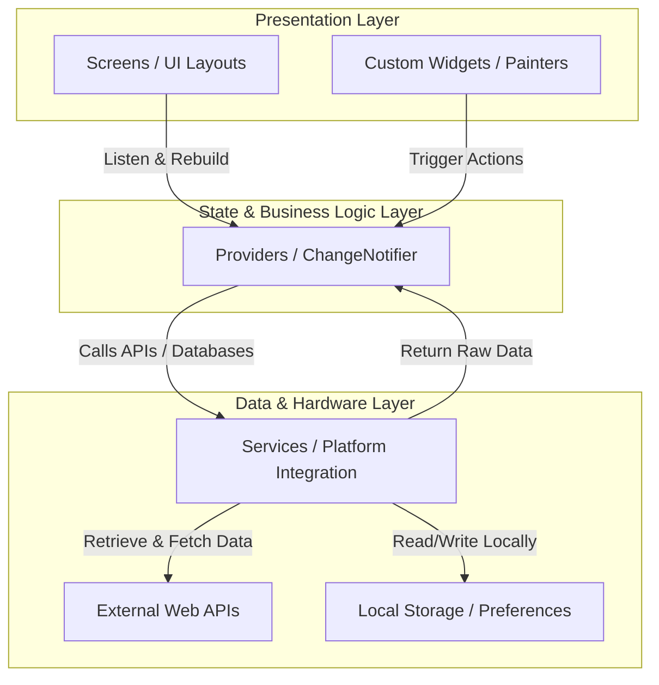
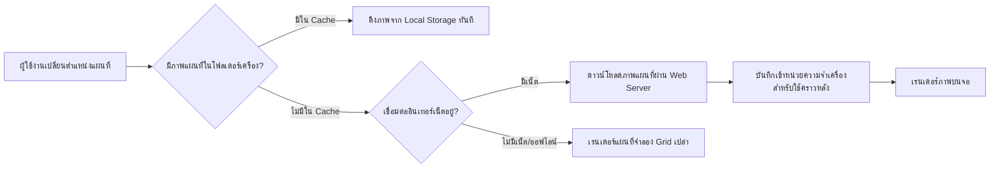

# สถาปัตยกรรมระบบ (System Architecture)

เอกสารนี้อธิบายถึงสถาปัตยกรรมทางซอฟต์แวร์ รูปแบบการจัดการสถานะ (State Management) โครงสร้างโฟลเดอร์ของซอร์สโค้ด และแผนภาพการทำงานเชิงระบบของแอปพลิเคชัน **BANTAWAN**

---

## 1. รูปแบบสถาปัตยกรรมหลัก (Architectural Pattern)

แอปพลิเคชันนี้ประยุกต์ใช้สถาปัตยกรรมในรูปแบบ **MVVM (Model-View-ViewModel)** โดยร่วมมือกับระบบการจัดการสถานะแบบ **Provider** (Reactive State Management) เพื่อให้มั่นใจในเรื่องของความเร็วและการลดภาระประมวลผล (Performance Optimization)



*   **View**: ออกแบบโครงสร้างจอในโฟลเดอร์ [lib/screens/](file:///f:/flutter1/flutter1/lib/screens/) และส่วนเสริมทางศิลป์ [lib/widgets/](file:///f:/flutter1/flutter1/lib/widgets/) ซึ่งเน้นการเขียน UI สไตล์ Tactical Dark Glassmorphism 
*   **ViewModel (Provider)**: ทำหน้าที่จัดการ State และความเชื่อมโยงในระบบ อยู่ใน [lib/providers/](file:///f:/flutter1/flutter1/lib/providers/) คอยกระจายเหตุการณ์แจ้งเตือน UI ให้วาดหน้าจอใหม่ผ่าน `notifyListeners()`
*   **Model (Services & APIs)**: รวบรวมฟังก์ชันการทำงานระนาบต่ำและเรียกใช้ข้อมูลดิบจาก API หรือฮาร์ดแวร์ จัดเก็บใน [lib/services/](file:///f:/flutter1/flutter1/lib/services/)

---

## 2. โครงสร้างโฟลเดอร์ในระบบ (Directory Structure)

```text
lib/
├── l10n/                    # ไฟล์ข้อมูลแปลภาษา (Translation Strings .arb)
│   └── generated/           # โค้ดสร้างอัตโนมัติของ Flutter Localization
├── navigation/              # ระบบการจัดทิศทางหน้าจอและโครงสร้าง Route
│   └── main_navigation.dart # โครงสร้าง Bottom Navigation Bar แบบลอยตัว
├── providers/               # ตัวจัดการสถานะหลักที่ผูกกับ Widgets
│   ├── map_provider.dart    # ประมวลพิกัดนำทาง คัดกรองสถานที่และวาดเส้นทาง OSRM
│   └── profile_provider.dart# จัดการข้อมูลประวัติการรักษาพยาบาล (Medical ID)
├── screens/                 # หน้าหลักของแต่ละระบบฟีเจอร์ในแอป (15 หน้าหลัก)
├── services/                # บริการควบคุมฮาร์ดแวร์และจัดหาข้อมูล
│   ├── nearby_service.dart  # จัดการเชื่อมต่อ P2P Mesh Network ผ่านบลูทูธ
│   ├── map_offline_service.dart # ดาวน์โหลด จัดเก็บ และนำเข้าแผนที่ออฟไลน์
│   ├── device_health_service.dart # ตรวจวัดสถานะแบตเตอรี่, GPS, และโหนด Mesh
│   ├── weather_service.dart # ติดต่อเช็คสภาพอากาศ ดึงค่า PM 2.5 และแจ้งเตือนภัยพิบัติ
│   ├── safety_check_service.dart # ตั้งเวลาความปลอดภัย นับถอยหลังส่งสัญญาณ SOS
│   └── emergency_tool_service.dart # ควบคุมไซเรน, ไฟฉาย และ Strobe หน้าจอกระพริบ
├── widgets/                 # คอมโพเนนต์ที่ใช้ร่วมกัน และ Custom Painters
│   └── map/                 # ส่วนประกอบย่อยบนแผนที่ (เช่น Markers, Search Panel)
└── main.dart                # ไฟล์จุดเริ่มต้นแอป ทำการลงทะเบียน Providers และเรียกหน้าแรก
```

---

## 3. สถาปัตยกรรมเครือข่ายแชทไร้เน็ต (P2P Mesh Network Flow)

ระบบเครือข่าย P2P ทำงานผ่าน Nearby Connections API ในโหมด **P2P Cluster** (รองรับการเชื่อมต่อแบบหลายขั้วพร้อมกัน) ซึ่งกลไกของแชทไร้อินเทอร์เน็ตและการแชร์พิกัดมีลำดับการส่งผ่านข้อมูลดังนี้:

```mermaid
sequenceDiagram
    autonumber
    actor UserA as โหนดผู้ใช้ A (ค้นหา)
    actor UserB as โหนดผู้ใช้ B (โฆษณา)
    
    Note over UserA, UserB: เริ่มเปิดใช้งาน Mesh Chat / ค้นหาคนรอบตัว
    UserB->>UserB: เปิดการแผร่กระจายสัญญาณ (Advertising)
    UserA->>UserA: เปิดการค้นหาสัญญาณ (Discovery)
    
    UserA->>UserB: ตรวจพบโหนด B และส่งคำขอเชื่อมต่อ (Request Connection)
    UserB-->>UserA: ยอมรับสิทธิ์การเชื่อมต่ออัตโนมัติ (Accept Connection)
    
    Note over UserA, UserB: เชื่อมต่อท่อส่งข้อมูลสำเร็จ (P2P Session Connected)
    
    rect rgb(15, 23, 42)
        Note right of UserA: ผู้ใช้ A กดส่งพิกัดปัจจุบันในห้องแชท
        UserA->>UserB: ส่งแพ็คเกจพิกัดละติจูด/ลองจิจูด (JSON Payload)
        UserB->>UserB: วิเคราะห์พิกัด และกระตุ้น Notification
        UserB-->>UserA: ตอบรับการได้รับข้อมูล
    end
```



*   **NearbyService** จะทำหน้าที่เปรียบเสมือนศูนย์กลางการจัดการ Bluetooth P2P คลัสเตอร์ คอยตรวจสอบการเช็คชื่ออุปกรณ์เชื่อมต่อ (Nodes list) และส่งต่อเหตุการณ์เข้ามาที่หน้าจอ [nearby_chat_screen.dart](file:///f:/flutter1/flutter1/lib/screens/nearby_chat_screen.dart)

---

## 4. โครงสร้างการจัดการแผนที่ออฟไลน์ (Offline-First Map Architecture)

สถาปัตยกรรมแผนที่ออฟไลน์ใช้ [MapOfflineService](file:///f:/flutter1/flutter1/lib/services/map_offline_service.dart) ประสานงานร่วมกับ `flutter_map` โดยเก็บพิกัดแผนที่เป็นรูปภาพไทล์ขนาด 256x256 พิกเซล ซึ่งแยกย่อยตามระดับการซูม (Zoom Levels) ไว้ในเครื่องผู้ใช้ล่วงหน้า:



*   **โหมดเดินป่า (Hike Dashboard)**: เมื่อยืนยันการเดินป่า ระบบจะสั่งรัน `downloadAreaTiles` ล่วงหน้าแบบขนาน เพื่อกวาดรูปแผนที่ทุกแผ่นในรัศมีรอบตัวลงมาจัดเก็บไว้ในฮาร์ดดิสก์ของโทรศัพท์มือถือ ป้องกันข้อมูลแผนที่หายตัวไปเมื่อเดินเข้าสู่พื้นที่อับสัญญาณมือถืออย่างแท้จริง
