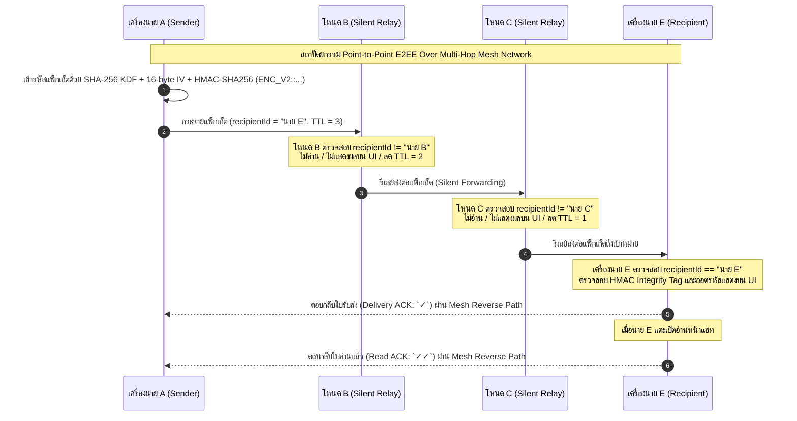

# BANTAWAN - System Architecture Documentation

**โครงการ**: BANTAWAN (Smart Survival & Emergency Assistance Application)  
**ระดับความสำคัญ**: เอกสารสถาปัตยกรรมระบบขั้นสูงสำหรับประเมินทางวิชาการ (Academic & Technical Audit)  
**เวอร์ชันของเอกสาร**: 1.4.0  

---

## 1. บทนำและแนวคิดสถาปัตยกรรม (Architecture Overview)

**BANTAWAN** ถูกออกแบบขึ้นตามหลักการ **Offline-First** และ **High Operational Resilience** เพื่อให้มั่นใจได้ว่าระบบสามารถสนับสนุนชีวิตของผู้ประสบภัยและผู้กู้ภัยได้แม้อยู่ในสภาวะที่โครงสร้างพื้นฐานด้านโทรคมนาคม (Cell Towers, ISPs, Centralized Servers) ทำงานไม่ได้ หรือถูกทำลายจากภัยพิบัติ

```text
┌─────────────────────────────────────────────────────────────────────────────┐
│                              USER INTERFACE LAYER                           │
│     Screens (Home, Map, SOS, Nearby, Survival Tools, First Aid, Hike)      │
└──────────────────────────────────────┬──────────────────────────────────────┘
                                       │
                                       ▼
┌─────────────────────────────────────────────────────────────────────────────┐
│                            STATE MANAGEMENT LAYER                           │
│        Providers (MapProvider, ProfileProvider, Service Listeners)          │
└──────────────────────────────────────┬──────────────────────────────────────┘
                                       │
                                       ▼
┌─────────────────────────────────────────────────────────────────────────────┐
│                           DOMAIN & REPOSITORY LAYER                         │
│           IPoiRepository, IRoutingRepository & Implementations              │
└──────────────────────────────────────┬──────────────────────────────────────┘
                                       │
                                       ▼
┌─────────────────────────────────────────────────────────────────────────────┐
│                         INFRASTRUCTURE & SERVICE LAYER                      │
│   APIs (Longdo, OSM, OSRM)  │ P2P Mesh Network │ Hardware (GPS, BT, Sound) │
└─────────────────────────────────────────────────────────────────────────────┘
```

---

## 2. การแบ่งชั้นสถาปัตยกรรม (Layer Responsibilities)

### 2.1 User Interface (UI) Layer (`lib/screens/`, `lib/widgets/`)
- **หน้าที่**: แสดงผลส่วนปฏิสัมพันธ์กับผู้ใช้ (User Interactions) แบบ Dark Mode นีออน (Glassmorphism & Tactical HUD Design)
- **การทำงาน**: รับคำสั่งจากผู้ใช้ (User Actions) แล้วเรียกใช้ `Provider` เพื่ออัปเดตสถานะ โดยไม่มีการฝัง Business Logic ซับซ้อนไว้ที่หน้าจอ

### 2.2 State Management Layer (`lib/providers/`)
- **หน้าที่**: บริหารจัดการสถานะของแอปพลิเคชัน (Reactive State Management) ผ่านรูปแบบ **Provider Pattern** (`ChangeNotifier`)
- **การทำงาน**: เก็บข้อมูลสถานะของแผนที่ (`MapProvider`), ข้อมูลส่วนบุคคลและสุขภาพ (`ProfileProvider`), ป้องกันการเกิด Rebuild หน้าจอที่ไม่จำเป็น และแจ้งเตือนหน้าจอ UI เมื่อข้อมูลมีการเปลี่ยนแปลงผ่าน `notifyListeners()`

### 2.3 Domain & Repository Layer (`lib/repositories/`, `lib/models/`)
- **หน้าที่**: กำหนดสัญญารูปแบบข้อมูล (Data Contracts / Interfaces) และจัดการตรรกะการเลือกแหล่งข้อมูล (Data Source Strategy)
- **คีย์ส่วนประกอบ**:
  - `IPoiRepository` / `PoiRepositoryImpl`: จัดการการดึงพิกัดโรงพยาบาลและสถานพยาบาล สลับระหว่างออนไลน์ (Longdo/Overpass) และออฟไลน์ (Local Cache)
  - `IRoutingRepository` / `RoutingRepositoryImpl`: จัดการการคำนวณเส้นทางสลับระหว่าง OSRM API (ขับขี่) และ Direct-Line Bearing (เดินเท้าออฟไลน์)
  - `MedicalFacility`, `RouteResult`, `CacheMetadata`: Data Entities หลักของระบบ

### 2.4 Infrastructure & Service Layer (`lib/services/`)
- **หน้าที่**: ติดต่อสื่อสารกับฮาร์ดแวร์ของอุปกรณ์, ระบบปฏิบัติติการ Android/iOS, ฐานข้อมูลในเครื่อง, และ REST APIs ภายนอก
- **จำแนกตามกลุ่มงาน**:
  - **Network APIs**: `LongdoService`, `OverpassService`, `WeatherService`, `SerpApiService`
  - **Local Persistence**: `PoiCacheService`, `ProfileService`, `EmergencyContactService`, `LanguageService`
  - **P2P Mesh Network**: `NearbyService` (Google Nearby Connections API)
  - **Device Hardware & Sensors**: `DeviceHealthService` (Battery/GPS), `EmergencyToolService` (Flashlight/Audio), `HikeService` (GPS Tracking)

---

## 3. สถาปัตยกรรมสื่อสารไร้เน็ต (Offline P2P Mesh Network Architecture)

ระบบแชทฉุกเฉินไร้เน็ต (`NearbyService`) ทำงานบนเทคโนโลยี **Google Nearby Connections API** ร่วมกับอัลกอริทึม **Multi-hop Flooding Relay with TTL** และระบบเข้ารหัส End-to-End Encryption (E2EE V2):

```text
[อุปกรณ์ A (ผู้ประสบภัย)] ──(Hop 1)──► [อุปกรณ์ B (ผู้กู้ภัย/Relay)] ──(Hop 2)──► [อุปกรณ์ C (ศูนย์ช่วยเหลือ)]
(ส่ง SOS: TTL=5)                     (ลด TTL เหลือ 4 & บันทึก ID)             (ได้รับข้อความ + สั่นเตือน)
```

### 3.1 ลำดับการส่งข้อความส่วนตัวผ่านโหนดทางผ่าน (E2EE Multi-Hop Silent Relay Sequence)

อาจารย์สามารถตรวจสอบไดอะแกรมการทำงานแบบ **Silent Relay** (ข้อความส่วนตัวระหว่าง นาย A ถึง นาย E ผ่านโหนดทางผ่าน B, C, D) ได้ตามลำดับขั้นตอนล่างนี้:



### 3.2 รูปแบบโครงสร้างแพ็กเก็ตข้อมูลปลอดภัย (Crypto Engine V2 Format)

แพ็กเก็ตที่ส่งผ่าน Mesh Network อยู่ในรูปแบบ:
```text
ENC_V2::<iv_base64>::<ciphertext_base64>::<hmac_sha256_base64>
```
1. **Key Derivation (KDF)**: สร้าง Secret Key 256-bit จาก `SHA-256(senderId + "_" + recipientId)`
2. **Initialization Vector (IV)**: สุ่มค่า IV ขนาด 16-byte ใหม่ทุกๆ แพ็กเก็ต ป้องกัน Replay Attack
3. **HMAC Integrity Tag**: ตรวจสอบการดัดแปลงแก้ไขแพ็กเก็ตโดยโหนดรีเลย์ตรงกลาง หากลายเซ็น HMAC ไม่ตรง แพ็กเก็ตจะถูกปฏิเสธทันที

### หลักการทำงานเชิงเทคนิค:
1. **P2P Cluster Strategy**: ใช้อัลกอริทึม `Strategy.P2P_CLUSTER` เพื่อเปิดให้อุปกรณ์ทุกเครื่องเป็นทั้ง Client และ Router
2. **Auto-Accept Handshake**: สั่งเชื่อมต่อสายสัญญาณอัตโนมัติทันทีที่พบอุปกรณ์ใกล้เคียงเพื่อความเร็วสูงสุดในภาวะฉุกเฉิน
3. **Loop Prevention (Deduplication)**: บันทึก `Message ID` ลงใน `Set<String> _processedMessageIds` หากได้รับข้อความที่มี ID เดิมซ้ำ จะถูกตัดทิ้งทันที ป้องกันการเกิด Broadcast Storm
4. **Time-To-Live (TTL) Decay**:
   - ข้อความแชททั่วไป: `TTL = 3` (ส่งต่อได้สูงสุด 3 ทอด)
   - ข้อความขอความช่วยเหลือ SOS: `TTL = 5` (ส่งต่อได้สูงสุด 5 ทอด ขยายระยะทางได้หลายร้อยเมตร)

---

## 4. กลยุทธ์การสลับข้อมูลออฟไลน์ (Offline-First Data Strategy)

```text
                     ร้องขอข้อมูลพิกัด/เส้นทาง
                               │
                               ▼
                   มีสัญญาณอินเทอร์เน็ตหรือไม่?
                               │
                   ┌───────────┴───────────┐
                มีเน็ต                   ไม่มีเน็ต
                   │                       │
                   ▼                       ▼
       แคชเดิมยังสดใหม่หรือไม่?        ดึงข้อมูลจาก Local Cache
       (ไม่เกิน 24 ชม. & ในรัศมี)     (PoiCacheService) / 
                   │                คำนวณเส้นทางแนวตรง (Bearing)
         ┌─────────┴─────────┐
      ยังสดใหม่            หมดอายุ
         │                   │
         ▼                   ▼
    ดึงจากแคชในเครื่อง   เรียกยิง API คู่ขนาน
    (ไม่ต้องยิงเน็ตซ้ำ)   (Longdo + Overpass)
                         และบันทึกอัปเดตแคช
```

---

## 5. การจัดการสิทธิ์และการรักษาความปลอดภัย (Permissions & Security Model)

- **Location Permissions**: ใช้สแกนหาอุปกรณ์ใกล้เคียงผ่าน Bluetooth/WiFi Direct และระบุพิกัด GPS บนแผนที่
- **Bluetooth Permissions** (Android 12+): ขอสิทธิ์ `bluetoothScan`, `bluetoothAdvertise`, `bluetoothConnect`
- **Nearby WiFi Devices** (Android 13+): ขอสิทธิ์ `nearbyWifiDevices` สำหรับการสร้าง P2P Socket สัญญาณสูง

---

## 6. สรุปคุณสมบัติทางสถาปัตยกรรม (Quality Attributes)

| คุณสมบัติ (Attribute) | การบรรลุเป้าหมายใน BANTAWAN |
|---|---|
| **Availability (ความพร้อมใช้งาน)** | 100% ออฟไลน์ใช้ได้แม้อยู่ off-grid ไร้สัญญาณเน็ต |
| **Performance (ประสิทธิภาพ)** | ตอบสนองทันทีด้วย Local Cache และยิง API แบบ Parallel Concurrent |
| **Maintainability (การบำรุงรักษา)** | แยกโค้ดตามขอบเขตหน้าที่ (Clean Architecture on Map Module) |
| **Extensibility (การขยายระบบ)** | รองรับการเพิ่ม Data Source ใหม่ผ่าน Repository Interfaces |
