# บทที่ 2
# ทฤษฎีและหลักการที่เกี่ยวข้อง (ฉบับสมบูรณ์)
## โครงงาน: ระบบสนับสนุนความปลอดภัยส่วนบุคคลบนสมาร์ตโฟน (BANTAWAN)

---

ในการพัฒนาระบบสนับสนุนความปลอดภัยส่วนบุคคลบนสมาร์ตโฟน (Personal Safety Support System on Smartphone) หรือระบบ **BANTAWAN** ผู้พัฒนาได้ทำการศึกษาและประยุกต์ใช้ทฤษฎี หลักการทางวิศวกรรมซอฟต์แวร์ สถาปัตยกรรมเครือข่ายไร้สายเฉพาะกิจ วิทยาการรหัสลับ ระบบสารสนเทศภูมิศาสตร์ ตลอดจนมาตรฐานการแพทย์ฉุกเฉินและงานวิจัยที่เกี่ยวข้อง เพื่อเป็นรากฐานสำคัญในการวิเคราะห์ ออกแบบ และพัฒนาระบบให้สามารถปฏิบัติการได้อย่างมีเสถียรภาพสูงสุด โดยเฉพาะอย่างยิ่งในสภาวะวิกฤตที่โครงสร้างพื้นฐานอินเทอร์เน็ตและเครือข่ายเซลลูลาร์ไม่สามารถให้บริการได้ เนื้อหาในบทนี้ประกอบด้วยหัวข้อหลัก 8 ประการ ดังต่อไปนี้

---

## 2.1 เฟรมเวิร์กและภาษาการพัฒนาซอฟต์แวร์ (Framework & Programming Language)

### 2.1.1 ภาษา Dart (Dart Programming Language)
ภาษา Dart เป็นภาษาโปรแกรมเชิงวัตถุ (Object-Oriented Programming: OOP) แบบกำหนดชนิดข้อมูลชัดเจน (Strongly Typed) ที่ได้รับการวิจัยและพัฒนาโดยบริษัท Google [1] โดยภาษา Dart ถูกออกแบบมาเพื่อตอบสนองการพัฒนาโปรแกรมประยุกต์ด้านส่วนต่อประสานกับผู้ใช้ (User Interface: UI) ที่ต้องการความลื่นไหลระดับสูง ทั้งบนแพลตฟอร์มอุปกรณ์เคลื่อนที่ เว็บ และคอมพิวเตอร์ตั้งโต๊ะ ภายในโครงงานนี้ได้เลือกใช้ Dart SDK เวอร์ชัน `^3.10.4` ขึ้นไป ซึ่งมีคุณลักษณะทางเทคนิคสำคัญที่จำเป็นต่อระบบความปลอดภัย ดังนี้

#### 1) โหมดการคอมไพล์ (Just-In-Time และ Ahead-Of-Time)
Dart รองรับสถาปัตยกรรมการคอมไพล์ 2 รูปแบบที่ส่งผลโดยตรงต่อวงจรการพัฒนาและการนำไปใช้งานจริง:
* **Just-In-Time (JIT):** ถูกใช้งานในช่วงการพัฒนาซอฟต์แวร์ (Debug Mode) เป็นกลไกหลักที่ขับเคลื่อนคุณสมบัติ **Stateful Hot Reload** ทำให้นักพัฒนาสามารถเห็นผลลัพธ์ของการปรับปรุงโค้ดหรือการจัดวาง Layout บนหน้าจอได้ภายในเวลาเสี้ยววินาทีโดยไม่ต้องเริ่มแอปพลิเคชันใหม่ทั้งหมด
* **Ahead-Of-Time (AOT):** ถูกใช้งานในการสร้างชุดติดตั้งสำหรับการใช้งานจริง (Release Build) โดยคอมไพเลอร์จะทำการแปลงโค้ดภาษา Dart ให้เป็นรหัสเครื่อง (Native Machine Code: ARM32, ARM64 หรือ x86_64) ล่วงหน้า ส่งผลให้อุปกรณ์สามารถเปิดแอปพลิเคชันได้ในทันทีโดยมีเวลาเริ่มต้น (Startup Time) สั้นมาก และมีอัตราเฟรมภาพที่คงที่สม่ำเสมอ [1] ซึ่งเป็นคุณสมบัติวิกฤตสำหรับระบบความปลอดภัยฉุกเฉินที่ผู้ประสบภัยต้องการเข้าถึงเครื่องมือขอความช่วยเหลือได้ในเสี้ยววินาที

นอกจากนี้ ในระหว่างกระบวนการคอมไพล์แบบ AOT ระบบจะประยุกต์ใช้เทคนิค **Tree Shaking** เพื่อทำการวิเคราะห์และตัดฟังก์ชัน คลาส หรือไลบรารีย่อยที่ไม่มีการเรียกใช้งานจริงออกจากไบนารีผลลัพธ์ ซึ่งทำงานสอดประสานกับเครื่องมือ R8 / ProGuard ในฝั่ง Android เนทีฟ ช่วยลดขนาดของไฟล์ติดตั้ง (APK) ให้มีขนาดกะทัดรัดที่สุด

#### 2) ระบบความปลอดภัยของชนิดข้อมูลและการป้องกันค่าว่าง (Sound Null Safety)
ปัญหาความผิดพลาดจากการเข้าถึงตัวแปรที่มีค่าว่าง (Null Pointer Exceptions) เป็นสาเหตุสำคัญอันดับต้นๆ ของการหยุดทำงานกะทันหันของแอปพลิเคชัน (Crash) ในสถานการณ์ฉุกเฉิน ความล้มเหลวดังกล่าวอาจก่อให้เกิดอันตรายถึงชีวิต ภาษา Dart จึงได้นำเสนอกลไก **Sound Null Safety** [2] ซึ่งเป็นระบบการตรวจสอบชนิดข้อมูลตั้งแต่ขั้นตอนคอมไพล์ (Compile-time Guarantee) โดยตัวแปรทุกตัวจะถูกกำหนดให้ไม่สามารถมีค่าว่างได้โดยปริยาย (Non-nullable by default) เว้นแต่ผู้พัฒนาจะระบุเครื่องหมาย `?` ไว้อย่างชัดเจน:

```dart
String emergencyNotice = "ต้องการความช่วยเหลือด่วน"; // ไม่สามารถเป็น null ได้เด็ดขาด
String? optionalAttachmentPath;                       // อนุญาตให้เป็น null ได้เมื่อไม่มีไฟล์แนบ
```

ประโยชน์ที่ได้รับในโครงงานคือ การลดความเสี่ยงของข้อผิดพลาดประเภท Null Pointer Exception ภายในโค้ด Dart ลงอย่างมีนัยสำคัญ อย่างไรก็ดี เนื่องจากระบบยังต้องมีปฏิสัมพันธ์กับปลั๊กอินระดับเนทีฟ ข้อมูลที่รับเข้ามาผ่านคลื่นวิทยุไร้สาย และสิทธิ์ของระบบปฏิบัติการ โครงงานจึงได้เสริมความรัดกุมด้วยการครอบบล็อก `try-catch` ในทุกจุดเสี่ยง และมีการตรวจสอบความถูกต้องของโครงสร้างข้อมูลขาเข้า (Input Data Validation) อย่างเข้มงวด

#### 3) การประมวลผลแบบอะซิงโครนัสและวงวนเหตุการณ์ (Asynchronous Event Loop & Isolates)
ภาษา Dart ทำงานบนโมเดลการประมวลผลแบบเธรดเดี่ยว (Single-Threaded Execution) ร่วมกับระบบวงวนเหตุการณ์ (Event Loop) [1] เพื่อหลีกเลี่ยงภาวะหน้าจอค้างหรือเฟรมภาพตกหล่น (UI Jank)

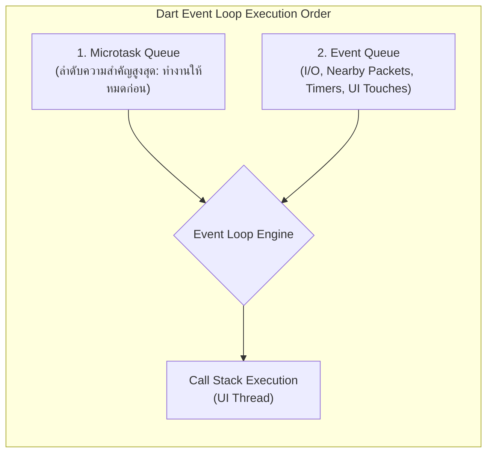

* **ลำดับการประมวลผลของ Event Loop:** ตัวขับเคลื่อนเหตุการณ์จะประมวลผลงานใน **Microtask Queue** ให้เสร็จสิ้นทั้งหมดก่อนเสมอ แล้วจึงสลับไปหยิบเหตุการณ์จาก **Event Queue** (เช่น เหตุการณ์การสัมผัสหน้าจอ, แพ็กเก็ตข้อมูลจากบลูทูธ, การหมดเวลาของ Timer) มาประมวลผลทีละรายการ
* **การแบ่งแยกภาระงาน (Isolates):** สำหรับภาระงานที่ต้องใช้พลังการคำนวณของซีพียูสูงเป็นเวลานาน เช่น การบีบอัดและเข้ารหัสไฟล์เสียงฉุกเฉิน หรือการถอดรหัส Polyline เส้นทางที่มีจุดพิกัดนับพันจุด ระบบจะแยกงานดังกล่าวออกไปประมวลผลบน Isolate อิสระ (`Isolate.run` หรือ `compute`) เพื่อให้เธรดหลักของ UI สามารถวาดภาพหน้าจอที่ความเร็ว 60 FPS ได้อย่างต่อเนื่อง
* **การประยุกต์ใช้ใน BANTAWAN:**
  * `Stream<T>`: จัดการกระแสข้อมูลที่หลั่งไหลเข้ามาอย่างต่อเนื่อง เช่น องศาเข็มทิศจากเซนเซอร์แม่เหล็ก (`Stream<CompassEvent>`), ข้อมูลแพ็กเก็ตข้อความขาเข้าผ่านบลูทูธ, และสถานะระดับแบตเตอรี่
  * `Future<T>`: รองรับการทำงานอะซิงโครนัสแบบครั้งเดียวจบ เช่น การร้องขอพิกัดดาวเทียม GNSS จาก `geolocator`, การอ่านเขียนข้อมูลลงฐานข้อมูล SQLite, และการดึงข้อมูลพยากรณ์อากาศผ่าน HTTP

#### 4) ระบบการจัดการแพ็กเกจและการสร้างซอฟต์แวร์ซ้ำได้ (pub.dev & Reproducible Build)
Dart มีระบบบริหารจัดการแพ็กเกจผ่านเครื่องมือ `pub` โดยระบุความต้องการของไลบรารีในไฟล์ `pubspec.yaml` และบันทึกเวอร์ชันและค่าแฮชของไลบรารีที่ถูกติดตั้งจริงไว้ในไฟล์ `pubspec.lock` ซึ่งรับประกันว่าสมาชิกในทีมพัฒนาและระบบ CI/CD จะทำการคอมไพล์โค้ดบนสภาพแวดล้อมที่เหมือนกันทุกประการ (Reproducible Build) รายการไลบรารีหลักที่ระบบใช้งาน ได้แก่:
* การจัดการสถานะ: `provider: ^6.1.1`
* แผนที่และพิกัด: `flutter_map: ^6.1.0`, `latlong2: ^0.9.0`, `geolocator: ^13.0.2`, `flutter_polyline_points: ^3.1.0`
* เครือข่ายไร้สาย: `nearby_connections: ^4.3.0`
* การจัดเก็บข้อมูลและความปลอดภัย: `sqflite: ^2.3.3+1`, `shared_preferences: ^2.2.2`, `flutter_secure_storage: ^9.2.2`
* เซนเซอร์และมัลติมีเดีย: `flutter_compass: ^0.8.1`, `torch_light: ^1.1.0`, `audioplayers: ^6.1.1`, `flutter_tts: ^4.2.2`, `record: ^6.2.1`

#### 5) การวิเคราะห์โค้ดแบบสถิต (Static Code Analysis)
โครงงานกำหนดกฎเกณฑ์การตรวจสอบคุณภาพโค้ดไว้อย่างเป็นทางการในไฟล์ `analysis_options.yaml` โดยเปิดใช้ชุดกฎ `flutter_lints` และกำหนดข้อบังคับการตรวจสอบความถูกต้องของชนิดข้อมูล เพื่อให้คำสั่ง `flutter analyze` สามารถตรวจพบข้อผิดพลาด เชาวน์ปัญญาการตั้งชื่อ หรือตัวแปรที่ไม่ได้ใช้งาน ก่อนที่จะรวมโค้ดเข้าสู่ระบบควบคุมเวอร์ชัน

---

### 2.1.2 เฟรมเวิร์ก Flutter (Flutter Framework)
Flutter เป็นชุดพัฒนาซอฟต์แวร์ส่วนต่อประสานข้ามแพลตฟอร์มแบบรหัสเปิด (Open-Source UI SDK) ที่พัฒนาโดย Google [3] เพื่อสร้างซอฟต์แวร์ที่ทำงานได้บนหลากหลายระบบปฏิบัติการจากฐานรหัสชุดเดียวกัน (Single Codebase)

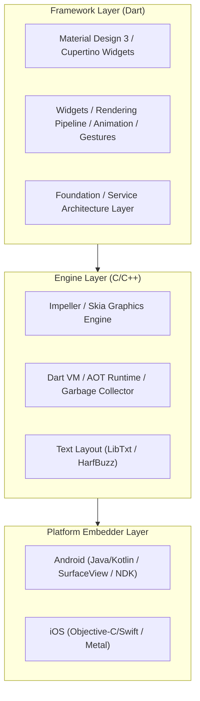

#### 1) โครงสร้างสถาปัตยกรรมแบบ 3 ชั้น (Three-Layer Architecture)
* **Framework Layer (เขียนด้วยภาษา Dart):** เป็นชั้นที่นักพัฒนาโต้ตอบโดยตรง ประกอบด้วยระบบวิดเจ็ตมาตรฐาน, ระบบคำนวณการจัดเรียง (Layout), ระบบตรวจจับการสัมผัส (Gestures) และแอนิเมชัน
* **Engine Layer (เขียนด้วยภาษา C/C++):** แกนประมวลผลหลัก ประกอบด้วยเอนจินการเรนเดอร์กราฟิก Impeller / Skia, ระบบจัดการหน่วยความจำ Dart VM / GC, และเอนจินประมวลผลฟอนต์
* **Platform Embedder Layer:** ทำหน้าที่เป็นตัวประสานงานระหว่าง Engine กับระบบปฏิบัติการเนทีฟ จัดการหน้าต่างแสดงผล การรับอินพุต และการประมวลผล Platform Channels

#### 2) สถาปัตยกรรมต้นไม้วิดเจ็ตและวงจรชีวิต (Widget Tree & Lifecycle)
Flutter วาดหน้าจอผ่านโครงสร้างต้นไม้ 3 ชุดที่ทำงานร่วมกัน:
1. **Widget Tree:** โครงสร้างข้อมูลแบบไม่เปลี่ยนแปลง (Immutable Configuration) ทำหน้าที่เป็นพิมพ์เขียวของ UI
2. **Element Tree:** โครงสร้างตัวกลางที่จัดการวงจรชีวิตและทำหน้าที่จับคู่ระหว่าง Widget กับ RenderObject
3. **RenderObject Tree:** โครงสร้างที่รับผิดชอบการคำนวณพิกัด ขนาด และการวาดพิกเซลจริงลงบนหน้าจอ (Painting)

#### 3) ช่องทางการสื่อสารระดับเนทีฟ (Platform Channels)
Flutter สื่อสารกับฮาร์ดแวร์เนทีฟผ่านการเข้ารหัสข้อความแบบไบนารี โดยใช้ `MethodChannel` สำหรับการสั่งการแบบเรียกแล้วตอบกลับ (RPC) เช่น การเปิด-ปิดไฟฉาย หรือการเริ่มสแกนบลูทูธ และใช้ `EventChannel` สำหรับการรับกระแสข้อมูลต่อเนื่องจากเซนเซอร์

#### 4) ไปป์ไลน์การเรนเดอร์และเอนจิน Impeller (Rendering Pipeline & Graphics Engine)
ในแต่ละรอบของเฟรมภาพ Flutter ดำเนินงานตามขั้นตอนอย่างเคร่งครัด:
$$\text{Build} \longrightarrow \text{Layout} \longrightarrow \text{Paint} \longrightarrow \text{Composite}$$
* **Build:** สร้างและปรับปรุงโครงสร้าง Widget Tree
* **Layout:** คำนวณขนาดและขอบเขตตามหลัก *"Constraints ไหลลงข้างล่าง, Sizes ส่งกลับขึ้นข้างบน"*
* **Paint:** บันทึกคำสั่งการวาดลงในเลเยอร์การแสดงผล
* **Composite:** รวมเลเยอร์ภาพและส่งผ่านไปยังหน่วยประมวลผลกราฟิก (GPU) ภายในเวลา 16.7 มิลลิวินาทีสำหรับหน้าจอ 60 Hz [3]

**เอนจิน Impeller:** ใน Flutter เวอร์ชันใหม่ มีการเปิดตัวเอนจิน Impeller ซึ่งใช้สถาปัตยกรรมแบบคอมไพล์ Shader ล่วงหน้า (Pre-compiled Shaders) เพื่อขจัดปัญหาการกระตุกจากการคอมไพล์ Shader ขณะทำงาน (Jank Elimination) โดย Impeller ถูกเปิดใช้เป็นค่าเริ่มต้นบน iOS และกำลังเปิดใช้งานบน Android ผ่าน Vulkan Backend ควบคู่กับ Skia Engine ซึ่งทำหน้าที่เป็นตัวเรนเดอร์มาตรฐานบนอุปกรณ์ Android ที่รองรับ OpenGL ES

#### 5) การเปรียบเทียบและการเลือก Flutter สำหรับระบบ BANTAWAN

| มิติการเปรียบเทียบ | Flutter | React Native | Native (Kotlin / Swift) |
|:---|:---|:---|:---|
| **ฐานโค้ด (Codebase)** | ชุดเดียว (Single Codebase) | ชุดเดียว | แยกตามระบบปฏิบัติการ |
| **กลไกการวาด UI** | เรนเดอร์เองด้วย Impeller/Skia | เรียกใช้ Native Components | เรียกใช้ Native Components |
| **ความสม่ำเสมอของ UI** | สม่ำเสมอเท่ากันทุกอุปกรณ์ | ขึ้นกับเวอร์ชัน OS ของเครื่อง | แยกตามระบบปฏิบัติการ |
| **ประสิทธิภาพการเรนเดอร์** | สูงมาก (60–120 FPS Native) | ปานกลาง (ติดสะพาน JS Bridge) | สูงสุดระดับเนทีฟ |
| **ต้นทุนและระยะเวลาพัฒนา** | ต่ำและรวดเร็ว | ปานกลาง | สูงและใช้เวลาพัฒนามาก |

**เหตุผลเชิงโครงงานที่เลือก Flutter:**
1. ความจำเป็นในการปรับแต่งหน้าจอส่วนต่อประสานฉุกเฉิน (Emergency UI) ที่ต้องการความแม่นยำสูง หน้าจอมืดสนิท (AMOLED Dark Mode) และมีปุ่มกดขนาดใหญ่ที่ตอบสนองทันที
2. ความสามารถในการควบคุม Canvas สำหรับการวาดแผ่นแผนที่เวกเตอร์และเส้นทางเรืองแสง (Polylines) ข้ามแพลตฟอร์มได้อย่างอิสระ
3. ข้อจำกัดและการจัดการของโครงงาน: ไลบรารีการสื่อสารเมช `nearby_connections` ใช้ความสามารถของ Google Play Services Nearby Connections API บนระบบปฏิบัติการ Android เป็นหลัก ดังนั้น โครงงานนี้จึงมุ่งเน้นการพัฒนาและทดสอบระบบบนอุปกรณ์สมาร์ตโฟนระบบปฏิบัติการ **Android เป็นเป้าหมายหลัก**

#### 6) การจัดการสิทธิ์ขณะทำงาน (Runtime Permissions)
ระบบความปลอดภัยจำเป็นต้องเข้าถึงความสามารถระดับลึกของระบบปฏิบัติการ จึงต้องมีการขอสิทธิ์กลุ่มอันตราย (Dangerous Permissions) ขณะทำงานตามที่ระบุไว้ใน `AndroidManifest.xml`:
* **พิกัดภูมิศาสตร์:** `ACCESS_FINE_LOCATION`, `ACCESS_COARSE_LOCATION`
* **ระบบบลูทูธ (Android 12+ API 31+):** `BLUETOOTH_SCAN`, `BLUETOOTH_ADVERTISE`, `BLUETOOTH_CONNECT`
* **เครือข่ายระยะใกล้ (Android 13+ API 33+):** `NEARBY_WIFI_DEVICES` (กำหนดแฟลก `neverForLocation`)
* **การแจ้งเตือน (Android 13+ API 33+):** `POST_NOTIFICATIONS`
* **มัลติมีเดียและฮาร์ดแวร์:** `RECORD_AUDIO`, `VIBRATE`, `WAKE_LOCK`
* **บริการเบื้องหลัง (Android 14+ API 34+):** `FOREGROUND_SERVICE`, `FOREGROUND_SERVICE_LOCATION`, `FOREGROUND_SERVICE_CONNECTED_DEVICE`

ระบบได้ออกแบบหน้าจอ **Permission Rationale** เพื่อชี้แจงเหตุผลความจำเป็นในการขอสิทธิ์ต่อผู้ใช้ก่อนนำส่งคำขอของระบบปฏิบัติการ เพื่อป้องกันไม่ให้ผู้ใช้ปฏิเสธการให้สิทธิ์ซึ่งจะทำให้ระบบสื่อสารเมชไม่สามารถเริ่มต้นทำงานได้

---

### 2.1.3 การจัดการสถานะด้วย Provider Pattern (State Management)

#### 1) การเปรียบเทียบแนวทางการจัดการสถานะใน Flutter

| รูปแบบ | กลไกหลัก | จุดเด่น | ข้อจำกัด |
|:---|:---|:---|:---|
| **`setState`** | สถานะอยู่ภายใน Widget เดียว | ง่าย ไม่ต้องติดตั้งไลบรารีเพิ่ม | ส่งต่อข้อมูลข้ามหน้าจอได้ยาก โค้ดผูกติดกัน |
| **Provider** | `ChangeNotifier` + `InheritedWidget` | เป็นทางการ เรียนรู้ง่าย โค้ดกระชับ | ต้องมีวินัยในการออกแบบขอบเขตโมเดล |
| **Riverpod** | Global Provider ไม่ผูกกับ Widget Tree | ตรวจสอบข้อผิดพลาดเวลาคอมไพล์ | แนวคิดมีความซับซ้อนสูง |
| **BLoC** | Event $\rightarrow$ State ผ่าน `Stream` | โครงสร้างเข้มงวด ทดสอบง่าย | เขียนโค้ดซ้ำซ้อน (Boilerplate) ปริมาณมาก |

#### 2) การประยุกต์ใช้ Provider ในระบบ BANTAWAN
ระบบลงทะเบียนตัวจัดการสถานะผ่าน `MultiProvider` ที่รากของแอปพลิเคชัน (`main.dart`):
* `MapProvider`: จัดการสถานะพิกัดผู้ใช้ หมุดสถานพยาบาล เส้นทางนำทาง และการสลับโหมดแผนที่
* `ProfileProvider`: จัดการข้อมูลส่วนตัว ข้อมูลสุขภาพประจำตัว และประวัติฉุกเฉิน
* `NearbyService`: ให้บริการสตรีมข้อมูลสถานะการเชื่อมต่อเมชและข้อความแชทขาเข้า

เพื่อป้องกันการ Rebuild วิดเจ็ตที่ไม่เกี่ยวข้อง ระบบประยุกต์ใช้เทคนิค 3 ระดับ:
1. `context.watch<T>()`: ใช้กับวิดเจ็ตที่ต้องการอัปเดตหน้าจอทุกครั้งที่โมเดลเปลี่ยนค่า
2. `context.read<T>()`: ใช้ในการเรียกคำสั่งหรือฟังก์ชันจากปุ่มกด โดยไม่ทำให้วิดเจ็ตถูก Rebuild เมื่อข้อมูลเปลี่ยน
3. `Selector<T, R>`: ดักฟังเฉพาะค่าคุณสมบัติย่อย เช่น ดักฟังเฉพาะค่าแบตเตอรี่ โดยไม่ Rebuild หน้าจอเมื่อพิกัดแผนที่เปลี่ยน

---

### 2.1.4 สถาปัตยกรรมซอฟต์แวร์แบบ Feature-First (Software Architecture)
โครงงานจัดโครงสร้างสถาปัตยกรรมตามแนวทาง **Feature-First Architecture** โดยแยกโค้ดตามขอบเขตความสามารถของระบบ (`lib/features/`) แทนการแยกตามชนิดของไฟล์:

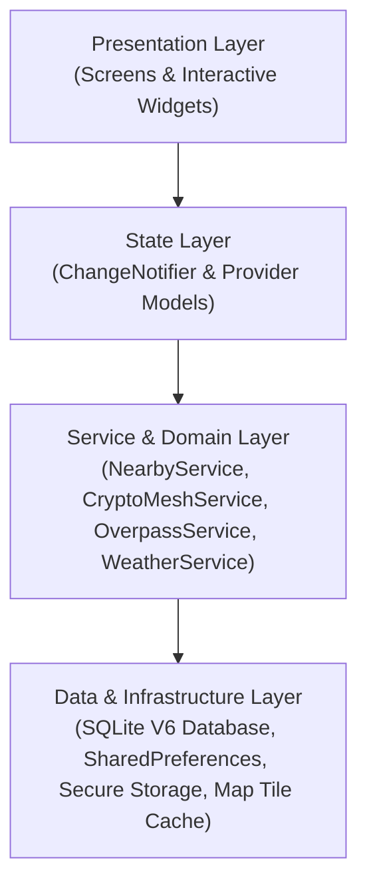

โครงสร้างโมดูลหลักประกอบด้วย:
* `chat/`: ระบบสื่อสารออฟไลน์ Mesh Routing, E2EE Cryptography, ฐานข้อมูลข้อความ SQLite V6
* `map/`: ระบบแผนที่ Slippy Map, แคชแผ่นแผนที่ออฟไลน์, การสืบค้น POI สถานพยาบาล
* `survival/`: เครื่องมือยังชีพ, ระบบบันทึกเส้นทางเดินป่า (Hike Tracker), เข็มทิศ, ไซเรน
* `first_aid/`: ฐานข้อมูลการปฐมพยาบาลออฟไลน์, ระบบเคาะจังหวะ CPR, ระบบอ่านออกเสียง TTS
* `weather/`: ระบบติดตามสภาพอากาศและดัชนีฝุ่น PM2.5 เพื่อแจ้งเตือนภัยสิ่งแวดล้อม
* `home/`: หน้าจอควบคุมกลาง สรุปสถานะความพร้อมของอุปกรณ์และสถานะวิทยุสื่อสาร

นอกจากนี้ ระบบรองรับการใช้งาน 2 ภาษา (ไทยและอังกฤษ) ผ่านระบบ Flutter Localization (`l10n.yaml` และโฟลเดอร์ `lib/l10n/`) เพื่อรองรับทั้งประชาชนในพื้นที่และนักท่องเที่ยวต่างชาติในยามเกิดภัยพิบัติ

---

### 2.1.5 หลักการออกแบบประสบการณ์ผู้ใช้ในภาวะฉุกเฉิน (Emergency UX)
ผู้ประสบภัยในสภาวะวิกฤตมักเผชิญกับความเครียดรุนแรง ความตื่นตระหนก มือสั่น หรืออยู่ในสภาพแวดล้อมที่มืดมิด การออกแบบ UI/UX จึงต้องอิงตามหลักการลดภาระทางปัญญา (Cognitive Load Reduction) และกฎความสะดวกในการใช้งานของ Nielsen [29]:

1. **การลดทอนขั้นตอนการเข้าถึง (Minimizing Critical Steps):** ออกแบบระบบนำทางหลักด้วย Floating Navigation Bar ให้สามารถสลับไปยังฟังก์ชัน SOS, แผนที่ และแชทได้ใน 1 การแตะ
2. **การป้องกันการสั่งการโดยอุบัติเหตุ (Error Prevention via Duration Confirmation):** ปุ่มขอความช่วยเหลือฉุกเฉิน SOS กำหนดให้ต้อง **กดค้างต่อเนื่องเป็นเวลา 3 วินาที** พร้อมแถบวงกลมแสดงความคืบหน้า (Circular Progress Indicator) เพื่อขจัดปัญหาการเผลอไปสัมผัสโดนปุ่มโดยไม่ตั้งใจ
3. **การส่งสัญญาณตอบสนองหลายช่องทางพร้อมกัน (Multimodal Feedback):** เมื่อส่งสัญญาณฉุกเฉินสำเร็จ ระบบจะตอบสนองด้วยเสียงไซเรนเตือนภัย, เสียงสังเคราะห์ภาษาไทย (TTS), ไฟฉายแฟลชกะพริบรหัสมอร์ส, และระบบการสั่นเตือน (Haptic Feedback) เพื่อให้ผู้ใช้รับรู้ได้แม้จะมองไม่เห็นหน้าจอ
4. **การประหยัดพลังงานระดับจอภาพ (True Black OLED Theme):** การออกแบบหน้าจอหลักใช้ธีมสีดำสนิท (#000000) ซึ่งทำให้เม็ดพิกเซลบนหน้าจอแสดงผลประเภท AMOLED ดับลงสนิท ช่วยยืดอายุการใช้งานแบตเตอรี่ได้สูงสุดในภาวะขาดแคลนพลังงาน

---

## 2.2 สภาพแวดล้อมและเครื่องมือสำหรับการพัฒนา (Development Tools & Environment)

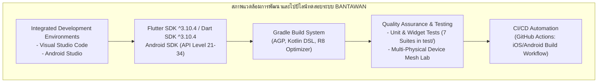

### 2.2.1 โปรแกรมแก้ไขโค้ดและสภาพแวดล้อมการพัฒนา (IDEs & DevTools)
1. **Visual Studio Code:** โปรแกรมแก้ไขโค้ดประสิทธิภาพสูง ใช้เป็นสภาพแวดล้อมหลักในการพัฒนาโค้ดภาษา Dart และ Flutter
2. **Android Studio:** ใช้สำหรับจัดการโครงสร้างฝั่ง Android เนทีฟ, การกำหนดสิทธิ์ใน Manifest, และการสร้าง Keystore สำหรับลงนามดิจิทัล (App Signing) [5]
3. **Dart DevTools:**
   * **Flutter Inspector:** วิเคราะห์โครงสร้างต้นไม้วิดเจ็ตและการจัดลำดับขนาดของ RenderObject
   * **Memory Profiler:** ตรวจสอบการใช้งานหน่วยความจำ RAM และป้องกัน Memory Leak จาก StreamSubscription
   * **Network Profiler:** วิเคราะห์ขนาดและเวลาแฝงของการส่ง HTTP Request ผ่านเครือข่าย

---

### 2.2.2 Android Studio, Android SDK และ Gradle Build System
* **Android SDK Build Tools & Platform Tools:** บริหารจัดการการคอมไพล์ไบต์โค้ดและการเชื่อมต่ออุปกรณ์ผ่าน Android Debug Bridge (`adb`)
* **การกำหนดระดับ API Levels:**
  * `minSdkVersion 21` (Android 5.0 Lollipop): เพื่อให้ครอบคลุมสมาร์ตโฟนรุ่นเก่าที่ยังใช้งานอยู่ในชุมชนห่างไกล
  * `compileSdkVersion 34` และ `targetSdkVersion 34` (Android 14): สอดคล้องกับข้อกำหนดความปลอดภัยล่าสุด
* **Gradle Build Automation:** ควบคุม Dependency เนทีฟ และเปิดใช้ระบบย่อขนาดโค้ด R8 เพื่อลดขนาดไฟล์ติดตั้ง APK

---

### 2.2.3 การจำลองระบบและระเบียบวิธีทดสอบด้วยอุปกรณ์จริงหลายเครื่อง (Multi-device Testing Strategy)
เนื่องจากเครื่องจำลองเสมือน (Android Virtual Device: AVD) มีข้อจำกัดทางกายภาพ ไม่สามารถจำลองการแพร่กระจายคลื่นวิทยุจริงของบลูทูธ (BLE Advertising / Scanning) และ Wi-Fi Direct ได้อย่างสมบูรณ์ โครงงานจึงกำหนดระเบียบวิธีทดสอบด้วย **สมาร์ตโฟนระบบปฏิบัติการ Android เครื่องจริงจำนวน 3 ถึง 5 เครื่อง** ต่างยี่ห้อและต่างสถาปัตยกรรม นำมาจัดตั้งเป็นโครงข่ายทดสอบการสื่อสารแบบ Peer-to-Peer ในสภาพแวดล้อมไร้คลื่นสัญญาณอินเทอร์เน็ตจริง

---

### 2.2.4 ระบบควบคุมเวอร์ชันของซอฟต์แวร์ (Version Control System)
โครงงานประยุกต์ใช้ระบบควบคุมเวอร์ชัน Git บนบริการ GitHub โดยใช้แนวทางที่ได้รับแรงบันดาลใจจาก Git Flow (Trunk-based ร่วมกับ Feature Branches) เพื่อควบคุมการพัฒนาและการรวมโค้ดเข้าสู่สาขาหลัก (`main`) อย่างเป็นระเบียบ

---

### 2.2.5 การรักษาคุณภาพและการเผยแพร่ซอฟต์แวร์ (Quality Assurance & CI/CD)

#### 1) การทดสอบซอฟต์แวร์ (Automated Testing)
โครงงานจัดเตรียมชุดทดสอบอัตโนมัติในโฟลเดอร์ `test/` จำนวน 7 ชุดทดสอบหลัก:
1. `hike_service_test.dart`: ทดสอบอัลกอริทึมการคำนวณระยะทาง ความเร็วเฉลี่ย และการบันทึกเส้นทางเดินเท้า
2. `medical_facility_classifier_test.dart`: ทดสอบการคัดกรองประเภทสถานพยาบาลและตัดสถานที่ที่ไม่เกี่ยวข้อง (เช่น ร้านค้าข้างโรงพยาบาล) ออกจากผลลัพธ์
3. `mesh_identity_conversation_test.dart`: ทดสอบระบบตัวตนดิจิทัล การสร้างคู่กุญแจ และการจับคู่ห้องสนทนา
4. `mesh_peer_discovery_test.dart`: ทดสอบตรรกะการตรวจจับและการลงทะเบียนโหนดเพื่อนบ้านในเครือข่ายเมช
5. `mule_envelope_test.dart`: ทดสอบการบรรจุซองจดหมายคนเดินสาร อายุการเก็บรักษา (TTL) และความสมบูรณ์ของเพย์โหลด
6. `notification_service_test.dart`: ทดสอบระบบยิงการแจ้งเตือนฉุกเฉินและการจัดลำดับความสำคัญของช่องสัญญาณแจ้งเตือน
7. `widget_test.dart`: ทดสอบความสมบูรณ์ในการเรนเดอร์โครงสร้างวิดเจ็ตพื้นฐาน

#### 2) ระบบรวมโค้ดและการสร้างไฟล์ติดตั้งอัตโนมัติ (CI/CD via GitHub Actions)
โครงงานมีการติดตั้งระบบอัตโนมัติผ่าน GitHub Actions ในไฟล์ `.github/workflows/ios_build.yml` ทำหน้าที่ตรวจสอบการคอมไพล์และการสร้างไฟล์ติดตั้งบนสภาพแวดล้อม macOS Runner อย่างสม่ำเสมอ

#### 3) การจัดทำเอกสารและ Semantic Versioning
โครงงานจัดเก็บบันทึกการเปลี่ยนแปลงตามมาตรฐาน **Semantic Versioning (MAJOR.MINOR.PATCH)** [30] ไว้ในไฟล์ `CHANGELOG.md` โดยมีประวัติการพัฒนาตั้งแต่ v1.0.0 จนถึงเวอร์ชัน v1.4.0 พร้อมระบบเอกสารทางเทคนิคในโฟลเดอร์ `docs/`

---

## 2.3 สถาปัตยกรรมระบบเครือข่ายไร้สายเฉพาะกิจและการสื่อสารออฟไลน์ (Ad-hoc Mesh Networking & Offline-First)

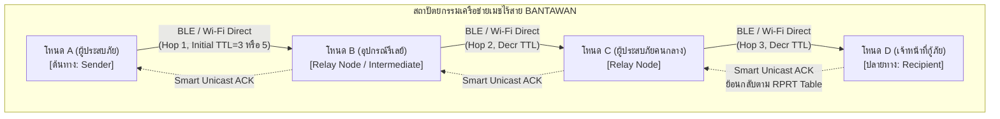

### 2.3.1 สถาปัตยกรรมแบบการทำงานออฟไลน์เป็นหลัก (Offline-First Architecture)

#### 1) ทฤษฎี CAP Theorem และ Eventual Consistency
ตามทฤษฎี **CAP Theorem** [31], [32] ระบบกระจายศูนย์ที่เกิดปัญหาเครือข่ายขาดช่วง (Network Partition: $P$) จะต้องเลือกระหว่าง **ความสอดคล้องของข้อมูล (Consistency: $C$)** หรือ **ความพร้อมใช้งานของระบบ (Availability: $A$)** ในบริบทของระบบกู้ภัยพิบัติ BANTAWAN เลือกให้ความสำคัญกับ **Availability ($A$) เป็นอันดับสูงสุด** นั่นคือผู้ประสบภัยต้องสามารถส่งสัญญาณขอความช่วยเหลือ ดูแผนที่ และใช้งานเครื่องมือได้ตลอดเวลา แม้ไม่มีเครือข่ายภายนอก โดยระบบยอมรับโมเดลความสอดคล้องแบบบั้นปลาย (**Eventual Consistency**) [33] ข้อมูลจะทยอยซิงก์สู่ความสอดคล้องเมื่อการเชื่อมต่อกลับคืนมา

แนวคิดนี้สอดคล้องกับหลักการ **Local-First Software** [34] ซึ่งกำหนดให้ข้อมูลหลักเป็นกรรมสิทธิ์และถูกเก็บรักษาไว้บนเครื่องของผู้ใช้เป็นลำดับแรก

#### 2) ลำดับการทำงานของระบบ Offline-First ใน BANTAWAN

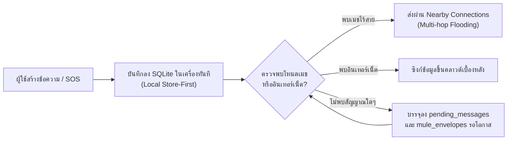

* **Offline Map & CacheMetadata:** ระบบแผนที่ใช้ `OfflineFallbackTileProvider` อ่านภาพแผ่นแผนที่จากแคชในเครื่อง (`map_tiles/{z}/{x}/{y}.png`) หากไม่พบจึงจะดึงจากอินเทอร์เน็ต พร้อมระบบ `CacheMetadata` ตรวจสอบอายุแคชข้อมูลสถานพยาบาลไม่เกิน 24 ชั่วโมง และทำลายแคชที่ค้างเกิน 7 วันโดยอัตโนมัติ

---

### 2.3.2 เครือข่ายไร้สายเฉพาะกิจเคลื่อนที่ (MANET) และเครือข่ายเมช (Mesh Network)

#### 1) การจำแนกโปรโตคอลการหาเส้นทางใน MANET

| ประเภทโปรโตคอล | กลไกหลัก | ตัวอย่าง | ข้อดี | ข้อจำกัดในภาวะภัยพิบัติ |
|:---|:---|:---|:---|:---|
| **Proactive (Table-driven)** | ปรับปรุงตารางเส้นทางทุกโหนดตลอดเวลา | DSDV [35], OLSR | ส่งข้อความได้ทันทีโดยไม่หน่วงเวลา | เปลืองแบนด์วิดท์วิทยุและแบตเตอรี่อย่างรุนแรง |
| **Reactive (On-demand)** | ค้นหาเส้นทางเมื่อต้องการส่งข้อความ | AODV [8], DSR | ประหยัดแบนด์วิดท์เมื่อไม่มีการส่ง | มีความหน่วงเวลาสูงในการค้นหาเส้นทางครั้งแรก |
| **Controlled Flooding** | กระจายข้อความไปรอบทิศทางโดยจำกัดขอบเขต | **BANTAWAN Mesh** | ทนทานต่อการเปลี่ยนโครงสร้างเครือข่าย ไม่ต้องรอค้นหาเส้นทาง | เสี่ยงต่อข้อความซ้ำซ้อน ต้องมีกลไกกำจัดซ้ำ |

#### 2) เหตุผลการเลือก Controlled Flooding ใน BANTAWAN
ในพื้นที่ประสบภัย โหนดสมาร์ตโฟนมีการเคลื่อนที่ตลอดเวลา เข้าและออกจากเครือข่ายอย่างคาดเดาไม่ได้ การรักษาตารางเส้นทางแบบ Proactive จะล้มเหลวและล้าสมัยอย่างรวดเร็ว ส่วนการค้นหาเส้นทางแบบ Reactive ก่อให้เกิดความหน่วงเวลาที่ไม่เหมาะสมต่อข้อความวิกฤตชีวิต โครงงานจึงเลือกใช้ **Controlled Flooding with Deduplication** ซึ่งมีความทนทานสูงสุดต่อโทโพโลยีที่เปลี่ยนแปลงตลอดเวลา

#### 3) การวิเคราะห์ปัญหา Broadcast Storm และการจำกัดขอบเขต
ปัญหา **Broadcast Storm** [36] เกิดขึ้นเมื่อโหนดทุกโหนดพยายามบรอดแคสต์ข้อความเดียวกันซ้ำๆ ก่อให้เกิดการชนกันของคลื่นสัญญาณ (Packet Collision) ระบบ BANTAWAN ป้องกันปัญหานี้ด้วยกลไก 2 ระดับ:
* **UUID Deduplication & LRU Cache:** แต่ละแพ็กเก็ตจะมี Message UUID เฉพาะ เมื่อโหนดใดได้รับแพ็กเก็ต จะนำ ID ไปเทียบกับแคช หากพบว่าเคยประมวลผลไปแล้ว จะละทิ้งทันที ทำให้ใน 1 รอบ ข้อความจะถูกส่งต่อจากแต่ละโหนด **ไม่เกิน 1 ครั้ง** ปริมาณข้อความจึงถูกจำกัดอยู่ที่ $O(N)$
* **การคำนวณรัศมีการสื่อสารสูงสุดเชิงทฤษฎี:**
  $$R_{max} \approx TTL \times r$$
  โดยที่ $r$ คือระยะการส่งสัญญาณวิทยุต่อหนึ่งทอด (Line-of-Sight ของ BLE/Wi-Fi Direct อยู่ที่ประมาณ 30 ถึง 50 เมตรในพื้นที่เปิดโล่ง)
  * ข้อความแชททั่วไป ($TTL = 3$): รัศมีครอบคลุมประมาณ $90 - 150$ เมตร
  * ข้อความขอความช่วยเหลือฉุกเฉิน SOS ($TTL = 5$): รัศมีครอบคลุมประมาณ $150 - 250$ เมตร และขยายได้ไกลหลายร้อยเมตรเมื่อมีโหนดคนเดินสารเคลื่อนที่

#### 4) การกำหนดค่า TTL ตามระดับความสำคัญ (Priority-based Dynamic Hop Count)
ระบบกำหนดค่าอายุขัยของแพ็กเก็ต (Time-To-Live) ตามระดับความสำคัญของข้อมูล:
* **ข้อความแชททั่วไป:** กำหนด $TTL = 3$ เพื่อประหยัดแบนด์วิดท์ของเครือข่าย
* **ข้อความฉุกเฉิน SOS:** กำหนด $TTL = 5$ เพื่อขยายขอบเขตการกระจายสัญญาณให้กว้างไกลที่สุด
* **Dynamic Hop Count Adjustment:** ระบบทำการตรวจวัดระยะการเดินทางจริงของแพ็กเก็ต และปรับเพิ่มหรือลดจำนวน Hop ที่อนุญาตให้เดินทางต่อไปได้อย่างสอดคล้องกับสภาพความหนาแน่นของโหนด

#### 5) การประกาศตัวตนรักษาการเชื่อมต่อ (Active Peer Announce)
ทุกๆ **25 วินาที** แต่ละโหนดจะทำการส่งแพ็กเก็ตกระจายตัวตน (Active Peer Announce) เพื่อแจ้งการมีอยู่ของตนและแลกเปลี่ยนรายชื่อโหนดข้างเคียง โดยใช้กลไกแบบ Soft-state ข้อมูลของโหนดที่ขาดการติดต่อเกินกว่าเวลาหมดอายุ (Timeout) จะถูกคัดออกจากตารางโหนดที่พร้อมใช้งานโดยอัตโนมัติ

#### 6) การตอบกลับใบเสร็จรับส่งเจาะจงท่อทางเดิม (Smart Reverse-Path Unicast ACK)
แทนที่จะส่งแพ็กเก็ตยืนยันการรับข้อความ (ACK) แบบกระจายทั่วเครือข่าย (Flooding) ซึ่งสร้างภาระแก่คลื่นสัญญาณ โหนดกลางทางจะบันทึกรหัสของโหนดต้นทางที่ส่งแพ็กเก็ตนั้นมาลงในตาราง **Reverse Path Routing Table (RPRT)** เมื่อโหนดปลายทางได้รับข้อความ แพ็กเก็ต ACK จะถูกส่งย้อนกลับผ่านเส้นทางเดิมแบบจุดต่อจุด (Unicast) ส่งผลให้สามารถ **ประหยัดแบนด์วิดท์ของคลื่นวิทยุได้มากกว่า 80%** เมื่อเทียบกับการบรอดแคสต์ ACK แบบเต็มรูปแบบ

---

### 2.3.3 เครือข่ายทนต่อความล่าช้า (DTN) และระบบคนเดินสาร (Data Mule)

#### 1) สถาปัตยกรรม DTN (Delay-Tolerant Networking)
ในกรณีที่เกิดภาวะเครือข่ายขาดออกจากกันเป็นหย่อมๆ (Network Partitioning) ทำให้ไม่มีเส้นทางเชื่อมโยงระหว่างผู้ประสบภัยกับศูนย์กู้ภัยในขณะนั้น ทฤษฎี DTN ตามมาตรฐาน RFC 4838 [37] และ Bundle Protocol RFC 5050 [38] ได้นำเสนอการแก้ปัญหาผ่านกลไก **Store-Carry-and-Forward**

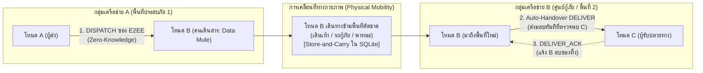
<div align="center"><b>รูปที่ 2.x: แผนภาพการทำงานของระบบ Delay-Tolerant Networking (DTN) ผ่านคนเดินสาร Data Mule ข้ามพื้นที่ตัดขาด</b></div>

| กลยุทธ์การส่งต่อใน DTN | หลักการทำงาน | จุดเด่น | ข้อจำกัด |
|:---|:---|:---|:---|
| **Epidemic Routing** [39] | โคลนข้อความส่งให้ทุกโหนดที่พบเจอ | โอกาสส่งถึงปลายทางสูงสุด | เปลืองพื้นที่จัดเก็บและพลังงานสูงมาก |
| **Spray and Wait** [40] | จำกัดจำนวนสำเนาที่จะแจกจ่าย | ควบคุมภาระของระบบได้ดี | ต้องบริหารโควตาสำเนาข้อความ |
| **Data Mule** [41] | ใช้อุปกรณ์เคลื่อนที่ทำหน้าที่ขนส่งข้อมูล | เหมาะสำหรับพื้นที่ห่างไกล ไม่ใช้พลังงานส่งคลื่นต่อเนื่อง | เวลาแฝงขึ้นกับการเคลื่อนที่ทางกายภาพ |

#### 2) การประยุกต์ใช้ใน BANTAWAN: ระบบซองจดหมายคนเดินสาร (Mule Envelope)
ข้อความที่ไม่สามารถส่งถึงผู้รับได้ทันทีจะถูกบรรจุลงในโครงสร้าง **Mule Envelope** และจัดเก็บลงในตาราง `mule_envelopes` ของฐานข้อมูล SQLite V6
* **ความปลอดภัยของคนเดินสาร (Zero-Knowledge Privacy):** ซองจดหมายข้อมูลจะถูกเข้ารหัสแบบ E2EE ด้วยกุญแจ X25519 ECDH + AES-256-GCM ของผู้รับปลายทางตั้งแต่ต้นทาง ทำให้เครื่องของคนเดินสาร (Data Mule Node) ทำหน้าที่เป็นเพียงผู้รับฝากและขนส่งข้อมูล โดยไม่สามารถอ่านหรือปลอมแปลงข้อความภายในซองจดหมายได้
* **การส่งมอบอัตโนมัติ (Auto-Handover):** ทันทีที่เครื่องคนเดินสารเดินเข้าสู่รัศมีการสื่อสารของโหนดผู้รับ ระบบจะตรวจจับผ่าน Connection Callback หรือ `PEER_ANNOUNCE` และส่งมอบซองจดหมายให้โดยอัตโนมัติ พร้อมส่งใบเสร็จ `DELIVER_ACK` กลับมาเพื่อให้เครื่องคนเดินสารลบซองออกจากฐานข้อมูล
* **การบริหารความเสี่ยง:** เพื่อป้องกันปัญหาการโจมตีแบบใช้ทรัพยากรจนหมดสิ้น (Resource Exhaustion Attack) หรือหน่วยความจำเต็ม ระบบได้กำหนดอายุเวลาหมดอายุของซองจดหมายไว้ที่ **48 ชั่วโมง** (`expiresAt`) และจำกัดขนาดสูงสุดของซองจดหมายไว้อย่างเคร่งครัด

---

### 2.3.4 วงจรชีวิตของสถานะข้อความ (Packet ACK & Delivery Lifecycle)

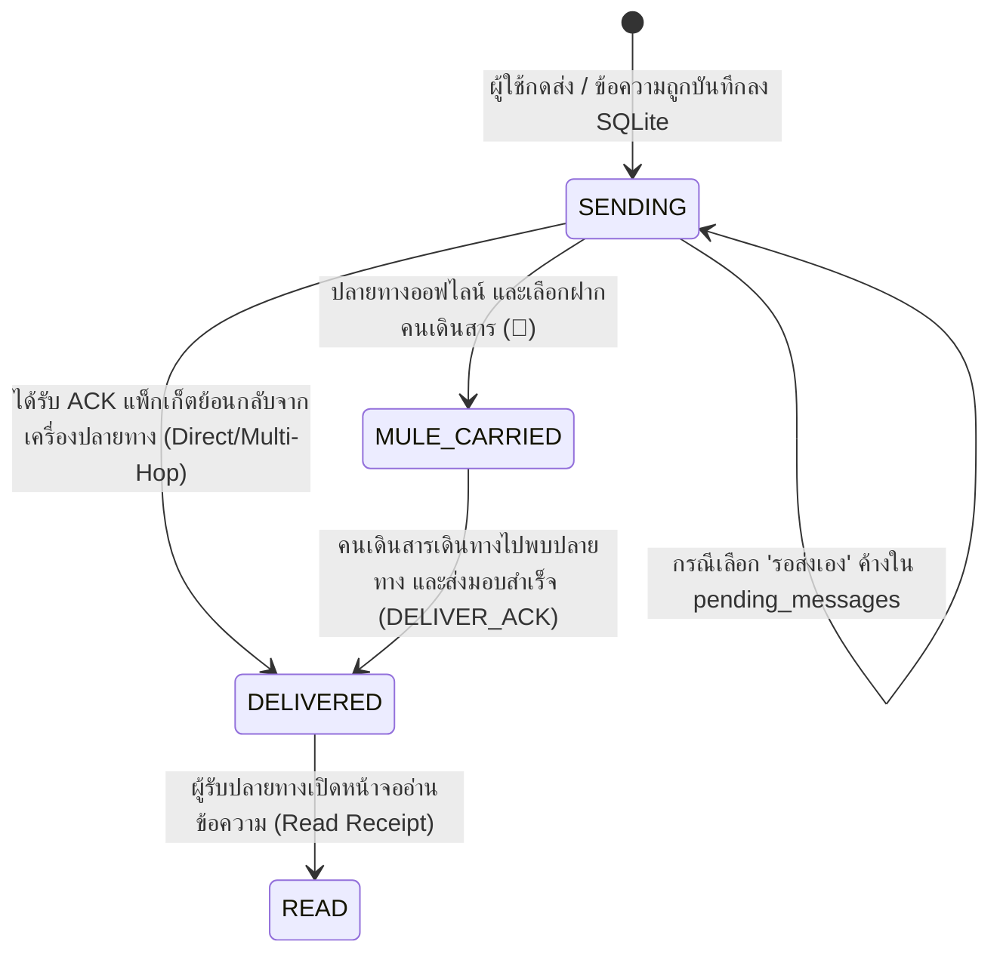

* `SENDING`: ข้อความถูกส่งออกจากเครื่องแล้วและกำลังเดินทางในเครือข่ายเมช
* `MULE_CARRIED`: ข้อความถูกฝากไว้กับคนเดินสารเรียบร้อยแล้ว กำลังเดินทางไปหาผู้รับ
* `DELIVERED`: ข้อความเดินทางถึงเครื่องปลายทางเรียบร้อยแล้ว
* `READ`: ผู้รับปลายทางเปิดหน้าจออ่านข้อความนั้นจริง

---

### 2.3.5 เทคโนโลยี Google Nearby Connections API

#### 1) วงจรการเชื่อมต่อ (Connection Lifecycle)
1. **Advertising:** โหนดประกาศตัวตนด้วย Service ID เฉพาะของระบบ BANTAWAN
2. **Discovery:** โหนดข้างเคียงสแกนค้นหาอุปกรณ์ที่ประกาศบริการเดียวกัน
3. **Connection Handshake:** ทำการส่งคำขอเชื่อมต่อและยืนยันตัวตนอัตโนมัติ
4. **Payload Transfer:** การรับส่งข้อมูลผ่าน 2 รูปแบบหลัก:
   * `Payload.BYTES`: ส่งข้อมูลข้อความขนาดเล็ก แพ็กเก็ตโครงสร้าง JSON พิกัด และสัญญาณฉุกเฉิน
   * `Payload.FILE` หรือ Base64 Chunking: ใช้สำหรับการส่งไฟล์เสียงและภาพถ่ายเหตุการณ์
5. **Disconnect:** จัดการปิดการเชื่อมต่อเมื่อโหนดเคลื่อนที่หลุดออกจากระยะสัญญาณ

#### 2) ข้อจำกัดเชิงเทคนิคและการแก้ไข
* **ข้อจำกัดของแพลตฟอร์ม:** Nearby Connections ทำงานบน Google Play Services ของ Android เป็นหลัก ทำให้การสื่อสารเมชข้ามระบบไปยัง iOS ไม่รองรับโดยตรง ระบบจึงกำหนดให้ Android เป็นแพลตฟอร์มเป้าหมายหลัก
* **การบริหารพลังงาน:** การสแกนและการค้นหาพร้อมกันตลอดเวลาสิ้นเปลืองพลังงาน ระบบจึงมีตัวจัดการความถี่และตัดสลับเข้าสู่โหมดประหยัดพลังงานเมื่อแบตเตอรี่ลดต่ำลง
* **ความจำเป็นของ E2EE:** แม้ Nearby Connections จะมีการเข้ารหัสระดับลิงก์ (Link-layer Encryption) แต่โหนดกลางทางที่ทำหน้าที่รีเลย์สามารถเข้าถึงเพย์โหลดได้ ระบบจึงต้องซ้อนทับด้วยชั้นการเข้ารหัส **End-to-End Encryption (E2EE)** ในระดับแอปพลิเคชัน

---

## 2.4 ทฤษฎีความมั่นคงปลอดภัยและการเข้ารหัสลับข้อมูล (Cryptography & Security Architecture)

### 2.4.0 แบบจำลองภัยคุกคามและเป้าหมายด้านความปลอดภัย (Threat Model & Security Goals)
ก่อนเลือกใช้อัลกอริทึมการเข้ารหัสลับ จำเป็นต้องกำหนดแบบจำลองภัยคุกคาม (Threat Model) อย่างชัดเจน ในเครือข่ายเมชไร้สาย **ทุกแพ็กเก็ตข้อมูลจะต้องเดินทางผ่านอุปกรณ์ของผู้อื่น** ผู้โจมตีจึงอาจเป็นโหนดคนกลางที่ร่วมอยู่ในเครือข่าย หรือผู้ดักฟังคลื่นวิทยุในพื้นที่ใกล้เคียง แบบจำลองภัยคุกคามของระบบตั้งอยู่บนสมมติฐานตามแบบจำลอง Dolev–Yao ว่าผู้โจมตีมีความสามารถในการ:
1. ดักรับและบันทึกแพ็กเก็ตคลื่นวิทยุทั้งหมดที่ผ่านไปมา (Eavesdropping)
2. ดัดแปลง แทรกแซง หรือส่งแพ็กเก็ตซ้ำในเครือข่าย (Tampering & Replaying)
3. เข้าร่วมเครือข่ายเสมือนเป็นโหนดผู้ใช้งานทั่วไป (Impersonation)
4. **แต่ผู้โจมตีไม่สามารถเข้าถึงพื้นที่จัดเก็บกุญแจส่วนตัว (Private Key) ภายในฮาร์ดแวร์ของผู้ใช้ได้**

#### ตารางที่ 2.1: เป้าหมายความมั่นคงปลอดภัยตามหลัก CIA Triad และกลไกที่ตอบสนองในระบบ BANTAWAN

| ภัยคุกคาม (Threats) | คุณสมบัติที่ต้องรักษา | กลไกทางเทคนิคในระบบ BANTAWAN | หัวข้ออ้างอิง |
|:---|:---|:---|:---:|
| **ดักฟังข้อความ (Eavesdropping)** | ความลับ (Confidentiality) | AES-256-CTR ด้วยกุญแจที่สกัดจาก X25519 ECDH + HKDF | 2.4.1 |
| **แก้ไขข้อความระหว่างทาง (Tampering)** | บูรณภาพ (Integrity) | HMAC-SHA256 แบบ Generic Encrypt-then-MAC | 2.4.1 |
| **ส่งแพ็กเก็ตเก่าซ้ำ (Replay Attack)** | ความสดใหม่ (Freshness) | Nonce Cache (LRU + TTL 15 นาที) และตาราง SQLite | 2.4.2 |
| **แอบอ้างตัวตน / คนกลาง (MITM)** | การพิสูจน์ตัวตน (Authentication) | การตรวจสอบ Public Key Fingerprint และ QR Code | 2.4.4 |
| **ขโมยกุญแจจากตัวเครื่อง** | ความลับของกุญแจ (Key Secrecy) | Android Keystore System ผ่าน `flutter_secure_storage` | 2.4.3 |
| **ท่วมเครือข่ายด้วยข้อความปลอม (DoS)** | ความพร้อมใช้งาน (Availability) | การจำกัด Hop TTL, UUID Deduplication, และ Ingress Limiter | 2.3.2 |

**ขอบเขตที่ระบบไม่ครอบคลุม (Security Limitations):**
เนื่องจากระบบทำงานบนสถาปัตยกรรมแบบกระจายศูนย์ (Flooding-based Relay) ข้อมูลส่วนหัวของแพ็กเก็ต (ได้แก่ Packet ID, TTL, Sender Node ID, และ Recipient Node ID) จำเป็นต้องเปิดเผยเพื่อให้โหนดกลางสามารถอ่านและตัดสินใจส่งต่อแพ็กเก็ตได้ ส่งผลให้ยังคงมีช่องว่างของการรั่วไหลของข้อมูลเมทาดาทา (Metadata Leakage) และการวิเคราะห์การจราจรเครือข่าย (Traffic Analysis) ได้

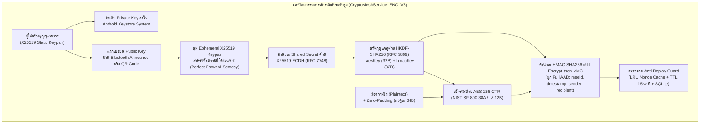

---

### 2.4.1 การเข้ารหัสจากต้นทางถึงปลายทาง (End-to-End Encryption: E2EE)

#### 1) การแลกเปลี่ยนกุญแจบนเส้นโค้งวงรี (X25519 ECDH)
* **ที่มาและมาตรฐาน:** ฟังก์ชัน X25519 บนเส้นโค้ง Curve25519 ออกแบบโดย Daniel J. Bernstein [42] ได้รับการรับรองในมาตรฐาน RFC 7748 [13] มีจุดเด่นด้านความเร็วในการประมวลผลสูง และต้านทานการโจมตีแบบช่องทางด้านข้าง (Side-channel Attacks เช่น Timing Attacks) ได้เหนือกว่าเส้นโค้งมาตรฐานดั้งเดิม
* **การจัดรูปกุญแจ (Clamping):** กุญแจส่วนตัวขนาด 32 ไบต์จะถูกปรับบิตตามข้อกำหนด RFC 7748 (เคลียร์บิต 0, 1, 2 และบิต 255 พร้อมทั้งตั้งบิต 254) เพื่อให้ค่าสเกลาร์เป็นผลคูณของ cofactor ($h=8$) ป้องกันการโจมตีแบบ Small-subgroup Attack
* **การตรวจสอบจุดผิดปกติ (Low-order Point Rejection):** ระบบตรวจสอบผลลัพธ์ของกระบวนการ ECDH หากได้ผลลัพธ์เป็นศูนย์ทั้งหมด (All-zero Output) ซึ่งเกิดจากอีกฝ่ายส่งกุญแจสาธารณะที่เป็นจุด Low-order Point ระบบจะทำการปฏิเสธทันที
* **การรักษาความลับไปข้างหน้า (Perfect Forward Secrecy: PFS):** เพื่อแก้ปัญหาของระบบที่ใช้กุญแจคงที่ (Static Key) ซึ่งหากกุญแจส่วนตัวรั่วไหลในอนาคตจะทำให้ข้อความในอดีตถูกถอดรหัสได้ทั้งหมด ระบบ BANTAWAN ในโหมด `ENC_V5` ได้นำเสนอการสร้าง **Ephemeral X25519 KeyPair แบบสุ่มใหม่ทุกข้อความ** ทำให้กุญแจลับร่วม (Shared Secret) ของแต่ละข้อความเป็นอิสระจากกัน แม้กุญแจหลักของเครื่องจะถูกขโมยในภายหลัง ผู้โจมตีก็ไม่สามารถถอดรหัสข้อความในอดีตได้

#### 2) ฟังก์ชันสกัดอนุพันธ์กุญแจคู่ขนาน (HKDF-SHA256 Dual Key Derivation)
ตามมาตรฐาน RFC 5869 [14] ระบบนำ Shared Secret ที่ได้จาก X25519 มาสกัดผ่าน HKDF-SHA256 โดยกำหนด Info String เป็น:
$$\text{Info} = \text{"BantawanAES256GCM\_v5::"}\parallel \text{senderId} \parallel \text{"::"} \parallel \text{recipientId}$$
เพื่อทำ Domain Separation ป้องกันการสับสนของบริบทการใช้งาน โดยทำการสกัดกุญแจความยาว 64 ไบต์ และแบ่งออกเป็น 2 ส่วนอย่างเด็ดขาด:
* **$K_{enc}$ (ไบต์ที่ 0–31):** กุญแจขนาด 256 บิต สำหรับการเข้ารหัสข้อความด้วย AES-256
* **$K_{mac}$ (ไบต์ที่ 32–63):** กุญแจขนาด 256 บิต สำหรับการรับรองความถูกต้องด้วย HMAC-SHA256

#### 3) การเข้ารหัสลับสมมาตรระดับบล็อก (AES-256-CTR)
ตามมาตรฐาน NIST SP 800-38A [11] โหมด Counter (CTR) แปลงบล็อกไซเฟอร์ให้ทำงานแบบสตรีม:
* **ข้อกำหนดสำคัญ (Nonce Uniqueness):** ความปลอดภัยของโหมด CTR ขึ้นอยู่กับเงื่อนไขสำคัญสูงสุดคือ **ห้ามใช้คู่ (กุญแจ, IV) ซ้ำกันโดยเด็ดขาด** ระบบจึงใช้ตัวสร้างเลขสุ่มระดับความปลอดภัยสูง (CSPRNG: `Random.secure()`) ในการสร้างค่า IV ขนาด 12 ไบต์ (96 บิต) ใหม่ทุกครั้งที่ส่งข้อความ
* **การป้องกันการดัดแปลง (Malleability Defense):** เนื่องจากโหมด CTR มีคุณสมบัติ Malleable (การพลิกบิตใน Ciphertext จะส่งผลให้บิตเดียวกันใน Plaintext พลิกตาม) ระบบจึง **บังคับใช้การตรวจสอบรหัส HMAC กำกับเสมอ** ก่อนที่จะนำข้อมูลไปถอดรหัส

#### 4) การประกอบการเข้ารหัสและการรับรองความถูกต้อง (Generic Encrypt-then-MAC)
เพื่อความมั่นคงปลอดภัยสูงสุด ระบบเลือกใช้รูปแบบการประกอบแบบ **Encrypt-then-MAC** ซึ่งได้รับการพิสูจน์ทางทฤษฎีโดย Bellare และ Namprempre [44] ว่าเป็นรูปแบบการประกอบที่ปลอดภัยที่สุดเมื่อใช้กุญแจอิสระต่อกัน (เทียบเท่าหลักการใน RFC 7366 [15] ของโพรโทคอล TLS):

| ทางเลือกสถาปัตยกรรม | ข้อดี | ข้อจำกัด |
|:---|:---|:---|
| **AES-256-CTR + HMAC-SHA256 (Encrypt-then-MAC)** | ประกอบจากอัลกอริทึมมาตรฐานสากล แยกกุญแจอิสระ ปลอดภัยสูงสุด | ต้องเขียนฟังก์ชันควบคุมลำดับการทำงานเอง |
| **AES-256-GCM** | เป็นมาตรฐาน AEAD สำเร็จรูป ประมวลผลเร็ว | ความปลอดภัยพังทลายทันทีหากเกิด Nonce Reuse |
| **ChaCha20-Poly1305** | ทำงานได้รวดเร็วบนอุปกรณ์ที่ไม่มีชุดคำสั่งเร่งความเร็ว AES | ต้องติดตั้งไลบรารีส่วนขยายเพิ่มเติม |

* **การตรวจสอบเวลาคงที่ (Constant-time Comparison):** การเปรียบเทียบรหัส MAC ระหว่างค่าที่คำนวณได้กับค่าที่ได้รับ กระทำโดยหลีกเลี่ยงการใช้ตัวดำเนินการ `==` ของสตริงทั่วไป เพื่อป้องกันการโจมตีแบบวิเคราะห์เวลา (Timing Attack)
* **การตรวจสอบ MAC ก่อนถอดรหัส (Authenticate-before-Decrypt):** หากค่า MAC ไม่ตรงกัน ระบบจะหยุดการประมวลผลทันทีโดยไม่มีการเรียกฟังก์ชันถอดรหัส AES

#### 5) โครงสร้างรูปแบบแพ็กเก็ตที่เข้ารหัสจริง (ENC_V5 Packet Structure)
แพ็กเก็ตที่เข้ารหัสของระบบ BANTAWAN มีโครงสร้างการจัดเรียงข้อความสตริงที่คั่นด้วยสัญลักษณ์ `::` ดังนี้:
$$\text{ENC\_V5} \ :: \ \text{ephemeralPubHex} \ :: \ \text{ivBase64} \ :: \ \text{msgId} \ :: \ \text{timestamp} \ :: \ \text{cipherBase64} \ :: \ \text{mac}$$

* **การพรางความยาวข้อความ (Zero-Padding):** ระบบนำข้อความ Plaintext มาเติม Null Bytes ให้ความยาวรวมเป็นทวีคูณของ 64 ไบต์ก่อนการเข้ารหัส เพื่อพรางความยาวของข้อความจริง ป้องกันการโจมตีด้วยการวิเคราะห์ขนาดข้อมูล (Traffic Analysis)
* **การผูกข้อมูลกำกับบริบท (Full AAD Binding):** ข้อมูลที่นำมาคำนวณร่วมใน HMAC ประกอบด้วย:
  $$\text{AAD} = \text{ephemeralPubHex} \parallel \text{ivBase64} \parallel \text{cipherBase64} \parallel \text{senderId} \parallel \text{recipientId} \parallel \text{msgId} \parallel \text{timestamp}$$
  ทำให้ผู้โจมตีไม่สามารถสลับรหัสผู้ส่ง ผู้รับ หรือนำข้อความไปใส่ในบทสนทนาอื่นได้

---

### 2.4.2 การป้องกันการโจมตีแบบส่งซ้ำ (Anti-Replay Attack Guard)
การโจมตีแบบส่งซ้ำในเครือข่ายออฟไลน์มีความท้าทายอย่างยิ่งเนื่องจากอุปกรณ์สมาร์ตโฟนไม่สามารถซิงค์เวลากับเซิร์ฟเวอร์ Network Time Protocol (NTP) ได้ ทำให้อาจเกิดความคลาดเคลื่อนของเวลาประจำเครื่อง (Clock Skew) ระบบจึงออกแบบกลไกป้องกัน 2 ระดับ:
1. **LRU Nonce Cache with TTL:** จัดเก็บค่า Nonce Key (`$ephemeralPubHex::$ivBase64::$msgId`) ไว้ในหน่วยความจำ RAM โครงสร้างแบบ Least Recently Used สูงสุด 2,000 รายการ (ใช้หน่วยความจำประมาณ 200 KB) กำหนดอายุขัย 15 นาที สำหรับตรวจจับแพ็กเก็ตซ้ำในการสื่อสารแบบเรียลไทม์
2. **Persistent SQLite Tracking:** บันทึกรหัส Packet ID ลงในตาราง `processed_packets` ถาวร เพื่อปิดช่องโหว่กรณีที่มีแพ็กเก็ตไหลเข้ามาเกิน 2,000 รายการจนเกิดการ Evict แคชใน RAM
3. **การจัดการเวลาของระบบคนเดินสาร (Data Mule Handling):** สำหรับข้อความที่ฝากส่งผ่านคนเดินสารซึ่งต้องใช้เวลาเดินทางนานกว่า 15 นาที ระบบจะยกเว้นการตรวจสอบหน้าต่างเวลา 15 นาทีของ Nonce Cache แต่จะใช้การตรวจสอบผ่านรหัสซองจดหมายในตาราง `mule_envelopes` และวันหมดอายุของซองจดหมาย (**72 ชั่วโมง**) แทน

---

### 2.4.3 การจัดเก็บกุญแจลับระดับฮาร์ดแวร์ (Hardware-backed Keystore)
ระบบจัดเก็บกุญแจลับส่วนตัว (X25519 Private Key) ผ่านไลบรารี `flutter_secure_storage`:
* **กลไกการทำงาน:** บนระบบปฏิบัติการ Android ระบบจะสร้างกุญแจหลัก (Master Key) ขึ้นภายใน **Android Keystore System** ซึ่งได้รับการปกป้องโดยชิปความปลอดภัยระดับฮาร์ดแวร์ (Trusted Execution Environment: TEE หรือ StrongBox Keymaster) [16] แล้วนำกุญแจหลักดังกล่าวมาทำการห่อหุ้ม (Key Wrapping) เข้ารหัสกุญแจส่วนตัว X25519 อีกชั้นหนึ่งก่อนจัดเก็บลงในพื้นที่เก็บข้อมูลความลับของแอปพลิเคชัน
* **ระดับความปลอดภัย:** ช่วยให้วัสดุกุญแจไม่สามารถถูกส่งออก (Non-exportable) ไปยังภายนอกได้โดยง่าย และแอปพลิเคชันอื่นไม่สามารถเข้าถึงได้ อย่างไรก็ดี ระดับการคุ้มครองจะขึ้นอยู่กับฮาร์ดแวร์ของสมาร์ตโฟนแต่ละรุ่น โดยอุปกรณ์รุ่นประหยัดอาจใช้การคุ้มครองระดับซอฟต์แวร์ของระบบปฏิบัติการแทน

---

### 2.4.4 การตรวจสอบตัวตนและลายนิ้วมือกุญแจสาธารณะ (Identity Fingerprint & QR Code Verification)
* **แบบจำลอง Trust On First Use (TOFU):** ในการพบกันครั้งแรกผ่านสัญญาณวิทยุ โหนดจะแลกเปลี่ยนกุญแจสาธารณะอัตโนมัติ ซึ่งอาจมีความเสี่ยงต่อการถูกแทรกแซงแบบ Man-in-the-Middle (MITM)
* **การตรวจสอบนอกช่องทาง (Out-of-band Verification):** เพื่อความปลอดภัยขั้นสูงสุด ผู้ใช้สามารถทำการยืนยันตัวตนซึ่งกันและกันผ่านช่องทางกายภาพ โดยการสแกนรหัส QR Code ของกุญแจสาธารณะต่อหน้ากัน
* **โครงสร้าง Key Fingerprint:** ระบบคำนวณลายนิ้วมือดิจิทัลจาก SHA-256 ของกุญแจสาธารณะ และจัดรูปแบบแสดงผลเป็นเลขฐานสิบหก 32 ตัวอักษร แบ่งเป็น 8 กลุ่ม กลุ่มละ 4 ตัวอักษร เช่น:
  $$\text{"8B80 91A2 7C31 45F0"}$$
  $$\text{"A91D 8E21 6C44 1FC0"}$$
* **ข้อจำกัดเชิงวิชาการ:** การพิสูจน์ตัวตนด้วยวิธีนี้ช่วยยืนยันความถูกต้องของกุญแจปลายทาง แต่ไม่ให้คุณสมบัติการไม่อาจปฏิเสธความรับผิด (Non-repudiation) ทางกฎหมาย เนื่องจากกระบวนการรับรองข้อความใช้รหัส HMAC ที่เกิดจากความลับร่วม (Symmetric Shared Secret) มิใช่ลายเซ็นดิจิทัลแบบกุญแจอสมมาตร (Asymmetric Digital Signature เช่น Ed25519)

---

### 2.4.5 ประเด็นความมั่นคงปลอดภัยของข้อความขอความช่วยเหลือฉุกเฉิน (SOS Security Trade-off)
ข้อความขอความช่วยเหลือฉุกเฉิน (SOS Alert) มีข้อขัดแย้งเชิงนโยบายระหว่าง **"การรักษาความลับ (Confidentiality)"** กับ **"ความพร้อมในการเข้าถึงข้อมูล (Availability & Reachability)"** เนื่องจากผู้ประสบภัยจำเป็นต้องให้เจ้าหน้าที่กู้ภัยหรือผู้คนในบริเวณใกล้เคียงทุกคนได้รับรู้พิกัดของตน แม้จะไม่เคยแลกเปลี่ยนกุญแจสาธารณะกันมาก่อนก็ตาม

ระบบ BANTAWAN จึงกำหนดให้:
* **ข้อความแชทส่วนตัว (Private Chat):** บังคับใช้การเข้ารหัสแบบ E2EE V5 เต็มรูปแบบ
* **สัญญาณขอความช่วยเหลือฉุกเฉิน (SOS Broadcast):** ส่งข้อมูลในรูปแบบ **บรอดแคสต์สาธารณะ (Unencrypted Broadcast)** เพื่อให้ทุกโหนดในรัศมีเครือข่ายเมชสามารถเปิดอ่านพิกัดละติจูด/ลองจิจูด และนำทางเข้าช่วยเหลือได้ทันที โดยยอมรับความเสี่ยงเรื่องการเปิดเผยพิกัดตำแหน่งของผู้ประสบภัยต่อโหนดอื่นในบริเวณนั้น เพื่อแลกกับโอกาสรอดชีวิตสูงสุด

---

## 2.5 ระบบสารสนเทศภูมิศาสตร์ การเรนเดอร์แผนที่ และการคำนวณเชิงพื้นที่ (GIS & Geospatial Analysis)

### 2.5.0 พื้นฐานระบบพิกัดและการหาตำแหน่ง (Geodetic Coordinates & GNSS)
* **ระบบพิกัด WGS84 (World Geodetic System 1984):** พิกัดมาตรฐานสากลที่ใช้ระบุตำแหน่งบนผิวโลกด้วยค่าละติจูด ($\phi$) และลองจิจูด ($\lambda$) ในหน่วยองศาทศนิยม
* **ระบบดาวเทียมนำทางสากล (Global Navigation Satellite System: GNSS):** สมาร์ตโฟนสมัยใหม่รองรับการรับสัญญาณจากกลุ่มดาวเทียมหลายระบบพร้อมกัน (GPS สหรัฐฯ, GLONASS รัสเซีย, Galileo สหภาพยุโรป, และ BeiDou จีน) ทำให้มีความแม่นยำระดับ 3–5 เมตรในพื้นที่เปิดโล่ง
* **ข้อจำกัด Cold Start และ Assisted GPS (A-GPS):** ในสภาวะปกติ สมาร์ตโฟนจะใช้อินเทอร์เน็ตในการดาวน์โหลดข้อมูลวงโคจรดาวเทียมล่วงหน้า (A-GPS) แต่ในพื้นที่ภัยพิบัติที่ไร้อินเทอร์เน็ต ชิปเซ็ตจะต้องรับข้อมูล Ephemeris จากดาวเทียมโดยตรง ส่งผลให้การจับสัญญาณพิกัดครั้งแรก (Time to First Fix: TTFF) อาจใช้เวลานานขึ้นเป็น 1–3 นาที
* **ไลบรารี `geolocator`:** ใช้เข้าถึงพิกัดฮาร์ดแวร์โดยปรับระดับความแม่นยำเป็น `LocationAccuracy.high` ในโหมดแผนที่ และปรับลดเป็น `LocationAccuracy.medium` ในโหมดประหยัดพลังงาน

---

### 2.5.1 โครงสร้างไทล์แผนที่บนเว็บ (Slippy Map Tiles & Pyramidal Tiling Structure)
การแสดงผลแผนที่ดิจิทัลบนอุปกรณ์เคลื่อนที่ทำงานบนพื้นฐานของมาตรฐาน **Slippy Map Tiles** [17]:
* **ระบบการฉายแผนที่โลก (Spherical Mercator Projection: EPSG:3857):** ทำการแปลงพื้นผิวโลกทรงกลมสามมิติให้กลายเป็นระนาบสองมิติแบบสี่เหลี่ยมจัตุรัส ขอบเขตละติจูดใช้งานอยู่ที่ $\pm 85.0511^\circ$

#### 1) สูตรคณิตศาสตร์การแปลงพิกัดเป็นหมายเลขแผ่นไทล์ ($X, Y, Z$)
สำหรับระดับการซูม $Z$ และพิกัดภูมิศาสตร์ละติจูด $\phi$ และลองจิจูด $\lambda$ (หน่วยองศา):
$$X = \left\lfloor \frac{\lambda + 180}{360} \cdot 2^{Z} \right\rfloor$$

$$Y = \left\lfloor \frac{1 - \dfrac{\ln\left(\tan\phi + \sec\phi\right)}{\pi}}{2} \cdot 2^{Z} \right\rfloor$$

ฟังก์ชันนี้ถูกนำไปใช้ในโมดูลดาวน์โหลดแผนที่ออฟไลน์ เพื่อแปลงกรอบขอบเขต Bounding Box (BBox) ให้กลายเป็นช่วงหมายเลขแผ่นภาพ $(X_{min}, X_{max}, Y_{min}, Y_{max})$

#### 2) ความละเอียดภาคพื้นดิน (Ground Resolution)
ขนาดพื้นที่จริงบนผิวโลกต่อหนึ่งพิกเซลของภาพแผนที่คำนวณได้จาก:
$$\text{Resolution} = \frac{156{,}543.03 \cdot \cos\phi}{2^{Z}} \quad (\text{เมตร/พิกเซล})$$
ที่บริเวณเส้นศูนย์สูตร ระดับการซูม $Z=13$ ให้ความละเอียดประมาณ 19.1 เมตร/พิกเซล และระดับ $Z=16$ ให้ความละเอียดสูงถึง 2.39 เมตร/พิกเซล ซึ่งเพียงพอสำหรับการมองเห็นแนวถนนและอาคารสถานพยาบาล

#### 3) การประมาณขนาดพื้นที่จัดเก็บแผนที่ออฟไลน์
สำหรับการจัดเก็บพื้นที่ปลอดภัยขนาดรัศมี 10 กิโลเมตร (พื้นที่สี่เหลี่ยมด้านละ 20 กิโลเมตร):

| ระดับการซูม ($Z$) | ความกว้างต่อแผ่นไทล์ (กม.) | จำนวนแผ่นไทล์ต่อด้าน (ประมาณ) | จำนวนแผ่นไทล์รวม |
|:---:|:---:|:---:|:---:|
| **13** | 4.89 | 5 | 25 |
| **14** | 2.45 | 9 | 81 |
| **15** | 1.22 | 17 | 289 |
| **16** | 0.61 | 33 | 1,089 |
| **รวม ($Z=13$ ถึง $16$)** | | | **$\approx$ 1,484 แผ่น** |

เมื่อภาพ PNG แต่ละแผ่นมีขนาดเฉลี่ย 15–20 KB พื้นที่จัดเก็บรวมจะอยู่ที่ประมาณ **22 – 30 MB** ซึ่งเป็นขนาดที่เหมาะสมอย่างยิ่งสำหรับหน่วยความจำของสมาร์ตโฟนทั่วไป

#### 4) นโยบายการใช้งานไทล์ (Tile Usage Policy Discussion)
มูลนิธิ OpenStreetMap มีข้อกำหนดการใช้งานไทล์ (Tile Usage Policy) [45] ที่เข้มงวด โดยไม่อนุญาตให้ทำการดาวน์โหลดแผ่นภาพปริมาณมาก (Bulk Prefetching) จากเซิร์ฟเวอร์สาธารณะ `tile.openstreetmap.org` สำหรับการนำไปใช้งานในเชิงพาณิชย์หรือระบบขนาดใหญ่ โครงงานนี้ทำการทดสอบในขอบเขตการศึกษาทางวิชาการ และสำหรับระบบปฏิบัติการจริงในอนาคต ขอเสนอแนะให้ใช้การตั้งเซิร์ฟเวอร์แสดงผลไทล์เฉพาะทางของหน่วยงานกู้ภัย หรือการบรรจุแผนที่เวกเตอร์ในรูปแบบไฟล์ก้อนเดียวล่วงหน้า เช่น **MBTiles**

#### 5) กลไกผู้ให้บริการแผนที่สำรอง (OfflineFallbackTileProvider)
ระบบใช้กลไก Fallback ในการแสดงผลแผนที่: เมื่อต้องการแสดงผลแผ่นภาพที่พิกัด $\{z\}/\{x\}/\{y\}$ ระบบจะทำการค้นหาไฟล์ในหน่วยความจำของเครื่อง (`map_tiles/{z}/{x}/{y}.png`) ก่อนเป็นลำดับแรก หากพบจะนำมาวาดบนหน้าจอทันทีโดยมีความหน่วงต่ำมากระดับการเข้าถึงไฟล์ในเครื่อง และหากไม่พบจึงจะส่งคำขอไปยังเซิร์ฟเวอร์เครือข่าย

---

### 2.5.2 การคำนวณระยะทางและทิศทางบนผิวทรงกลมโลก
เมื่อระบบอยู่ในโหมดออฟไลน์ ระบบคำนวณระยะทางตรงระหว่างผู้ใช้ $(\phi_1, \lambda_1)$ กับสถานพยาบาล $(\phi_2, \lambda_2)$ ด้วย **สูตรฮาเวอร์ซีน (Haversine Formula)** [18]:

$$a = \sin^2\left(\frac{\Delta\phi}{2}\right) + \cos(\phi_1) \cdot \cos(\phi_2) \cdot \sin^2\left(\frac{\Delta\lambda}{2}\right)$$

$$c = 2 \cdot \text{atan2}\left(\sqrt{a}, \sqrt{1-a}\right)$$

$$d = R \cdot c \quad (\text{รัศมีโลกเฉลี่ย } R \approx 6,371 \text{ กิโลเมตร})$$

* **ความคลาดเคลื่อนของ Haversine:** สูตร Haversine ตั้งอยู่บนสมมติฐานว่าโลกเป็นทรงกลมสมบูรณ์ จึงมีความคลาดเคลื่อนประมาณ **ร้อยละ 0.5** (ประมาณ 5 เมตรต่อระยะทาง 1 กิโลเมตร) เมื่อเทียบกับทรงรีจริงของโลก [46] ซึ่งมีความแม่นยำเพียงพอสำหรับการค้นหาและจัดลำดับสถานพยาบาลที่ใกล้ที่สุด

#### 1) การคำนวณมุมทิศเริ่มต้น (Initial Bearing Navigation)
เพื่อนำทางแบบลูกศรชี้ตรงในโหมดออฟไลน์ ระบบคำนวณมุมทิศ $\theta$ จากพิกัดเริ่มต้นไปยังพิกัดเป้าหมายตามหลักตรีโกณมิติ [46]:
$$\theta = \text{atan2}\left(\sin\Delta\lambda \cdot \cos\phi_2, \ \cos\phi_1 \cdot \sin\phi_2 - \sin\phi_1 \cdot \cos\phi_2 \cdot \cos\Delta\lambda\right)$$
แล้วแปลงมุม $\theta$ ให้อยู่ในช่วง $0^\circ - 360^\circ$ นำมาลบด้วยมุมทิศหัวเครื่องจากเข็มทิศแม่เหล็ก เพื่อให้ลูกศรบนหน้าจอหมุนชี้ตรงไปยังสถานพยาบาลเสมอ

#### 2) การประมาณเวลาเดินเท้าเมื่อออฟไลน์ (Walking ETA Estimation)
ในคลาส `RoutingRepositoryImpl` ระบบทำการคำนวณเวลาเดินเท้าโดยประมาณตามสูตร:
$$\text{Time (minutes)} = \left(\frac{d}{v}\right) \times 60$$
โดยกำหนดอัตราความเร็วเฉลี่ยของการเดินเท้าบนพื้นราบ $v = 5 \text{ กิโลเมตร/ชั่วโมง}$ ทั้งนี้ ระยะทางดังกล่าวเป็นระยะขจัดตรง (Direct Distance) ซึ่งในความเป็นจริงอาจต้องใช้เวลามากกว่านี้ตามสิ่งกีดขวางบนเส้นทางจริง

---

### 2.5.3 การจัดการแผนที่และสายการประมวลผลข้อมูลสถานพยาบาล (POI Pipeline)

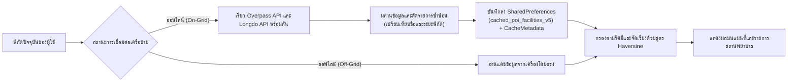

* **นโยบายอายุข้อมูล (Cache Invalidation Strategy):** ข้อมูลสถานพยาบาลที่บันทึกไว้เกิน 24 ชั่วโมงจะถือว่าหมดอายุสำหรับการค้นหาใหม่ แต่หากระบบอยู่ในโหมดออฟไลน์ ระบบจะยอมรับการแสดงผลข้อมูลเดิมที่แคชไว้ (**Stale-while-offline**) เพราะข้อมูลเดิมยังคงมีคุณค่าต่อการเอาชีวิตรอดมากกว่าการไม่แสดงข้อมูลใดๆ
* **การล้างแคชเก่า (Cache Eviction):** ข้อมูลแคชที่ไม่มีการเข้าถึงเกิน 7 วัน จะถูกลบทิ้งโดยอัตโนมัติเพื่อคืนพื้นที่หน่วยความจำให้แก่อุปกรณ์

---

## 2.6 ส่วนต่อประสานโปรแกรมประยุกต์ภายนอก (External Web APIs)

### 2.6.0 สถาปัตยกรรม REST API และการจัดการความผิดพลาดในภาวะวิกฤต (REST & Fault Tolerance)
บริการภายนอกทั้งหมดที่ระบบ BANTAWAN เชื่อมต่อ ทำงานบนสถาปัตยกรรม **Representational State Transfer (REST)** ผ่านโพรโทคอล HTTP/HTTPS และแลกเปลี่ยนข้อมูลในรูปแบบ **JavaScript Object Notation (JSON)** ในสภาวะภัยพิบัติที่เครือข่ายสัญญาณมีความผันผวนสูง ระบบได้รับการออกแบบตามหลักวิศวกรรมความคงทนต่อความผิดพลาด (Fault Tolerance) 4 ประการ:

1. **การกำหนดเวลาหมดอายุของคำขอ (Network Timeouts):** ทุกการเรียกผ่านเครือข่ายจะถูกจำกัดเวลาไม่เกิน 8 ถึง 15 วินาที เพื่อป้องกันปัญหาเธรดการประมวลผลถูกบล็อก (Blocking I/O) จนทำให้หน้าจอผู้ใช้ค้าง
2. **กลไกการสลับเซิร์ฟเวอร์สำรอง (Automated Failover & Mirrors):** หากเซิร์ฟเวอร์หลักไม่ตอบสนองหรือถูกจำกัดอัตราคำขอ (HTTP 429 Too Many Requests หรือ HTTP 504 Gateway Timeout) ระบบจะสลับไปเรียกเซิร์ฟเวอร์มิเรอร์สำรองโดยอัตโนมัติ
3. **การถดถอยการทำงานอย่างสง่างาม (Graceful Degradation):** เมื่อการเชื่อมต่ออินเทอร์เน็ตล้มเหลวโดยสมบูรณ์ ระบบจะตัดสลับเข้าสู่โหมดออฟไลน์และนำข้อมูลล่าสุดที่แคชไว้ในเครื่อง (Stale Cache) ขึ้นมาแสดงผลแทนการแจ้งข้อผิดพลาด
4. **ความปลอดภัยของกุญแจเข้าถึง (API Key Security):** กุญแจ API เช่น คีย์ของ Longdo Map หรือ SerpApi จะถูกจัดเก็บผ่านตัวแปรสภาพแวดล้อม (Environment Variables / `.env`) ไม่ฝังลงในซอร์สโค้ดสาธารณะ

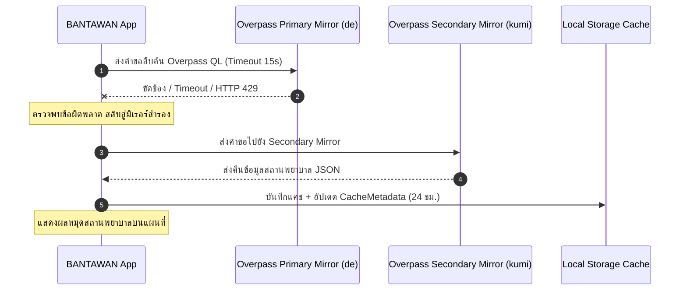

---

### 2.6.1 OpenStreetMap และ Overpass API (การสืบค้นข้อมูลสถานพยาบาล)
OpenStreetMap (OSM) เป็นฐานข้อมูลสารสนเทศภูมิศาสตร์ระดับโลกที่จัดเก็บข้อมูลในโครงสร้าง 3 รูปแบบหลัก ได้แก่ **Node** (จุดพิกัดเดี่ยว), **Way** (เส้นทางหรือขอบเขตปิด), และ **Relation** (ความสัมพันธ์เชิงพื้นที่) [17]

**Overpass API** เป็นเครื่องมือประเภท Read-Only REST API ที่ให้บริการสืบค้นข้อมูลเฉพาะเจาะจงจากฐานข้อมูล OSM ผ่านภาษา **Overpass Query Language (Overpass QL)** [19] โดยระบบ BANTAWAN ใช้คิวรีในการค้นหาสถานพยาบาลและคลินิกในรัศมีที่กำหนดดังตัวอย่าง:

```text
[out:json][timeout:15];
(
  node["amenity"~"hospital|clinic|doctors"](around:5000, 7.1988, 100.5954);
  way["amenity"~"hospital|clinic|doctors"](around:5000, 7.1988, 100.5954);
  node["healthcare"~"hospital|clinic|doctor"](around:5000, 7.1988, 100.5954);
);
out center;
```

**กลไกมิเรอร์สำรอง 4 แหล่ง (Quad-Mirror Failover):**  
เนื่องจากเซิร์ฟเวอร์สาธารณะของ Overpass API มีข้อจำกัดด้านโหลดการใช้งานและมักเกิดการปฏิเสธคำขอ คลาส `OverpassService` จึงได้กำหนดรายการมิเรอร์สำรอง 4 แห่งทั่วโลก โดยจะสลับใช้งานตามลำดับหากพบข้อผิดพลาด:
1. `https://overpass-api.de/api/interpreter` (เซิร์ฟเวอร์หลัก - ประเทศเยอรมนี)
2. `https://overpass.kumi.systems/api/interpreter` (มิเรอร์สำรอง 1)
3. `https://maps.mail.ru/osm/tools/overpass/api/interpreter` (มิเรอร์สำรอง 2)
4. `https://overpass.openstreetmap.fr/api/interpreter` (มิเรอร์สำรอง 3 - ประเทศฝรั่งเศส)

---

### 2.6.2 Longdo Map API และระบบค้นหาสถานที่ในประเทศไทย (Longdo POI Search)
Longdo Map เป็นระบบแผนที่และค้นหาสถานที่สัญชาติไทย พัฒนาโดยบริษัท เมทราไบต์ จำกัด (Metamedia Technology Co., Ltd.) [21] มีจุดเด่นสำคัญคือ **ความครอบคลุมและความแม่นยำของฐานข้อมูลสถานที่ (Point of Interest: POI) ภาษาไทย** รวมถึงชื่อตรอก ซอก ซอย และชุมชนท้องถิ่นที่ละเอียดกว่าฐานข้อมูลแผนที่สากล

ระบบประยุกต์ใช้บริการของ Longdo ผ่าน 2 รูปแบบหลัก:
1. **Longdo POI Search API:** เรียกผ่าน Endpoint `https://search.longdo.com/mapsearch/jsonsearch` โดยส่งพิกัดละติจูด ลองจิจูด รัศมีการค้นหา (`span`), คำสำคัญ (`keyword="โรงพยาบาล"` หรือ `"คลินิก"`), และจำนวนผลลัพธ์ (`limit`) เพื่อนำรายชื่อสถานพยาบาล เบอร์โทรศัพท์ และที่อยู่ภาษาไทยมาผสานร่วมกับข้อมูลจาก OpenStreetMap
2. **Longdo Live Traffic Layer:** เชื่อมต่อเลเยอร์ไทล์รายงานสภาพการจราจรแบบเรียลไทม์เพื่อแสดงความหนาแน่นของการจราจรบนเส้นทางในภาวะปกติและช่วงเริ่มต้นการอพยพ

---

### 2.6.3 OSRM Routing Engine (การคำนวณเส้นทางและขั้นตอนวิธีบีบอัด Polyline)
Open Source Routing Machine (OSRM) เป็นระบบคำนวณเส้นทางประสิทธิภาพสูงที่ทำงานบนกราฟถนนของ OpenStreetMap [20] โดยประมวลผลล่วงหน้าด้วยอัลกอริทึม **Contraction Hierarchies (CH)** เพื่อให้สามารถหาเส้นทางที่สั้นที่สุดและเร็วที่สุดได้ในระดับมิลลิวินาที

ระบบเรียกใช้ OSRM ผ่าน REST Endpoint:
```text
https://router.project-osrm.org/route/v1/driving/{lon1},{lat1};{lon2},{lat2}?overview=full&geometries=polyline
```

ผลลัพธ์ที่ได้รับประกอบด้วยระยะทางรวม (เมตร), เวลาเดินทางโดยประมาณ (วินาที), และเรขาคณิตของเส้นทางในรูปแบบ **Encoded Polyline Algorithm** ซึ่งมีขั้นตอนการบีบอัดข้อมูลดังนี้:
1. นำค่าพิกัดละติจูดและลองจิจูดแต่ละจุดมาคูณด้วย $10^5$ แล้วปัดเศษเป็นเลขจำนวนเต็ม
2. ทำการเข้ารหัสผลต่างพิกัดระหว่างจุดปัจจุบันกับจุดก่อนหน้า (Delta Encoding)
3. แปลงค่าผลต่างให้อยู่ในรูปแบบ Two's Complement และเลื่อนบิตไปทางซ้าย 1 บิต (Left Shift) หากค่าเป็นลบจะทำการกลับบิต (Bitwise Inversion)
4. แบ่งข้อมูลออกเป็นก้อนขนาด 5 บิต และบวกด้วย $63$ เพื่อแปลงเป็นรหัส ASCII ที่พิมพ์ได้ (Printable ASCII Characters) ช่วยลดขนาดข้อมูลพิกัดเส้นทางลงได้มากกว่าร้อยละ 80

---

### 2.6.4 Open-Meteo Weather API และ Air Quality API (พยากรณ์อากาศและมลพิษ)
Open-Meteo เป็นบริการ API ด้านอุตุนิยมวิทยาและคุณภาพอากาศแบบโอเพนซอร์สที่ไม่มีการเรียกเก็บค่าบริการและไม่ต้องใช้ API Key [22] เหมาะสำหรับการพัฒนาระบบฉุกเฉินสาธารณะ

1. **Weather Forecast API:** สืบค้นข้อมูลสภาพอากาศ อุณหภูมิ ความชื้นสัมพัทธ์ ความเร็วลม และรหัสสภาพอากาศตามมาตรฐานขององค์การอุตุนิยมวิทยาโลก (WMO Weather Interpretation Codes) เช่น รหัส 0 (ท้องฟ้าแจ่มใส), 61–65 (ฝนตก), 95–99 (พายุฟ้าคะนอง) เพื่อนำมาแปลงเป็นข้อความและไอคอนเตือนภัย
2. **Air Quality API:** ดึงข้อมูลมลพิษทางอากาศจากแบบจำลอง **Copernicus Atmosphere Monitoring Service (CAMS)** [48] ครอบคลุมพารามิเตอร์:
   * $\text{PM}_{2.5}$ (ฝุ่นละอองขนาดไม่เกิน 2.5 ไมครอน)
   * $\text{PM}_{10}$ (ฝุ่นละอองขนาดไม่เกิน 10 ไมครอน)
   * $\text{CO}$ (คาร์บอนมอนอกไซด์)
   * $\text{NO}_2$ (ไนโตรเจนไดออกไซด์)
   * $\text{O}_3$ (โอโซน)
3. **เกณฑ์มาตรฐานการแจ้งเตือน PM2.5 ในโค้ดจริง (`weather_service.dart`):**  
   ระบบตัดสินระดับอันตรายตามเกณฑ์มาตรฐานคุณภาพอากาศในบรรยากาศของประเทศไทย (ปรับปรุง พ.ศ. 2566 โดยคณะกรรมการสิ่งแวดล้อมแห่งชาติ [49]):
   * **$\text{PM}_{2.5} > 50 \ \mu\text{g/m}^3$:** ระดับ **"มีผลกระทบต่อสุขภาพ (อันตราย)"**
   * **$\text{PM}_{2.5} > 35 \ \mu\text{g/m}^3$:** ระดับ **"เริ่มมีผลกระทบต่อสุขภาพ"** (สอดคล้องกับค่าเฉลี่ย 24 ชั่วโมง $37.5 \ \mu\text{g/m}^3$ ของไทย)
   * **$\text{PM}_{2.5} > 25 \ \mu\text{g/m}^3$:** ระดับ **"ปานกลาง"**
   * **$\text{PM}_{2.5} \le 25 \ \mu\text{g/m}^3$:** ระดับ **"ดีมาก / ปกติ"**

---

### 2.6.5 SerpApi และ Google Local Search API (ระบบค้นหาสถานพยาบาลสำรอง)
เพื่อป้องกันกรณีที่ข้อมูลสถานพยาบาลใน OpenStreetMap หรือ Longdo ในพื้นที่ชนบทห่างไกลไม่สมบูรณ์ โครงงานได้ผนวกบริการ **SerpApi** ซึ่งทำหน้าที่เป็น REST Proxy ในการสืบค้นข้อมูลตำแหน่งจาก Google Maps และ Google Local Search:
* ช่วยดึงรายชื่อคลินิกชุมชน โรงพยาบาลส่งเสริมสุขภาพตำบล (รพ.สต.) และร้านขายยาในพื้นที่รอบข้าง พร้อมหมายเลขโทรศัพท์ติดต่อและสถานะเวลาทำการ
* ผลลัพธ์ถูกนำมาประมวลผลผ่านสายงาน POI Deduplication เพื่อตัดรายการที่ซ้ำซ้อนกับ OSM ออกก่อนบันทึกลงหน่วยความจำแคชของเครื่อง

---

### 2.6.6 Komoot Photon API และ OpenStreetMap Nominatim (บริการ Geocoding)
การระบุตำแหน่งในการแพทย์ฉุกเฉินต้องการข้อมูลที่เป็นทั้งตัวเลขพิกัดและชื่อสถานที่ที่มนุษย์เข้าใจได้ ระบบจึงประยุกต์ใช้บริการ Geocoding 2 แหล่ง:
1. **Komoot Photon API:** บริการค้นหาสถานที่แบบเปิดที่สร้างขึ้นบนฐานข้อมูล OpenStreetMap ร่วมกับเอนจิน Elasticsearch รองรับการค้นหาแบบพิมพ์ไม่ครบ (Typeahead / Autocomplete) และการแปลงพิกัดกลับเป็นที่อยู่ (Reverse Geocoding)
2. **OSM Nominatim:** ใช้แปลงค่าพิกัด $(\phi, \lambda)$ ให้กลายเป็นชื่อถนน ตำบล อำเภอ และจังหวัดในประเทศไทย เพื่อนำไปใส่ในเนื้อหาข้อความ SMS ขอความช่วยเหลือฉุกเฉิน โดยระบบปฏิบัติตามนโยบายการใช้งาน (Usage Policy) อย่างเคร่งครัด ได้แก่ การจำกัดอัตราไม่เกิน 1 คำขอต่อวินาที และการระบุ User-Agent Header เฉพาะของระบบ BANTAWAN [47]

---

### ตารางที่ 2.2: สรุปส่วนต่อประสานโปรแกรมประยุกต์ภายนอก (External APIs) ที่ใช้ในระบบ

| บริการ API | บทบาทหน้าที่หลักในระบบ | ความต้องการอินเทอร์เน็ต | กลไกสำรองเมื่อออฟไลน์หรือบริการล้มเหลว |
|:---|:---|:---:|:---|
| **Overpass API** | ค้นหาโรงพยาบาลและคลินิกจาก OSM | ต้องใช้อินเทอร์เน็ต | สลับมิเรอร์สำรอง 4 แหล่ง + อ่านแคชในเครื่อง |
| **Longdo Map API** | สืบค้น POI ภาษาไทยและสภาพจราจรสด | ต้องใช้อินเทอร์เน็ต | สลับใช้ OSM + อ่านแคชสถานพยาบาลในเครื่อง |
| **OSRM Routing Engine** | คำนวณเส้นทางขับขี่เลี้ยวต่อเลี้ยว | ต้องใช้อินเทอร์เน็ต | นำทางตรงด้วยลูกศรเข็มทิศ + คำนวณ ETA เดินเท้า |
| **Open-Meteo Weather** | พยากรณ์อุณหภูมิ ฝน ความเร็วลม WMO | ต้องใช้อินเทอร์เน็ต | แสดงข้อมูลสภาพอากาศล่าสุดที่ถูกแคชไว้ |
| **Open-Meteo Air Quality**| ตรวจสอบฝุ่น PM2.5, PM10, AQI (CAMS) | ต้องใช้อินเทอร์เน็ต | แสดงข้อมูลมลพิษล่าสุดที่ถูกแคชไว้ |
| **SerpApi / Google Local**| ค้นหาสถานพยาบาลและร้านยาสำรอง | ต้องใช้อินเทอร์เน็ต | ใช้ข้อมูลจาก Overpass และ Longdo ทดแทน |
| **Photon / Nominatim** | แปลงพิกัดเป็นชื่อสถานที่ (Geocoding) | ต้องใช้อินเทอร์เน็ต | แสดงผลเฉพาะตัวเลขพิกัด WGS84 บริสุทธิ์ |

---

## 2.7 การควบคุมฮาร์ดแวร์ เซนเซอร์สมาร์ตโฟน และระบบฐานข้อมูลภายใน

### 2.7.1 เซนเซอร์เข็มทิศดิจิทัล (Magnetometer)
* **ทิศเหนือแม่เหล็กและทิศเหนือจริง:** เซนเซอร์แมกนีโตมิเตอร์ตรวจจับ **ทิศเหนือแม่เหล็ก (Magnetic North)** ซึ่งมีความคลาดเคลื่อนจากทิศเหนือจริง (True North) ตามค่าเบี่ยงเบนแม่เหล็กประจำถิ่น (Magnetic Declination) ในการนำทางฉุกเฉิน ค่าความคลาดเคลื่อนนี้อยู่ในระดับที่ยอมรับได้สำหรับการเดินเท้าเข้าหาจุดปลอดภัย
* **การรบกวนและการสอบเทียบ (Sensor Calibration):** สนามแม่เหล็กจากโลหะหรืออุปกรณ์อิเล็กทรอนิกส์ใกล้เคียง (Hard-iron/Soft-iron Interference) อาจทำให้เข็มทิศคลาดเคลื่อน ผู้ใช้สามารถทำการสอบเทียบได้โดยการแกว่งสมาร์ตโฟนเป็นรูปเลข 8 ในอากาศ
* **การนำทางโดยไม่พึ่งพาดาวเทียม:** เข็มทิศสามารถทำงานได้อย่างสมบูรณ์ในอาคาร ใต้ดิน หรือในหุบเขาอับสัญญาณดาวเทียม

---

### 2.7.2 ระบบประเมินสุขภาพอุปกรณ์และพลังงาน
* **การลดพลังงานบนหน้าจอ AMOLED:** หน้าจอ AMOLED ส่องสว่างด้วยเม็ดพิกเซลอิสระ การใช้ธีมดำสนิท (#000000) ทำให้เม็ดพิกเซลดับสนิท ช่วยลดการใช้พลังงานได้จริงเมื่อเทียบกับจอ LCD แบบมีไฟ Backlight
* **การรับมือ Doze Mode และ App Standby:** ระบบปฏิบัติการ Android มีกลไก Doze Mode [50] เพื่อจำกัดกิจกรรมเบื้องหลังเมื่อปิดหน้าจอ ระบบ BANTAWAN แก้ปัญหานี้ด้วยการประกาศใช้ **Foreground Service** ร่วมกับสิทธิ์ `FOREGROUND_SERVICE_CONNECTED_DEVICE` และ `WAKE_LOCK` เพื่อให้การสแกนและส่งต่อข้อความเมชทำงานต่อเนื่องแม้หน้าจอดับลง
* **เกณฑ์ประหยัดพลังงานวิกฤต (20% Threshold):** เมื่อระดับแบตเตอรี่ลดต่ำกว่าร้อยละ 20 ระบบจะปรับลดทอนรอบการส่ง Peer Announce จากทุก 25 วินาที เป็นทุก 60 วินาที เพื่อสงวนพลังงานให้ใช้งานได้นานที่สุด

---

### 2.7.3 ระบบเสียง มัลติมีเดีย และสัญญาณไฟฉุกเฉิน
* **โครงสร้างเวลารหัสมอร์สสากล (Morse Code SOS Timing):** ตามคำแนะนำของสหภาพโทรคมนาคมระหว่างประเทศ ITU-R M.1677-1 [51] โดยในคลาส `EmergencyToolService` ของระบบ กำหนดค่าเวลาฐาน $T = 200 \text{ มิลลิวินาที}$:

| สัญลักษณ์ | สัญญาณ | ระยะเวลาเปิดไฟ (ms) | ระยะเวลาปิดไฟ (ms) | คำอธิบายตามมาตรฐาน |
|:---:|:---:|:---:|:---:|:---|
| **S** | $\cdot \ \cdot \ \cdot$ | 200, 200, 200 | 200, 200, 600 | จุดสั้น 3 ครั้ง ($1T$) คั่น $1T$ และเว้นท้ายอักษร $3T$ |
| **O** | $- \ - \ -$ | 600, 600, 600 | 200, 200, 600 | ขีดยาว 3 ครั้ง ($3T$) คั่น $1T$ และเว้นท้ายอักษร $3T$ |
| **S** | $\cdot \ \cdot \ \cdot$ | 200, 200, 200 | 200, 200, 1000 | จุดสั้น 3 ครั้ง ($1T$) คั่น $1T$ และหยุดรอบ $5T$ |

* **การส่ง SMS ฉุกเฉิน:** ใช้แพ็กเกจ `url_launcher` ส่งผ่าน `sms:?body=...` URI Scheme ไปยังแอปพลิเคชันข้อความของระบบ เพื่อเปิดให้ผู้ใช้ยืนยันการส่งพิกัด ซึ่งสอดคล้องกับนโยบายความปลอดภัยของ Google Play Store โดยไม่ต้องขอสิทธิ์อันตราย `SEND_SMS`
* **ข้อจำกัดของเสียงสังเคราะห์ภาษาไทย (Text-to-Speech):** การอ่านออกเสียงขั้นตอนปฐมพยาบาลภาษาไทยพึ่งพาชุดเอนจิน Google Text-to-Speech ที่ติดตั้งบนระบบปฏิบัติการ หากอุปกรณ์บางรุ่นไม่มีการดาวน์โหลดชุดเสียงภาษาไทยออฟไลน์ไว้ล่วงหน้า ระบบจะแสดงผลคำแนะนำเป็นข้อความบนหน้าจอควบคู่กันเสมอ

---

### 2.7.4 ระบบฐานข้อมูลภายในอุปกรณ์ (SQLite V6 Schema Architecture)
ฐานข้อมูล SQLite ภายในเครื่อง (`bantawan_chat.db`) ทำงานตามคุณสมบัติ **ACID** (Atomicity, Consistency, Isolation, Durability) เพื่อความมั่นใจว่าข้อมูลข้อความฉุกเฉินจะไม่สูญหายแม้เครื่องดับกะทันหัน โดยมีโครงสร้างคำสั่งสคีมาเวอร์ชัน 6 และดัชนี (Indexes) ครบถ้วนทั้ง 5 ตาราง:

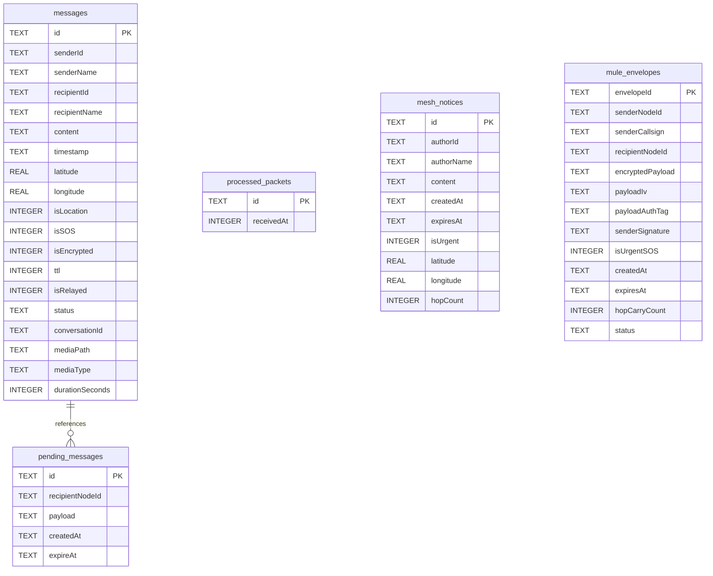

* **การย้ายสคีมา (Database Migration):** จัดการผ่านฟังก์ชัน `onUpgrade` ของ `sqflite` เพื่อให้ผู้ใช้สามารถอัปเดตแอปพลิเคชันเวอร์ชันใหม่ได้โดยไม่สูญเสียประวัติการสนทนาเดิม

---

## 2.8 ทฤษฎีการแพทย์ฉุกเฉินและงานวิจัยที่เกี่ยวข้อง (Emergency Medicine & Literature Review)

### 2.8.0 ขอบเขตความรับผิดชอบทางการแพทย์ (Medical Disclaimer)
แอปพลิเคชัน BANTAWAN ถูกออกแบบมาเพื่อทำหน้าที่เป็น **คู่มือสนับสนุนการตัดสินใจเบื้องต้น (First Aid Decision Support)** เท่านั้น ไม่สามารถใช้ทดแทนการวินิจฉัย การรักษา หรือการดูแลโดยบุคลากรทางการแพทย์มืออาชีพได้ ในกรณีที่สามารถติดต่อสื่อสารได้ ผู้ใช้ต้องโทรแจ้งสายด่วนการแพทย์ฉุกเฉิน **1669** หรือหน่วยกู้ภัยในทันที

---

### 2.8.1 มาตรฐานการกู้ชีพและการปฐมพยาบาลเบื้องต้น (First Aid Protocols)
ข้อมูลการปฐมพยาบาลในแอปพลิเคชันอ้างอิงตามแนวทางสากลของ American Heart Association (AHA 2020 Guidelines) [52], [53], สถาบันการแพทย์ฉุกเฉินแห่งชาติ (สพฉ.), และสภากาชาดไทย:
1. **การช่วยฟื้นคืนชีพขั้นพื้นฐาน (CPR):**
   * กำหนดอัตราความเร็วของการกดหน้าอกที่ **100 – 120 ครั้งต่อนาที (BPM)** กดลึก 5–6 เซนติเมตร ปล่อยให้อกคืนตัวสุด และทำการกดต่อเนื่อง สอดคล้องกับเสียงจังหวะเมโทรนอมในตัวแอปพลิเคชัน
2. **การห้ามเลือดและการขันชะเนาะ (Hemorrhage Control & Tourniquet):**
   * **กรณีที่ใช้ขันชะเนาะได้:** บาดแผลฉีกขาดขนาดใหญ่ที่มีเลือดพุ่งออกจากหลอดเลือดแดงบริเวณแขนหรือขา ซึ่งการกดแผลโดยตรง (Direct Pressure) ไม่สามารถหยุดเลือดได้ [54] โดยต้องบันทึกเวลาที่รัดและห้ามคลายออกเอง
   * **กรณีที่ห้ามขันชะเนาะ:** **กรณีถูกงูพิษกัด** ห้ามทำการขันชะเนาะหรือรัดแน่นอย่างเด็ดขาด เพราะจะทำให้เนื้อเยื่อส่วนปลายขาดเลือดจนเน่าตาย [55]
3. **การปฐมพยาบาลกรณีงูพิษกัด:** ให้อวัยวะที่ถูกกัดอยู่นิ่งที่สุด ดามด้วยผ้ายืดหลวมๆ ห้ามกรีดแผล ห้ามดูดพิษ และรีบนำส่งโรงพยาบาลพร้อมจดจำลักษณะของงู
4. **โรคลมแดด (Heatstroke):** ย้ายผู้ป่วยเข้าที่ร่ม และทำการ **ลดอุณหภูมิร่างกายให้เร็วที่สุด** ด้วยการใช้น้ำเย็นเช็ดตัวและพัดวี [56] ห้ามให้น้ำดื่มหากผู้ป่วยหมดสติ
5. **แผลไฟไหม้และน้ำร้อนลวก:** ให้ใช้น้ำสะอาดอุณหภูมิห้องไหลผ่านบริเวณแผลเป็นเวลา **10 – 20 นาที** ห้ามใช้น้ำแข็งประคบโดยตรง และปิดแผลด้วยผ้าสะอาดหลวมๆ

---

### 2.8.2 การทบทวนวรรณกรรมและการเปรียบเทียบระบบที่เกี่ยวข้อง (Literature Review)

จากการศึกษางานวิจัยและระบบสื่อสารในภาวะฉุกเฉินที่มีอยู่ในปัจจุบัน:
1. **Bridgefy [24]:** แอปพลิเคชันส่งข้อความผ่านบลูทูธเมชยอดนิยม แต่ในเวอร์ชันก่อนหน้ามีรายงานการตรวจพบช่องโหว่ความปลอดภัยในการเข้ารหัสและการรั่วไหลของข้อมูลระบุตัวตน [58] อีกทั้งไม่มีฟังก์ชันแผนที่ออฟไลน์หรือชุดเครื่องมือแพทย์ฉุกเฉิน
2. **FireChat [25]:** แอปพลิเคชันส่งข้อความออฟไลน์รุ่นบุกเบิก แต่ขาดระบบการเข้ารหัสลับแบบ E2EE ที่รัดกุมและยุติการพัฒนาไปแล้ว
3. **Briar [26]:** แอปพลิเคชันโอเพนซอร์สที่มีระบบความปลอดภัยสูงมากผ่านเครือข่าย Tor และบลูทูธ แต่ถูกออกแบบสำหรับนักกิจกรรมทางการเมือง ขาดระบบการจัดการภัยพิบัติ แผนที่ และเครื่องมือเอาชีวิตรอด
4. **Serval Mesh Project [27]:** ระบบเครือข่ายเมชระดับงานวิจัยเพื่อการกู้ภัย แต่ต้องการการดัดแปลงสิทธิ์ระดับสูงของระบบปฏิบัติการ (Root Access) ทำให้ยากต่อการใช้งานของประชาชนทั่วไป
5. **GoTenna Mesh [28]:** ระบบส่งข้อความผ่านคลื่นวิทยุ VHF/UHF ระยะไกล แต่มีข้อจำกัดอย่างยิ่งคือผู้ใช้ต้องซื้ออุปกรณ์ฮาร์ดแวร์ภายนอกราคาแพงมาเชื่อมต่อเพิ่มเติม
6. **Meshtastic [57]:** โครงการโอเพนซอร์สเครือข่ายเมชความถี่ต่ำด้วยโมดูล LoRa (Long Range) สามารถสื่อสารได้ไกลหลายกิโลเมตรและกินพลังงานต่ำมาก แต่ผู้ใช้ต้องพกพาอุปกรณ์เสริมภายนอกและมีอัตราการส่งข้อมูลต่ำ
7. **Apple Emergency SOS via Satellite:** ระบบส่งข้อความขอความช่วยเหลือฉุกเฉินผ่านดาวเทียมวงโคจรต่ำ แต่จำกัดเฉพาะสมาร์ตโฟนระดับไฮเอนด์รุ่นใหม่ และต้องการพื้นที่โล่งที่มองเห็นท้องฟ้าโดยไม่มีสิ่งบดบัง

---

### ตารางที่ 2.3: การเปรียบเทียบคุณสมบัติเชิงเทคนิคระหว่างระบบ BANTAWAN กับระบบสื่อสารออฟไลน์ที่เกี่ยวข้อง

| คุณสมบัติและเทคโนโลยี | Bridgefy [24] | Briar [26] | Serval Mesh [27] | GoTenna [28] | Meshtastic [57] | **ระบบ BANTAWAN (โครงงานนี้)** |
|:---|:---:|:---:|:---:|:---:|:---:|:---:|
| **1. การทำงานแบบไร้อินเทอร์เน็ต** | รองรับ | รองรับ | รองรับ | รองรับ | รองรับ | **รองรับสมบูรณ์ (Offline-First)** |
| **2. ความต้องการอุปกรณ์ฮาร์ดแวร์ภายนอก** | ไม่ต้องการ | ไม่ต้องการ | ไม่ต้องการ | ต้องใช้อุปกรณ์เสริม | ต้องใช้อุปกรณ์เสริม | **ไม่ต้องการ (ใช้สมาร์ตโฟนทั่วไป)** |
| **3. สื่อกลางการส่งสัญญาณ** | BLE | BLE / Wi-Fi | Wi-Fi Ad-hoc | คลื่นวิทยุ VHF/UHF | คลื่นวิทยุ LoRa | **BLE + Wi-Fi Direct (Nearby API)** |
| **4. การส่งต่อข้อมูลหลายทอด (Multi-hop)** | รองรับ | รองรับ | รองรับ | รองรับ | รองรับ | **รองรับ (TTL + RPRT + Dedup)** |
| **5. กลไกคนเดินสาร (Data Mule / DTN)** | มีจำกัด | รองรับ | มีจำกัด | มีจำกัด | มีจำกัด | **รองรับ (Store-Carry-and-Forward 72 ชม.)** |
| **6. การเข้ารหัสลับแบบ E2EE** | รองรับ [58] | รองรับสูง | รองรับ | รองรับ | รองรับ | **รองรับ (X25519 + AES-256-CTR + HMAC)** |
| **7. การรักษาความลับไปข้างหน้า (PFS)** | ไม่พบข้อมูล | รองรับ | ไม่พบข้อมูล | ไม่พบข้อมูล | ไม่พบข้อมูล | **รองรับ (Ephemeral X25519 ต่อข้อความ)** |
| **8. การป้องกันการส่งซ้ำ (Anti-Replay)** | มีจำกัด | รองรับ | ไม่พบข้อมูล | มีจำกัด | รองรับ | **รองรับ (LRU Nonce Cache + SQLite)** |
| **9. ระบบแผนที่ออฟไลน์และการนำทาง (GIS)** | ไม่พบข้อมูล | ไม่พบข้อมูล | มีขั้นพื้นฐาน | มีขั้นพื้นฐาน | มีขั้นพื้นฐาน | **รองรับ (Tile Cache + Haversine + Overpass)** |
| **10. การตรวจวัดสภาพอากาศและ PM2.5** | ไม่พบข้อมูล | ไม่พบข้อมูล | ไม่พบข้อมูล | ไม่พบข้อมูล | ไม่พบข้อมูล | **รองรับ (Open-Meteo Weather & AQI API)** |
| **11. เครื่องมือเอาชีวิตรอดและปฐมพยาบาล** | ไม่พบข้อมูล | ไม่พบข้อมูล | ไม่พบข้อมูล | ไม่พบข้อมูล | ไม่พบข้อมูล | **รองรับครบวงจร (SOS, TTS, CPR, มอร์ส)** |
| **12. รองรับแพลตฟอร์มเป้าหมาย** | Android / iOS | Android | Android (Root) | Android / iOS | Android / iOS | **Android (เป้าหมายหลักในการทดสอบ)** |
| **13. การผ่านการตรวจสอบความปลอดภัยภายนอก** | เคยตรวจสอบ [58] | เคยตรวจสอบ | เคยตรวจสอบ | ไม่พบข้อมูล | โอเพนซอร์ส | **ยังไม่ผ่านการตรวจสอบอิสระ (ข้อจำกัด)** |

---

### 2.8.3 ช่องว่างงานวิจัยและข้อเสนอเชิงนวัตกรรมของโครงงาน (Research Gap & Contribution)
จากการทบทวนวรรณกรรมข้างต้น พบช่องว่างสำคัญในงานวิจัยเดิม:
1. ระบบแชทออฟไลน์ที่มีอยู่ส่วนใหญ่ มุ่งเน้นเฉพาะการส่งข้อความตัวอักษร แต่ **ขาดการบูรณาการเข้ากับระบบสารสนเทศภูมิศาสตร์ (GIS) และข้อมูลสถานพยาบาลออฟไลน์** ซึ่งเป็นสิ่งจำเป็นเร่งด่วนที่สุดในยามเกิดภัยพิบัติ
2. ระบบที่สื่อสารได้ระยะไกลมัก **ต้องอาศัยอุปกรณ์ฮาร์ดแวร์ภายนอกราคาแพง** ซึ่งประชาชนทั่วไปไม่สามารถเข้าถึงได้ในชีวิตประจำวัน
3. ระบบที่มีความปลอดภัยสูงมักถูกออกแบบมาสำหรับการสนทนาทางการเมือง ทำให้ขาดเครื่องมือช่วยชีวิตฉุกเฉินและคู่มือการแพทย์

**ข้อเสนอเชิงนวัตกรรมของโครงงาน BANTAWAN:**
โครงงานนี้ได้เติมเต็มช่องว่างดังกล่าวด้วยการบูรณาการความสามารถ 4 ประการเข้าไว้ใน **แอปพลิเคชันเดียวบนสมาร์ตโฟนทั่วไปโดยไม่ต้องซื้ออุปกรณ์เพิ่ม**:
1. เครือข่ายสื่อสารเมชหลายทอดที่รองรับระบบคนเดินสาร (Data Mule)
2. สถาปัตยกรรมความปลอดภัย E2EE V5 ที่รองรับ Perfect Forward Secrecy และ Anti-Replay Guard
3. ระบบแผนที่ออฟไลน์และการคำนวณระยะขจัดตรงด้วยสูตร Haversine เพื่อค้นหาสถานพยาบาล
4. ชุดเครื่องมือเอาชีวิตรอดและคู่มือปฐมพยาบาลประกอบเสียงสังเคราะห์ที่ลดภาระทางปัญญาของผู้ประสบภัย

---

## 2.9 สรุปบทที่ 2 (Chapter Summary)

การศึกษาวิจัยในบทที่ 2 ได้รวบรวมทฤษฎี เทคโนโลยี และหลักการทางวิศวกรรมซอฟต์แวร์ที่เกี่ยวข้องกับระบบสนับสนุนความปลอดภัยส่วนบุคคลบนสมาร์ตโฟน (BANTAWAN) ไว้อย่างครอบคลุม โดยสามารถสรุปความเชื่อมโยงระหว่างปัญหาในภาวะภัยพิบัติกับเทคโนโลยีที่เลือกใช้ได้ดังตารางที่ 2.4:

### ตารางที่ 2.4: ความสัมพันธ์ระหว่างปัญหาในภาวะวิกฤต เทคโนโลยีที่เลือกใช้ และข้อแลกเปลี่ยนทางวิศวกรรม

| ปัญหาในสภาวะภัยพิบัติ | เทคโนโลยีและหลักการที่เลือกใช้ | ข้อแลกเปลี่ยนทางวิศวกรรม (Engineering Trade-offs) | หัวข้ออ้างอิง |
|:---|:---|:---|:---:|
| โครงข่ายอินเทอร์เน็ตล่มสลาย | สถาปัตยกรรม Offline-First และ Google Nearby Connections | ยอมรับความสอดคล้องแบบบั้นปลาย (Eventual Consistency) เหนือความสดใหม่ | 2.3.1 |
| ผู้ประสบภัยอยู่นอกระยะคลื่นวิทยุ | Multi-hop Flooding Relay พร้อมการควบคุมด้วยค่า TTL | ใช้แบนด์วิดท์และพลังงานของโหนดกลางทางเพิ่มขึ้น | 2.3.2 |
| โครงข่ายเครือข่ายขาดเป็นหย่อม | Delay-Tolerant Networking (DTN) และระบบคนเดินสาร (Data Mule) | ข้อความมีความหน่วงเวลาสูงและไม่รับประกันเวลาส่งถึง | 2.3.3 |
| ข้อความเดินทางผ่านเครื่องคนแปลกหน้า | E2EE (X25519 ECDH + AES-256-CTR + Encrypt-then-MAC) | ต้องเปิดเผยข้อมูลส่วนหัว (Metadata) สำหรับการส่งต่อ | 2.4.1 |
| การโจมตีด้วยการส่งแพ็กเก็ตซ้ำ | LRU Nonce Cache with TTL ร่วมกับตารางถาวรใน SQLite | ต้องบริหารจัดการความคลาดเคลื่อนของเวลาประจำเครื่อง (Clock Skew) | 2.4.2 |
| ไม่มีระบบแผนที่และการนำทาง | Offline Slippy Tile Cache, สูตร Haversine และ Initial Bearing | ระยะขจัดตรงสั้นกว่าระยะการเดินจริงตามสภาพภูมิประเทศ | 2.5 |
| ปริมาณพลังงานแบตเตอรี่จำกัด | Ultra Power-Saving Mode, ธีม AMOLED ดำสนิท, Foreground Service | ลดทอนความถี่ในการค้นหาโหนดเพื่อนบ้านลงในโหมดวิกฤต | 2.7.2 |
| ผู้ประสบภัยตื่นตระหนกหรือบาดเจ็บ | Emergency UX (ปุ่ม SOS ค้าง 3 วิ), เสียงพูดสังเคราะห์ TTS, สัญญาณมอร์ส | คำแนะนำเป็นเพียงการช่วยเหลือเบื้องต้น ไม่ทดแทนบุคลากรทางการแพทย์ | 2.1.5, 2.8 |

### ข้อจำกัดของเทคโนโลยีที่เกี่ยวข้อง (Technical Limitations Summary)
เพื่อให้รายงานมีความถูกต้องตามหลักการวิชาการ ข้อจำกัดเชิงเทคโนโลยีที่ต้องยอมรับในการศึกษานี้ ได้แก่:
1. Google Nearby Connections ทำงานบนฐาน Google Play Services เป็นหลัก ทำให้ระบบจำกัดการทดสอบบนอุปกรณ์ Android
2. กำลังส่งและระยะทางของ BLE และ Wi-Fi Direct แปรผันตามสิ่งกีดขวางทางกายภาพและความแตกต่างของรุ่นฮาร์ดแวร์
3. การส่งต่อข้อมูลแบบ Flooding มีข้อจำกัดด้านความสามารถในการขยายขนาด (Scalability) หากเครือข่ายมีความหนาแน่นของโหนดสูงมาก
4. ข้อมูลสถานพยาบาลจาก OpenStreetMap มาจากอาสาสมัคร จึงอาจมีความไม่สมบูรณ์ในพื้นที่ชนบทห่างไกล
5. ระบบยังไม่ผ่านการประเมินความปลอดภัยจากผู้ตรวจสอบอิสระภายนอก (Independent Third-party Security Audit)

ข้อจำกัดทางวิศวกรรมเหล่านี้ เป็นปัจจัยสำคัญที่จะถูกนำไปวิเคราะห์และออกแบบวิธีการดำเนินงานใน **บทที่ 3** ตลอดจนการสรุปผลและข้อเสนอแนะเพื่อการวิจัยต่อยอดใน **บทที่ 5** ต่อไป

---

## เอกสารอ้างอิง (References - มาตรฐาน IEEE)

[1] Google Inc., "Dart Programming Language Specification," 5th ed., Dart Language Team, 2023. [Online]. Available: https://dart.dev/guides/language

[2] P. Sagonas and K. Voigt, "Sound Null Safety in Dart: Design and Implementation," in *Proceedings of the ACM on Programming Languages (OOPSLA)*, vol. 5, no. 142, pp. 1–28, Oct. 2021.

[3] Google LLC, "Flutter Architecture Overview," Flutter Documentation, 2024. [Online]. Available: https://docs.flutter.dev/resources/architectural-overview

[4] R. Roussel, "Provider: InheritedWidgets, but simple," Pub.dev Package Repository, 2024. [Online]. Available: https://pub.dev/packages/provider

[5] Google Developers, "Android Studio and SDK Tools Release Notes," Android Developers Portal, 2024. [Online]. Available: https://developer.android.com/studio/intro

[6] V. Driessen, "A Successful Git Branching Model," nvie.com, 2010. [Online]. Available: https://nvie.com/posts/a-successful-git-branching-model/

[7] A. F. A. Rahman and S. M. Babamir, "Offline-First Mobile Architecture: A Systematic Literature Review and Quality Assessment," *IEEE Access*, vol. 9, pp. 112450–112468, 2021.

[8] C. Perkins, E. Royer, and S. Das, "Ad hoc On-Demand Distance Vector (AODV) Routing," *RFC 3561*, IETF Network Working Group, Jul. 2003.

[9] K. Fall, "A Delay-Tolerant Network Architecture for Challenged Internets," in *Proceedings of the 2003 Conference on Applications, Technologies, Architectures, and Protocols for Computer Communications (SIGCOMM)*, Karlsruhe, Germany, 2003, pp. 27–34.

[10] Google LLC, "Nearby Connections API Overview and Strategies," Google Developers, 2024. [Online]. Available: https://developers.google.com/nearby/connections/overview

[11] M. Dworkin, "Recommendation for Block Cipher Modes of Operation: Methods and Techniques," *NIST Special Publication 800-38A*, National Institute of Standards and Technology, Gaithersburg, MD, Dec. 2001.

[12] National Institute of Standards and Technology (NIST), "Advanced Encryption Standard (AES)," *Federal Information Processing Standards Publication (FIPS) 197*, Nov. 2001.

[13] A. Langley, M. Hamburg, and S. Turner, "Elliptic Curves for Security," *RFC 7748*, Internet Engineering Task Force (IETF), Jan. 2016.

[14] H. Krawczyk and P. Eronen, "HMAC-based Extract-and-Expand Key Derivation Function (HKDF)," *RFC 5869*, Internet Engineering Task Force (IETF), May 2010.

[15] P. Gutmann, "Encrypt-then-MAC for Transport Layer Security (TLS) and Datagram Transport Layer Security (DTLS)," *RFC 7366*, Internet Engineering Task Force (IETF), Sep. 2014.

[16] Android Open Source Project (AOSP), "Android Keystore System and Hardware-backed Cryptography," 2024. [Online]. Available: https://source.android.com/security/keystore

[17] OpenStreetMap Foundation, "Slippy Map Tilenames and EPSG:3857 Projection Standard," OpenStreetMap Wiki, 2024. [Online]. Available: https://wiki.openstreetmap.org/wiki/Slippy_map_tilenames

[18] R. W. Sinnott, "Virtues of the Haversine," *Sky and Telescope*, vol. 68, no. 2, p. 159, 1984.

[19] R. Roland, "Overpass API: An Overpass QL Query Engine for OpenStreetMap Data," OpenStreetMap Wiki, 2024. [Online]. Available: https://wiki.openstreetmap.org/wiki/Overpass_API

[20] D. Luxen and C. Vetter, "Real-time routing with OpenStreetMap data," in *Proceedings of the 19th ACM SIGSPATIAL International Conference on Advances in Geographic Information Systems*, Chicago, IL, 2011, pp. 513–516.

[21] Metamedia Technology, "Longdo Map API Documentation and Web Services," Metamedia Technology Co., Ltd., 2024. [Online]. Available: https://map.longdo.com/docs/

[22] P. Zippenfenig, "Open-Meteo: Open-Source Weather and Air Quality API Architecture," 2023. [Online]. Available: https://open-meteo.com/en/docs

[23] สถาบันการแพทย์ฉุกเฉินแห่งชาติ (สพฉ.), "คู่มือแนวทางการช่วยฟื้นคืนชีพขั้นพื้นฐานและการปฐมพยาบาลในภาวะฉุกเฉิน," สำนักพัฒนามาตรฐานการแพทย์ฉุกเฉิน, กระทรวงสาธารณสุข, 2565.

[24] Bridgefy Inc., "Bridgefy Offline Messaging Protocol and Software Development Kit," 2024. [Online]. Available: https://bridgefy.me/technology/

[25] Open Garden, "FireChat: Off-The-Grid Peer-to-Peer Mesh Communication Architecture," Technical Whitepaper, 2016.

[26] M. Rogers and Briar Project Developers, "Briar: Secure P2P Messaging for Activists and Disaster Relief," in *Proceedings of the Privacy Enhancing Technologies Symposium (PETS)*, 2020.

[27] P. Gardner-Stephen, "The Serval Mesh: A Distributed Cellular Mesh Communication System for Disaster Recovery," in *Proceedings of the IEEE Global Humanitarian Technology Conference (GHTC)*, Seattle, WA, 2011, pp. 431–436.

[28] GoTenna Inc., "GoTenna Mesh: Decentralized Mobile Ad-hoc Networking System Architecture," Technical Specification Whitepaper, 2021.

[29] J. Nielsen, "10 Usability Heuristics for User Interface Design," Nielsen Norman Group, 1994 (updated 2024). [Online]. Available: https://www.nngroup.com/articles/ten-usability-heuristics/

[30] T. Preston-Werner, "Semantic Versioning 2.0.0." [Online]. Available: https://semver.org

[31] E. A. Brewer, "Towards robust distributed systems," keynote at ACM Symposium on Principles of Distributed Computing (PODC), 2000.

[32] S. Gilbert and N. Lynch, "Brewer's conjecture and the feasibility of consistent, available, partition-tolerant web services," *ACM SIGACT News*, vol. 33, no. 2, pp. 51–59, 2002.

[33] W. Vogels, "Eventually consistent," *Communications of the ACM*, vol. 52, no. 1, pp. 40–44, 2009.

[34] M. Kleppmann, A. Wiggins, P. van Hardenberg, and M. McGranaghan, "Local-first software: You own your data, in spite of the cloud," in *Proc. ACM SIGPLAN Int. Symp. on New Ideas, New Paradigms, and Reflections on Programming and Software (Onward!)*, 2019.

[35] C. E. Perkins and P. Bhagwat, "Highly dynamic destination-sequenced distance-vector routing (DSDV) for mobile computers," in *Proc. ACM SIGCOMM*, 1994, pp. 234–244.

[36] S.-Y. Ni, Y.-C. Tseng, Y.-S. Chen, and J.-P. Sheu, "The broadcast storm problem in a mobile ad hoc network," in *Proc. ACM/IEEE MobiCom*, 1999, pp. 151–162.

[37] V. Cerf et al., "Delay-Tolerant Networking Architecture," *RFC 4838*, IETF, Apr. 2007.

[38] K. Scott and S. Burleigh, "Bundle Protocol Specification," *RFC 5050*, IETF, Nov. 2007.

[39] A. Vahdat and D. Becker, "Epidemic routing for partially-connected ad hoc networks," Duke University, Tech. Rep. CS-2000-06, 2000.

[40] T. Spyropoulos, K. Psounis, and C. S. Raghavendra, "Spray and wait: An efficient routing scheme for intermittently connected mobile networks," in *Proc. ACM SIGCOMM Workshop on Delay-Tolerant Networking (WDTN)*, 2005, pp. 252–259.

[41] R. C. Shah, S. Roy, S. Jain, and W. Brunette, "Data MULEs: Modeling a three-tier architecture for sparse sensor networks," in *Proc. IEEE Int. Workshop on Sensor Network Protocols and Applications (SNPA)*, 2003, pp. 30–41.

[42] D. J. Bernstein, "Curve25519: New Diffie-Hellman speed records," in *Public Key Cryptography – PKC 2006*, LNCS vol. 3958, Springer, 2006, pp. 207–228.

[43] D. McGrew, "An Interface and Algorithms for Authenticated Encryption," *RFC 5116*, IETF, Jan. 2008.

[44] M. Bellare and C. Namprempre, "Authenticated encryption: Relations among notions and analysis of the generic composition paradigm," in *Advances in Cryptology – ASIACRYPT 2000*, LNCS vol. 1976, Springer, 2000, pp. 531–545.

[45] OpenStreetMap Foundation, "Tile Usage Policy," OpenStreetMap Operations, 2024. [Online]. Available: https://operations.osmfoundation.org/policies/tiles/

[46] C. Veness, "Calculate distance, bearing and more between latitude/longitude points," Movable Type Scripts, 2023. [Online]. Available: https://www.movable-type.co.uk/scripts/latlong.html

[47] OpenStreetMap Foundation, "Nominatim Usage Policy," OpenStreetMap Wiki, 2024. [Online]. Available: https://operations.osmfoundation.org/policies/nominatim/

[48] Open-Meteo, "Air Quality API documentation and Copernicus Atmosphere Monitoring Service (CAMS)," 2023. [Online]. Available: https://open-meteo.com/en/docs/air-quality-api

[49] กรมควบคุมมลพิษ, "ประกาศคณะกรรมการสิ่งแวดล้อมแห่งชาติ เรื่อง กำหนดมาตรฐานฝุ่นละอองขนาดไม่เกิน 2.5 ไมครอนในบรรยากาศโดยทั่วไป," ราชกิจจานุเบกษา, เล่ม 139, ตอนพิเศษ 163 ง, 2565.

[50] Android Developers, "Optimize for Doze and App Standby and Foreground Services Overview," Google Developers, 2024. [Online]. Available: https://developer.android.com/training/monitoring-device-state/doze-standby

[51] International Telecommunication Union, "International Morse code," *Recommendation ITU-R M.1677-1*, Oct. 2009.

[52] R. M. Merchant et al., "Part 1: Executive Summary: 2020 American Heart Association Guidelines for Cardiopulmonary Resuscitation and Emergency Cardiovascular Care," *Circulation*, vol. 142, suppl. 2, pp. S337–S357, 2020.

[53] A. R. Panchal et al., "Part 3: Adult Basic and Advanced Life Support: 2020 AHA Guidelines for CPR and ECC," *Circulation*, vol. 142, suppl. 2, pp. S366–S468, 2020.

[54] E. M. Bulger et al., "An evidence-based prehospital guideline for external hemorrhage control: American College of Surgeons Committee on Trauma," *Prehospital Emergency Care*, vol. 18, no. 2, pp. 163–173, 2014.

[55] World Health Organization, *Guidelines for the Management of Snakebites*, 2nd ed., WHO Regional Office for South-East Asia, New Delhi, 2016.

[56] G. Gaudio and J. Grissom, "Cooling methods in heat stroke," *Journal of Emergency Medicine*, vol. 50, no. 4, pp. 607–616, 2016.

[57] Meshtastic Project, "Meshtastic Open-source Off-grid Mesh Documentation," 2024. [Online]. Available: https://meshtastic.org/docs/

[58] M. R. Albrecht, J. Blasco, R. B. Jensen, and L. Mareková, "Mesh messaging in large-scale protests: Breaking Bridgefy," in *Topics in Cryptology – CT-RSA 2021*, LNCS vol. 12704, Springer, 2021, pp. 375–398.
