# สถาปัตยกรรมระบบ (System Architecture & Flows) - BANTAWAN

เอกสารนี้แสดงรายละเอียดโครงสร้างสถาปัตยกรรมทางซอฟต์แวร์ โครงสร้างของข้อมูล และแผนภาพลำดับการทำงาน (Sequence/Data Flow) ของแต่ละระบบย่อยในแอปพลิเคชัน BANTAWAN/SOS Premier ทั้งหมด

---

## 🏛️ 1. สถาปัตยกรรมซอฟต์แวร์ (Software Architecture)

BANTAWAN พัฒนาขึ้นโดยอ้างอิงสถาปัตยกรรมแบบ **Clean MVVM-Service Pattern** ซึ่งแบ่งขอบเขตหน้าที่การทำงาน (Separation of Concerns) ออกเป็นชั้นชั้นอย่างชัดเจน เพื่อประสิทธิภาพการทำงานสูงสุดและการป้องกันข้อบกพร่องเรื่องวงจรชีวิตหน่วยความจำ (Memory Lifecycle Bugs)

### แผนภาพสถาปัตยกรรมภาพรวม (System Architecture Layers)

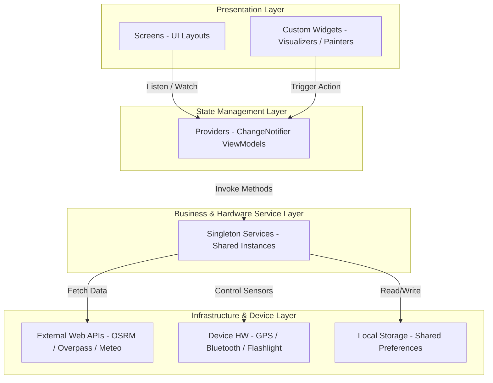

---

## 📂 2. โครงสร้างโฟลเดอร์โครงการ (Folder Structure)

ซอร์สโค้ดในไดเรกทอรี `lib/` มีการจัดโครงสร้างอย่างเป็นระบบตามขอบเขตการทำงานของสถาปัตยกรรม MVVM-Service:

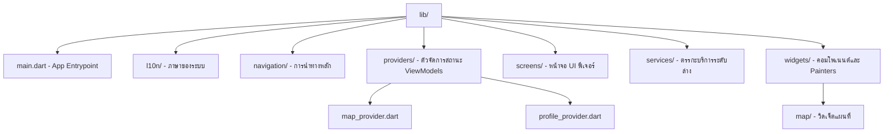

---

## ⚡ 3. การจัดการสถานะ (State Management)

แอปพลิเคชันนี้ใช้ **Provider Pattern** ในการบริหารจัดการสถานะและการไหลของข้อมูลแบบ Reactive เมื่อ State ใน ViewModels เปลี่ยนแปลง จะเกิดกระบวนการ Rebuild UI ทันทีผ่านตัวฟัง (`Consumer` หรือ `context.watch`) และคำสั่งแจ้งเตือน (`notifyListeners`)

### แผนภาพวงจรการจัดการสถานะ (State Lifecycle Loop)

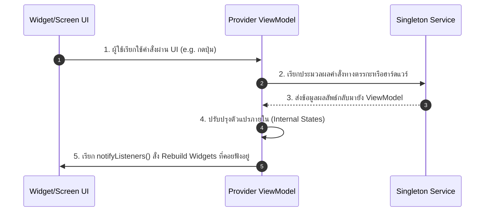

---

## ⚙️ 4. บริการระดับล่าง (Services)

คลาสในชั้น **Services** ทั้งหมดถูกออกแบบในลักษณะ **Singleton Pattern** (ใช้งานผ่านคีย์เวิร์ดคอนสตรัคเตอร์แบบ `static final`) เพื่อทำหน้าที่เป็นจุดประสานงานร่วมชิ้นเดียวตลอดอายุการใช้งานของแอป ป้องกันปัญหาการล้างทำลายหน่วยความจำจาก Provider เผลอเรียก `dispose` 

### ความสัมพันธ์ระหว่าง Singleton Services

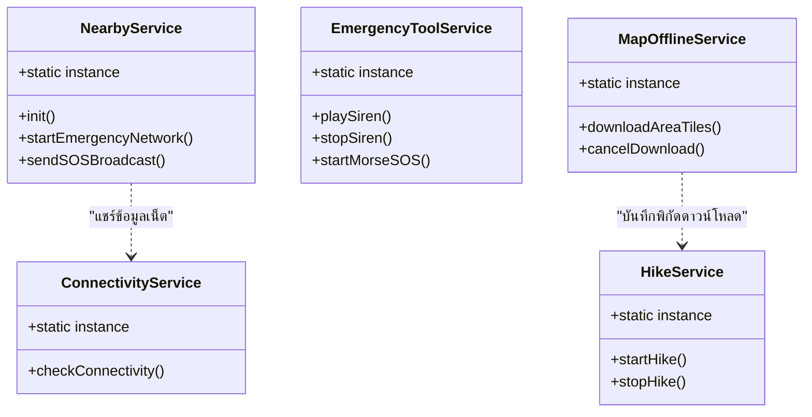

---

## 📊 5. ตัวจัดการสถานะระดับบน (Providers)

ทำหน้าที่เป็นตัวกลางระหว่าง UI และ Services โดยเก็บตัวแปรที่ใช้เรนเดอร์ UI และควบคุมขั้นตอนการอัปเดตหน้าจอ

*   **MapProvider**: ทำการดึงและประมวลผลเส้นทาง GPS, นำทาง OSRM, ข้อมูลโรงพยาบาล Overpass และวาดมาร์กเกอร์ (Markers) บนแผนที่
*   **ProfileProvider**: จัดเก็บข้อมูล Medical ID (หมู่โลหิต โรคประจำตัว) และประสานงานส่งข้อมูลอัปเดตไปที่ระบบแชท P2P เมื่อมีการแก้ไขข้อมูลผู้ใช้

### การผูกการทำงานของ Providers และ Services

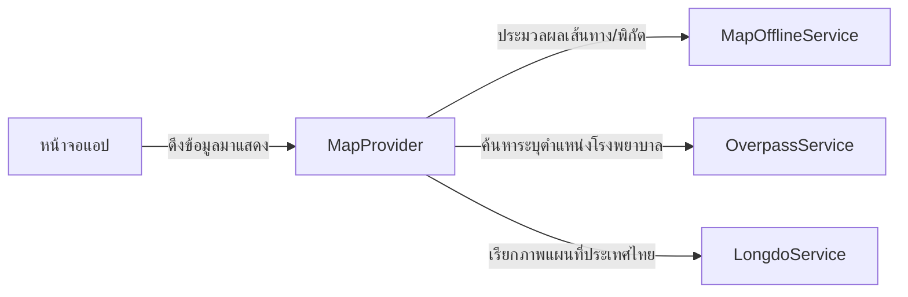

---

## 🎨 6. วิดเจ็ตพิเศษและ Custom Painters (Widgets)

เพื่อส่งมอบประสบการณ์ผู้ใช้สไตล์ Tactical UI แอปพลิเคชันใช้ Custom Canvas Drawing ในการวาดแอนิเมชันระดับพิกเซล

*   **WeatherParticlePainter**: จัดทำละอองฝน/ละอองหิมะตามสภาพอากาศด้วยอนุภาคเคลื่อนไหวคณิตศาสตร์ฟังก์ชันไซน์
*   **TacticalButtonPainter**: วาดปุ่มชีพจรเรืองแสงนีออนไล่เฉดสี
*   **FirstAidVisualizer**: ทำแอนิเมชันวงแหวนจังหวะการกดหน้าอก CPR อ้างอิงตามจังหวะเวลาสากล

### แผนภาพการประมวลผลกราฟิก (Painter Repaint Flow)

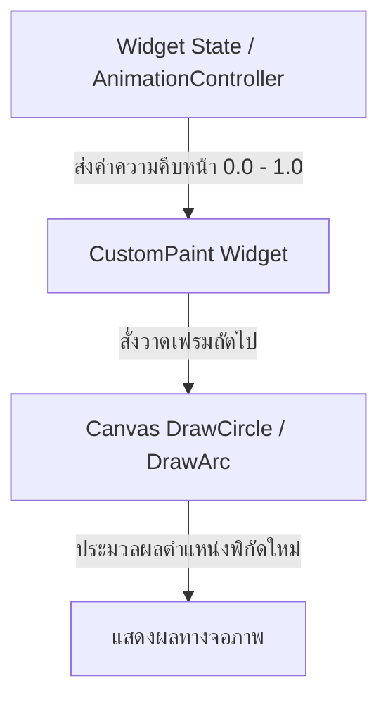

---

## 🔄 7. ลำดับการไหลของข้อมูล (Data Flow)

เมื่อมีการแก้ไขโปรไฟล์ข้อมูลสุขภาพของผู้ใช้ การเปลี่ยนแปลงจะถูกส่งผ่านชั้นสถาปัตยกรรมเพื่ออัปเดตหน่วยความจำและแจ้งระบบแชท

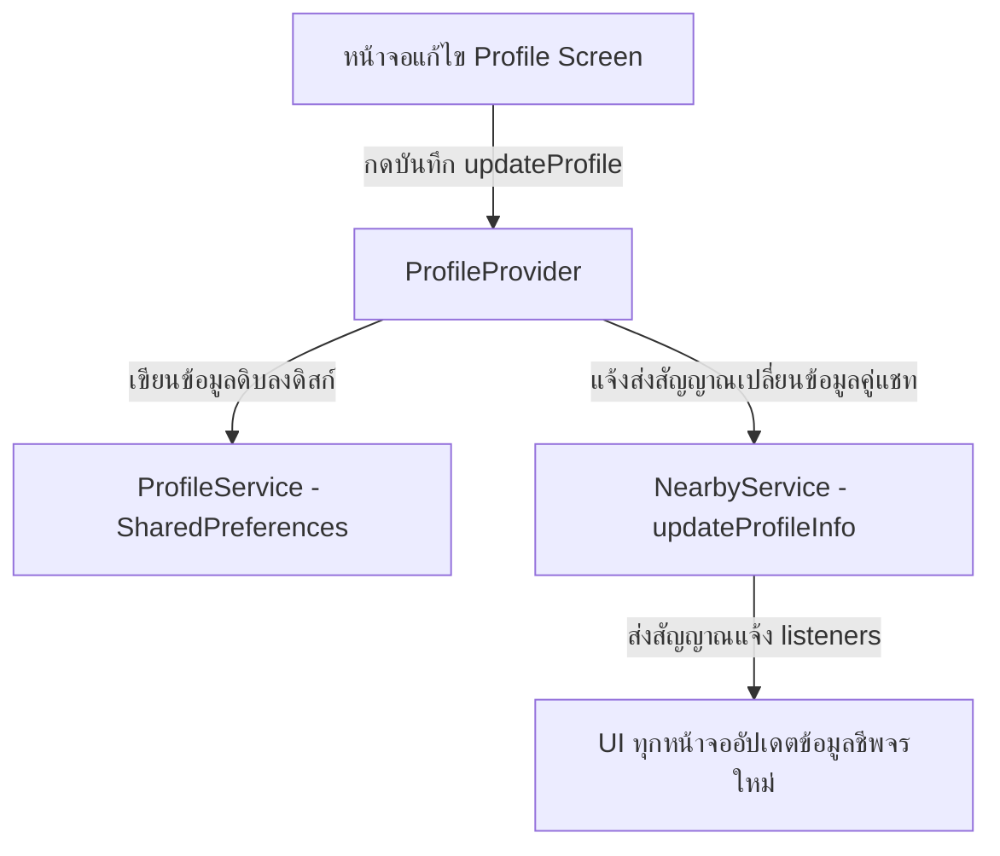

---

## 🌐 8. ลำดับการทำงานของ API เครือข่าย (API Flow)

กระบวนการประมวลผลแผนที่และประเมินสภาพอากาศเมื่อผู้ใช้เชื่อมต่ออินเทอร์เน็ตปกติ:

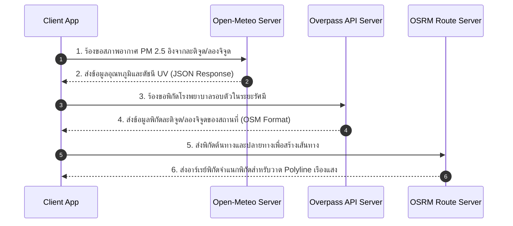

---

## 💾 9. ลำดับการดาวน์โหลดแผนที่ออฟไลน์ (Offline Map Flow)

แอปพลิเคชันมีกลไกตรวจสอบพื้นที่จัดเก็บแผนที่ออฟไลน์ก่อนดึงข้อมูลภายนอกทุกครั้ง เพื่อประหยัดพลังงานและการเชื่อมต่อ:

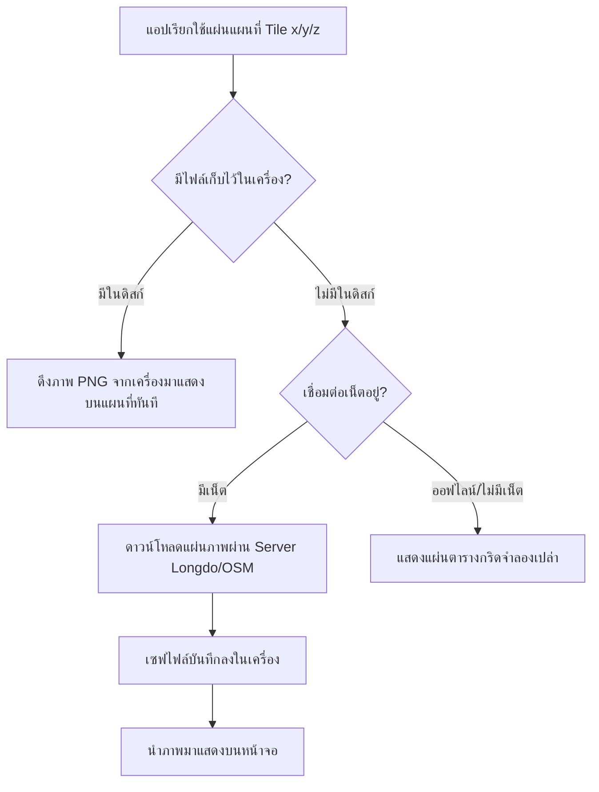

---

## 🚨 10. ลำดับการขอความช่วยเหลือฉุกเฉิน (SOS Flow)

สเตตแมชชีนและกระบวนการทำงานของปุ่มขอความช่วยเหลือฉุกเฉิน (SOS):

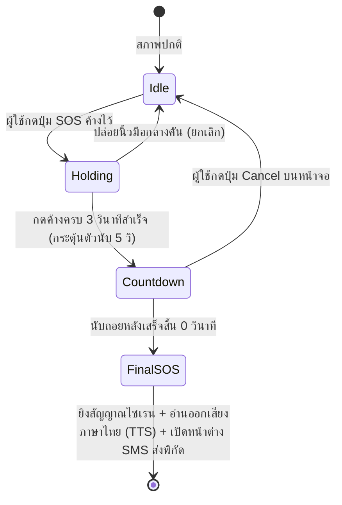

---

## 📶 11. โครงสร้างเครือข่ายไร้อินเทอร์เน็ต (Mesh Network Handshake Flow)

กระบวนการสร้างเส้นทางแชทแบบจุดต่อจุด (Peer-to-Peer) ระหว่างสองอุปกรณ์เมื่อขาดการติดต่อจากโลกภายนอก:

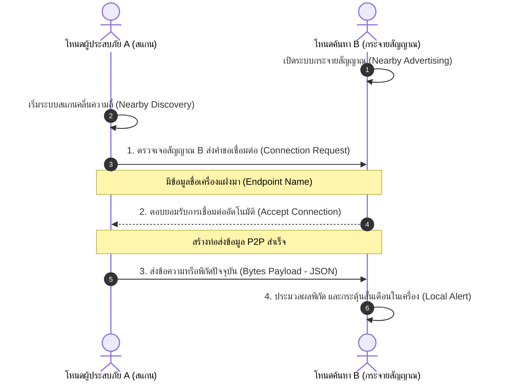

---

## 📄 สัญญาอนุญาต (License)

*   ขณะนี้โปรเจกต์ **BANTAWAN** ยังไม่ได้มีการกำหนดประเภทของสัญญาอนุญาต (License) อย่างเป็นทางการเพื่อวัตถุประสงค์เชิงพาณิชย์ หรือการเผยแพร่แบบ Open-Source
