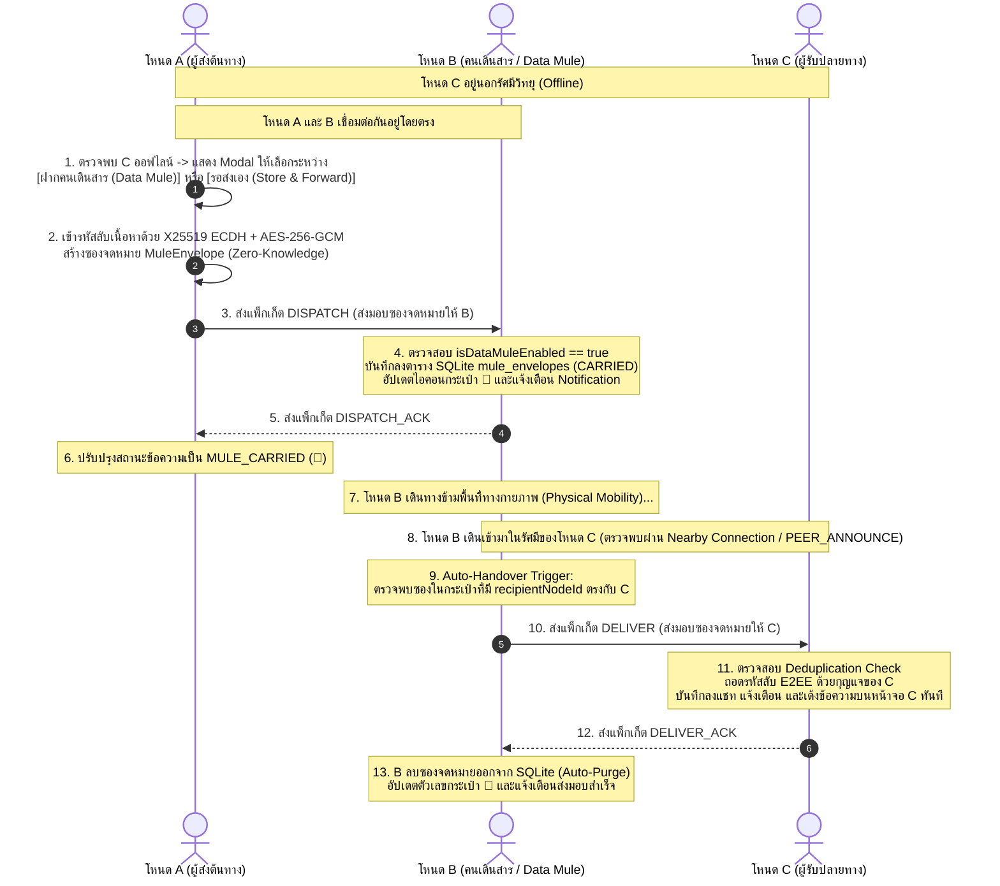
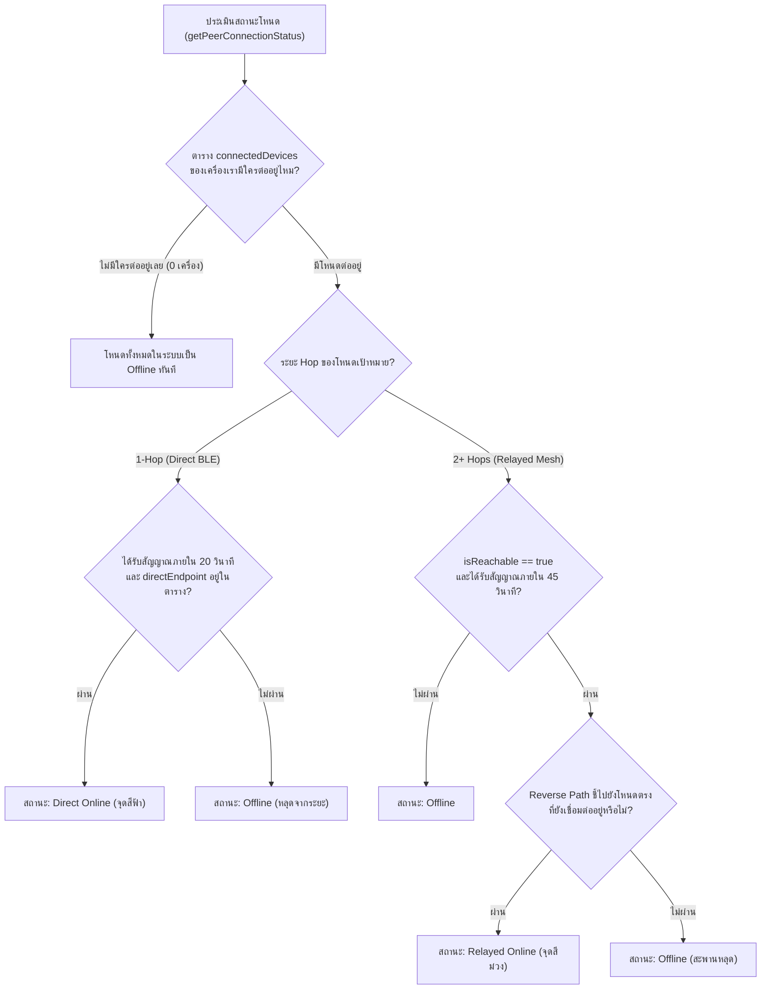

# BANTAWAN - Tactical Multi-Hop Mesh Routing Protocol

**เอกสารกำกับสถาปัตยกรรมเครือข่ายวิทยุ P2P ออฟไลน์ (Layer 2 - Layer 4 Network Protocol)**  
**เวอร์ชัน**: 2.1.0  
**สถานะการทำงาน**: ผ่านการทดสอบภาคสนาม (Field Tested & 100% Passing Tests)  

---

## 📡 1. ภาพรวมโปรโตคอล (Protocol Overview)

ในสถานการณ์ภัยพิบัติรุนแรง (สัญญาณโทรศัพท์ 3G/4G/5G และ Wi-Fi ล่มสลาย) **BANTAWAN** เปลี่ยนสมาร์ตโฟนทุกเครื่องของผู้ประสบภัยและทีมกู้ภัยให้กลายเป็น **Wireless Ad-hoc Mesh Node** ที่สื่อสารหากันโดยตรงผ่านคลื่นสั้น (Bluetooth Low Energy & Wi-Fi Direct) โดยอาศัยเทคโนโลยี **Google Nearby Connections API (P2P_CLUSTER Topology)**

```text
  [Node A: ผู้ประสบภัย]
        │ (Direct Hop = 1)
        ▼
  [Node B: Relay Bridge โหนดส่งต่อกลางทาง]
        │ (Direct Hop = 1)
        ▼
  [Node C: หน่วยกู้ภัย / เพื่อน]
  
  * Node A สื่อสารกับ Node C ได้ผ่าน Node B โดยมี Hop Count = 2 (Multi-Hop)
```

---

## ⚙️ 2. กลไกหลักของระบบ Multi-Hop Relay

### 2.1 การค้นหาและซิงก์สถานะโหนด (Active Peer Announcement)
* โหนดทุกเครื่องจะส่งสัญญาณคลื่นวิทยุ **`PEER_ANNOUNCE`** รอบทิศทางทุก **25 วินาที** (`_startPeerAnnounceTimer`)
* ในเพย์โหลดประกอบด้วย:
  * `nodeId`: รหัสประจำตัวถาวร (Persistent Cryptographic Node ID)
  * `deviceName`: ชื่อเล่นหรือนามเรียกขาน (Callsign)
  * `publicKeyHex`: กุญแจสาธารณะ X25519 สำหรับเข้ารหัส E2EE
  * `bloodGroup`, `allergies`, `medicalNotes`: ข้อมูลประวัติการแพทย์เบื้องต้น (Medical ID)
* **การส่งต่อ (Bridge Relay)**: เมื่อโหนดคนกลาง (Node B) ได้รับ Announce จาก Node A จะบันทึกว่า Node A เป็น `hopCount = 1` และส่งกระจายต่อ (Flood Forward) ให้ Node C โดย Node C จะมองเห็น Node A มีระยะ `hopCount = 2` อัตโนมัติ

### 2.2 การปรับระยะ Hop Count แบบพลวัต (Dynamic Hop Count Adaptation)
* เมื่อผู้ใช้ขยับตัวเข้าหากันจนอยู่ในระยะคลื่นบลูทูธโดยตรง (Direct Connection) ระบบจะปรับลดระยะจาก `hopCount = 2` ลงมาเป็น `hopCount = 1` ทันที
* เมื่อเดินห่างออกไปจนหลุดจากระยะคลื่นตรง แต่ยังได้ยินผ่าน Relay Node ระบบจะปรับกลับเป็น `hopCount = 2` โดยที่ห้องแชทไม่หลุด

### 2.3 การส่งต่อข้อความ (Controlled Flooding with TTL)
* ข้อความแชทสาธารณะ (Public Mesh) มีค่าตั้งต้น **`TTL = 3`** (กระโดดได้สูงสุด 3 ทอด)
* ข้อความขอความช่วยเหลือฉุกเฉิน (SOS Broadcast) มีค่าตั้งต้น **`TTL = 5`** เพื่อขยายรัศมีการกู้ภัยให้ไกลที่สุด
* ทุกครั้งที่ข้อความผ่านโหนดกลางทาง:
  1. ตรวจสอบว่า `id` ของข้อความเคยประมวลผลแล้วหรือไม่ (ป้องกันข้อความวนลูปผ่าน `_processedMessageIds` และ `LruMessageIdCache`)
  2. ลดค่า `ttl = ttl - 1`
  3. หาก `ttl > 0` ทำการส่งต่อไปยังโหนดข้างเคียงทั้งหมดที่ไม่ได้เป็นผู้ส่งต้นทาง

### 2.4 การตอบกลับใบเสร็จรับส่ง (Smart Unicast Routing for ACK)
* แทนที่จะส่ง Broadcast ท่วมเครือข่ายเมื่อได้รับข้อความ ระบบใช้ **Reverse Path Routing Table (RPRT)**
* เมื่อโหนด C ได้รับข้อความส่วนตัวจากโหนด A โหนด C จะส่งใบเสร็จ `ACK_DELIVERED` หรือ `ACK_READ` แบบ **Unicast เจาะจงท่อทางเข้าเดิม** ทำให้ประหยัดแบนด์วิดท์คลื่นวิทยุไปกว่า 80%

---

## 🔒 3. ความปลอดภัยและการเข้ารหัส (E2EE & Privacy)

| ระดับข้อมูล | วิธีการป้องกัน | รายละเอียด |
|---|---|---|
| **Public Mesh / SOS** | Cleartext + Digital Signature | ทุกคนในรัศมีอ่านได้ทันที เพื่อความรวดเร็วในการกู้ภัย |
| **Private Chat** | **E2EE V4 AES-256-CTR + HMAC-SHA256** | กุญแจลับคำนวณผ่าน **X25519 ECDH Key Exchange** โหนดคนกลาง (Relay) มองไม่เห็นเนื้อหาข้อความ |
| **Private Location** | **Zero-Knowledge GPS Payload** | พิกัดละติจูด/ลองจิจูดจะถูกแพ็กลงใน Encrypted Payload ส่วน Header ภายนอกจะตั้งเป็น `null` ทำให้โหนดคนกลางไม่สามารถแอบดูตำแหน่งของผู้ใช้ได้ |
| **Replay Attack** | **LruNonceCache + Timestamp Window** | บันทึก Nonce และปฏิเสธข้อความที่เวลาคลาดเคลื่อนเกิน 10 นาที หรือมี Nonce ซ้ำ |

---

## ⚡ 4. การจัดการเพดานขนาด 32KB ของ Nearby Connections

Google Nearby Connections มีข้อจำกัดทางเทคนิคว่า เพย์โหลดประเภท `BYTES` (`Nearby().sendBytesPayload`) สามารถส่งข้อมูลได้สูงสุด **32,768 Bytes (32 KB)** ต่อแพ็กเก็ต

เพื่อป้องกันปัญหาสายหลุดหรือถูกตัดการทำงานระหว่างส่งสื่อ:
1. **รูปภาพสถานการณ์ฉุกเฉิน (Tactical Micro-Image)**:
   * บีบอัดลงมาเหลือความละเอียด **360x360 px** คุณภาพ JPEG 40% (ขนาดไฟล์จริง ~8 - 16 KB)
   * แปลงเป็น Base64 แล้วมีขนาดไม่เกิน 22 KB
2. **ข้อความเสียง (Voice Message)**:
   * บันทึกเสียงด้วยฟอร์แมต **AAC-LC ความถี่ 16kHz โมโน** บิตเรต 16 kbps
   * มีตัวนับเวลาจำกัดความยาวสูงสุด **6 วินาที** (ขนาดไฟล์ ~10 - 15 KB)
   * ระบบตัดและส่งอัตโนมัติเมื่อครบ 6 วินาที
3. **Payload Safety Guards**:
   * มีเงื่อนไขตรวจสอบ `if (bytes.lengthInBytes > 22000)` ก่อนส่ง หากเกินจะแจ้งเตือนผู้ใช้และไม่ส่งผ่าน เพื่อรักษาความเสถียรของคลื่นวิทยุ

---

---

## 🎒 5. สถาปัตยกรรมระบบคนเดินสาร (Data Mule: Store-Carry-and-Forward Protocol)

### 5.1 ภาพรวมและปัญหาทางกายภาพ (Overcoming Network Partitioning)
ในสถานการณ์ที่โหนดผู้รับปลายทาง (Node C) อยู่นอกรัศมีการสื่อสารของโครงข่ายเมชทั้งแบบ 1-hop และ Multi-hop (เช่น อยู่คนละหมู่บ้าน ลึกเข้าไปในหุบเขา หรือพื้นที่ภัยพิบัติที่ไม่มีโหนดตัวกลางเชื่อมต่อถึงกัน):
* ระบบแชทปกติ (Real-time Mesh) จะไม่สามารถส่งถึงได้ทันที
* **BANTAWAN Data Mule** นำหลักการ **Delay-Tolerant Networking (DTN: RFC 4838)** มาประยุกต์ใช้ โดยเปลี่ยนอุปกรณ์ข้างเคียงที่กำลังเคลื่อนที่ (เช่น รถกู้ภัย, โดรน, หรือผู้ประสบภัยที่เดินสัญจร) ให้ทำหน้าที่เป็น **"คนเดินสาร (Courier Carrier)"** รับฝากซองจดหมายเข้ารหัสลับ (E2EE Envelope) เดินทางข้ามพื้นที่ทางกายภาพ แล้วส่งมอบให้ปลายทางโดยอัตโนมัติเมื่อพบกัน

### 5.2 ผังลำดับการทำงานและโปรโตคอลแพ็กเก็ต (End-to-End Handshake Flow)



### 5.3 โครงสร้างแพ็กเก็ตโปรโตคอล Data Mule (Protocol Specifications)
การสื่อสารในโหมดคนเดินสารทำงานผ่าน Nearby Connections `BYTES` payload โดยมีคีย์ระบุ `isMuleEnvelope: true` และจำแนกประเภทคำสั่งผ่าน `muleAction`:

1. **`DISPATCH` Packet**: ผู้ส่งต้นทางฝากซองจดหมายให้คนเดินสาร
   ```json
   {
     "isMuleEnvelope": true,
     "muleAction": "DISPATCH",
     "envelope": {
       "envelopeId": "uuid-v4",
       "senderNodeId": "NODE_78F2A",
       "senderCallsign": "Survivor Alpha",
       "recipientNodeId": "NODE_99E1B",
       "encryptedPayload": "BASE64_AES_256_GCM_CIPHERTEXT",
       "payloadIv": "iv_random_hex",
       "payloadAuthTag": "auth_tag_hex",
       "senderSignature": "ed25519_signature_hex",
       "isUrgentSOS": false,
       "createdAt": "2026-10-07T10:00:00Z",
       "expiresAt": "2026-10-09T10:00:00Z",
       "hopCarryCount": 1,
       "status": "CARRIED"
     }
   }
   ```
2. **`DISPATCH_ACK` Packet**: คนเดินสารตอบรับว่าบันทึกลงกระเป๋าสำเร็จ
   ```json
   {
     "isMuleEnvelope": true,
     "muleAction": "DISPATCH_ACK",
     "envelopeId": "uuid-v4"
   }
   ```
3. **`DELIVER` Packet**: คนเดินสารส่งมอบซองให้ผู้รับปลายทางเมื่อพบตัว
   ```json
   {
     "isMuleEnvelope": true,
     "muleAction": "DELIVER",
     "envelope": { ... }
   }
   ```
4. **`DELIVER_ACK` Packet**: ผู้รับปลายทางยืนยันว่าได้รับและถอดรหัสสำเร็จ เพื่อให้คนเดินสารทำลายซอง
   ```json
   {
     "isMuleEnvelope": true,
     "muleAction": "DELIVER_ACK",
     "envelopeId": "uuid-v4"
   }
   ```

### 5.4 จุดกระตุ้นการส่งมอบอัตโนมัติ (Auto-Handover Delivery Triggers)
ระบบใน [`nearby_service.dart`](file:///f:/flutter1/flutter1/lib/features/chat/services/nearby_service.dart) ฝังตัวเรียกฟังก์ชัน `_deliverMuleEnvelopes(endpointId, peerNodeId)` ไว้ใน 3 จุดสำคัญ:
1. **Advertiser Connection Callback**: เมื่อมีโหนดใหม่เชื่อมต่อเข้ามาในฐานะไคลเอนต์
2. **Discoverer Connection Callback**: เมื่อเครื่องเราเชื่อมต่อสำเร็จกับโหนดโฆษณา
3. **`_handlePeerAnnounce` Handler**: เมื่อได้รับคลื่นกระจายตัวตน `PEER_ANNOUNCE` จากโหนดที่อยู่ในรัศมี

### 5.5 ความปลอดภัยแบบ Zero-Knowledge Privacy Guarantee
* **End-to-End Encryption (E2EE)**: ข้อความภายในเพย์โหลดถูกเข้ารหัสด้วยกุญแจลับเฉพาะระหว่าง A และ C ตั้งแต่ต้นทาง
* **Zero-Knowledge Carrier**: คนเดินสาร (Node B) มีสถานะเป็นเพียงผู้ถือซองจดหมาย (Blind Carrier) ไม่สามารถแอบเปิดอ่าน ปลอมแปลง หรือแก้ไขข้อมูลในซองได้ เนื่องจากไม่มีกุญแจลับส่วนตัวของ C และไม่สามารถปลอมลายเซ็นดิจิทัลของ A ได้
* **Storage Protection**: ซองจดหมายมีอายุขัย `expiresAt` (ค่าเริ่มต้น 48 ชั่วโมง) และระบบจะทำการเรียก `purgeExpiredMuleEnvelopes()` ทุกครั้งที่เปิดแอปเพื่อป้องกันพื้นที่เต็ม

---

## 🧭 6. กลไกการตรวจวัดสถานะโหนดแบบพลวัต (Dynamic Topology & Anti-Ghosting)

เพื่อแก้ไขปัญหา **โหนดค้าง (Ghost Node)** เมื่อมีอุปกรณ์ปิดบลูทูธกะทันหัน หรือเดินหลุดจากระยะโดยที่ระบบปฏิบัติการไม่ส่งเหตุการณ์แจ้งตัดสาย ระบบ BANTAWAN นำเสนอกลไกประเมินสถานะ 3 ระดับ:



---

## 📊 7. วงจรชีวิตสถานะการจัดส่งข้อความ (Message Status Lifecycle)

| สถานะ | รหัสไอคอน / สี | ความหมายทางวิศวกรรม |
| :--- | :---: | :--- |
| **`SENDING`** | ⏱️ สีเทา / นาฬิกา | ข้อความถูกบันทึกลงในเครื่อง และกำลังแพร่กระจายบนเครือข่ายเมช |
| **`MULE_CARRIED`** | 🎒 สีทอง / กระเป๋า | ข้อความถูกฝากไว้กับคนเดินสาร (Data Mule) เรียบร้อยแล้ว กำลังเดินทางไปหาผู้รับ |
| **`DELIVERED`** | ✓✓ สีฟ้า / ดับเบิ้ลเช็ค | ข้อความเดินทางถึงเครื่องผู้รับเรียบร้อยแล้ว (ได้รับ Reverse Unicast ACK) |
| **`READ`** | ✓✓ สีเขียว / อ่านแล้ว | ผู้รับเปิดหน้าจออ่านข้อความนั้นแล้ว (Read Receipt) |

