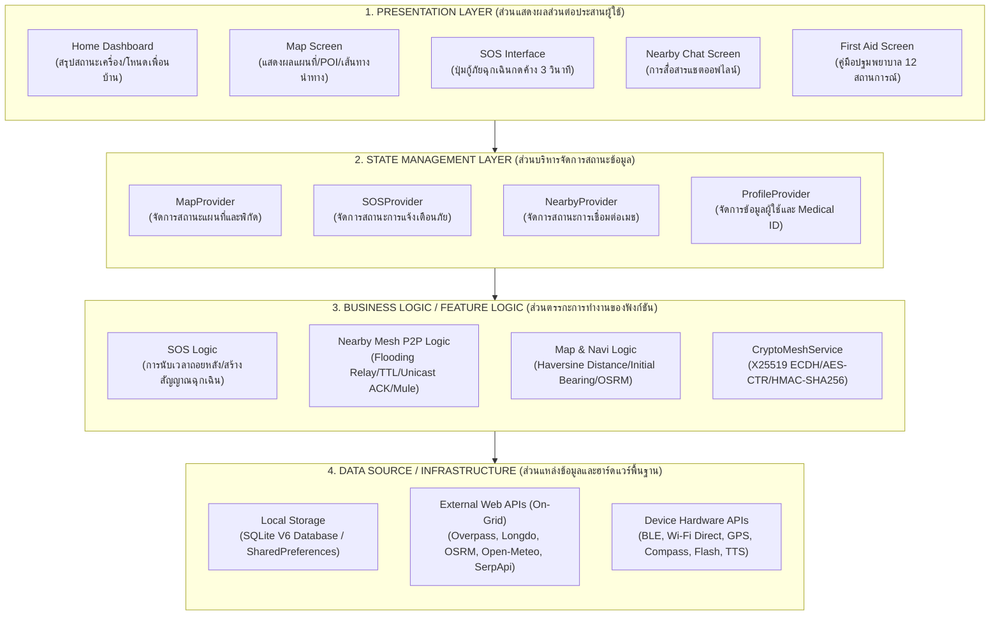
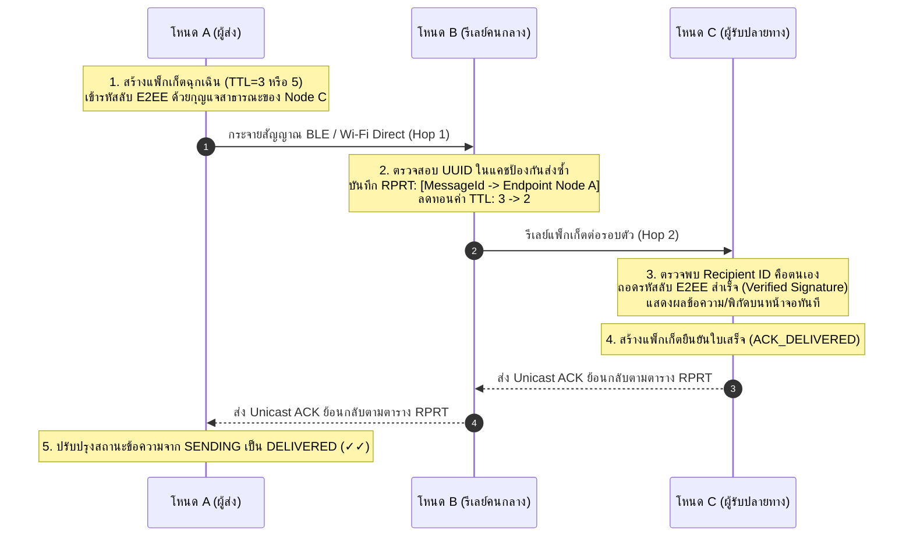
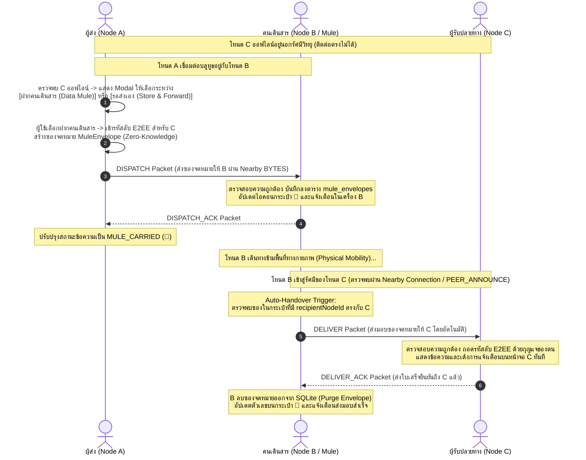
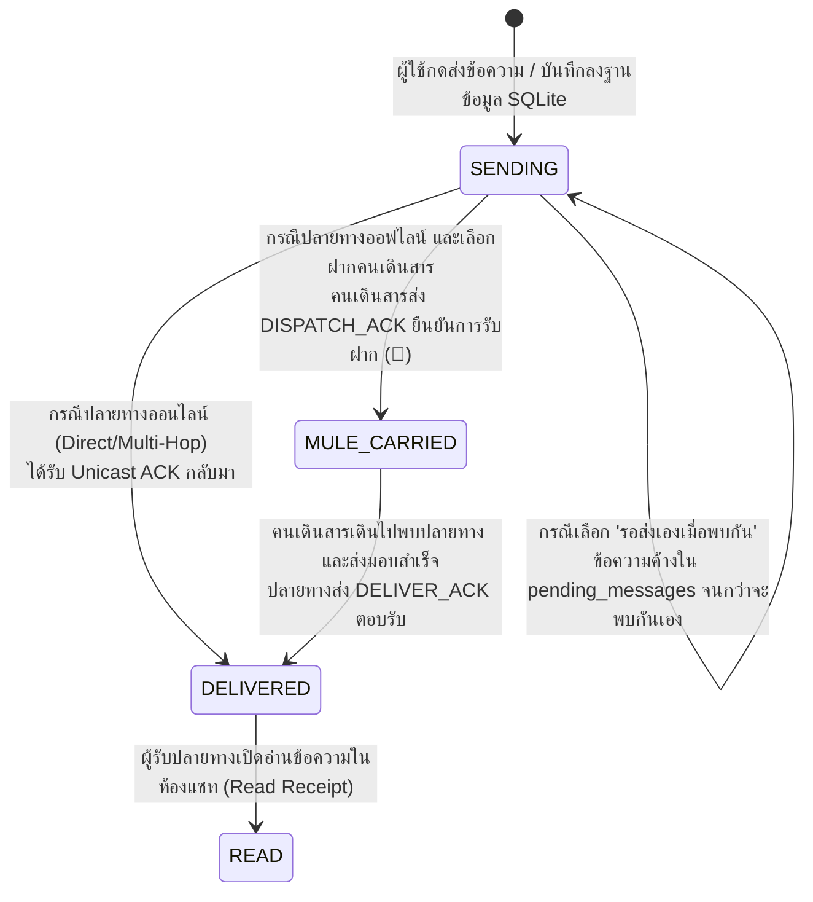
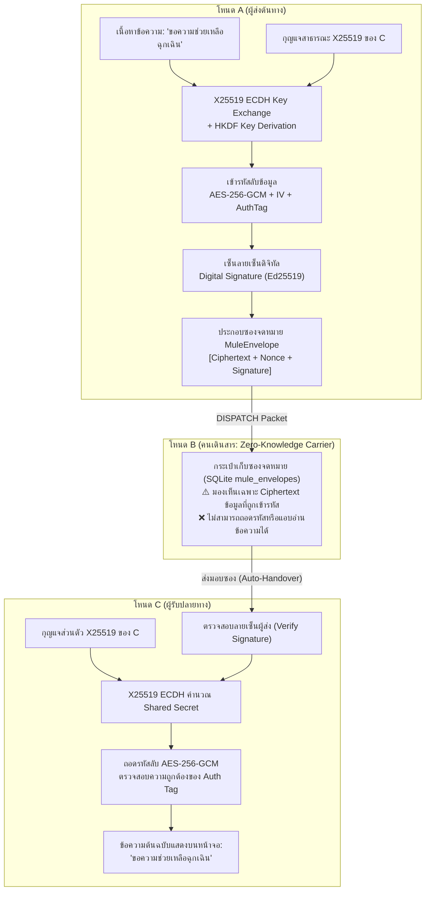
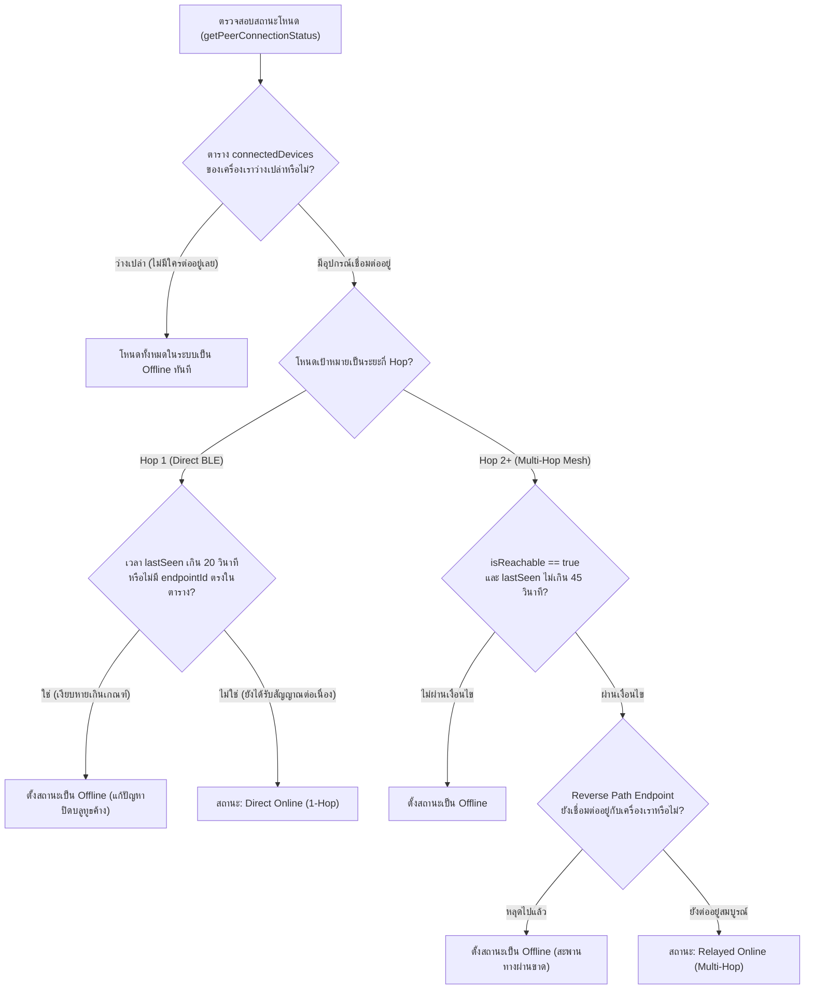

# บทที่ 3
# วิธีการดำเนินงานและการออกแบบสถาปัตยกรรมระบบ (Methodology & System Architecture)
## โครงงาน: ระบบสนับสนุนความปลอดภัยส่วนบุคคลบนสมาร์ตโฟน (Personal Safety Support for Smartphones)
### สาขาวิชาวิศวกรรมคอมพิวเตอร์ คณะวิศวกรรมศาสตร์ มหาวิทยาลัยเทคโนโลยีราชมงคลศรีวิชัย
**ปีการศึกษา 2569 (Academic Year 2026)**

---

ในบทนี้จะอธิบายถึงระเบียบวิธีวิจัย ขั้นตอนการดำเนินงานตลอดภาคการศึกษา แผนการดำเนินงาน การออกแบบสถาปัตยกรรมระบบ 4 เลเยอร์หลัก การออกแบบฐานข้อมูลภายในอุปกรณ์พร้อมพจนานุกรมข้อมูล (Data Dictionary) ตลอดจนการออกแบบโปรโตคอลการสื่อสารไร้สายแบบเครือข่ายเมชและการเข้ารหัสลับข้อมูล เพื่อให้ระบบ BANTAWAN สามารถปฏิบัติการได้อย่างถูกต้อง มีความมั่นคงปลอดภัย และมีเสถียรภาพสูงสุดในสภาวะวิกฤต

---

## 3.1 แผนการดำเนินงานพัฒนาโครงงาน (Project Work Plan)

การดำเนินงานพัฒนาโครงงานระบบสนับสนุนความปลอดภัยส่วนบุคคลบนสมาร์ตโฟน ได้แบ่งขั้นตอนการทำงานออกเป็น 8 กิจกรรมหลัก ครอบคลุมระยะเวลา 17 สัปดาห์ตลอดภาคการศึกษา ดังแสดงในตารางที่ 3.1

### ตารางที่ 3.1: แผนการดำเนินงานพัฒนาโครงงานตลอดภาคการศึกษา (17 สัปดาห์)

| กิจกรรม / สัปดาห์ | แผน/ผล | 1 | 2 | 3 | 4 | 5 | 6 | 7 | 8 | 9 | 10 | 11 | 12 | 13 | 14 | 15 | 16 | 17 |
|:---|:---:|:---:|:---:|:---:|:---:|:---:|:---:|:---:|:---:|:---:|:---:|:---:|:---:|:---:|:---:|:---:|:---:|:---:|
| **3.1.1 ศึกษาและเข้าใจปัญหา (Problem Understanding)** | P A | ■ ■ | ■ ■ | ■ ■ | | | | | | | | | | | | | | |
| **3.1.2 การสืบค้นข้อมูลและทฤษฎี (Literature Review)** | P A | | | ■ ■ | ■ ■ | ■ ■ | ■ ■ | | | | | | | | | | | |
| **3.1.3 การวิเคราะห์ความต้องการ (Requirements Analysis)** | P A | | | | ■ ■ | ■ ■ | ■ ■ | ■ ■ | | | | | | | | | | |
| **3.1.4 การออกแบบสถาปัตยกรรมและฐานข้อมูล (System Design)**| P A | | | | | | | ■ ■ | ■ ■ | ■ ■ | ■ ■ | | | | | | | |
| **3.1.5 การพัฒนาโปรแกรมประยุกต์ (Implementation)** | P A | | | | | | | | | ■ ■ | ■ ■ | ■ ■ | ■ ■ | ■ ■ | | | | |
| **3.1.6 การทดสอบและปรับปรุงระบบ (Testing & Optimization)** | P A | | | | | | | | | | | | ■ ■ | ■ ■ | ■ ■ | ■ ■ | | |
| **3.1.7 การสอบประเมินโครงงาน (Project Defense Exam)** | P A | | | | | | | | | | | | | | | ■ ■ | ■ ■ | |
| **3.1.8 การจัดทำเล่มปริญญานิพนธ์ฉบับสมบูรณ์ (Documentation)**| P A | | | | | | | | | | | | | | | | ■ ■ | ■ ■ |

*(หมายเหตุ: P = แผนการดำเนินงานที่วางไว้ [Plan], A = การดำเนินงานจริงที่สำเร็จ [Actual])*

**รายละเอียดกิจกรรมการดำเนินงาน:**
* **3.1.1 ศึกษาและเข้าใจปัญหา:** สำรวจปัญหาความล้มเหลวของการสื่อสารในพื้นที่ประสบภัยพิบัติ และข้อจำกัดของแอปพลิเคชันความปลอดภัยทั่วไปที่พึ่งพาอินเทอร์เน็ต
* **3.1.2 การสืบค้นข้อมูลและทฤษฎี:** ศึกษาเอกสารและงานวิจัยที่เกี่ยวข้องกับ Mobile Ad-hoc Networks (MANET), Delay-Tolerant Networking (DTN), Cryptography (X25519, AES, HMAC), และ Geographic Information Systems (GIS)
* **3.1.3 การวิเคราะห์ความต้องการ:** กำหนดข้อกำหนดเชิงหน้าที่ (Functional Requirements) 10 ระบบ และข้อกำหนดด้านความปลอดภัยและประสิทธิภาพ
* **3.1.4 การออกแบบสถาปัตยกรรมและฐานข้อมูล:** ออกแบบสถาปัตยกรรม 4 เลเยอร์ สคีมาฐานข้อมูล SQLite V6 และโครงสร้างแพ็กเก็ต Nearby Connections
* **3.1.5 การพัฒนาโปรแกรมประยุกต์:** พัฒนาส่วนติดต่อผู้ใช้ด้วย Flutter และพัฒนาระบบแบ็กเอนด์ในเครื่อง (Local Services)
* **3.1.6 การทดสอบและปรับปรุงระบบ:** ดำเนินการทดสอบ Automated Test Suites 7 ชุด และการทดสอบภาคสนามจำลองด้วยเครื่อง Android 3–5 เครื่อง
* **3.1.7 การสอบประเมินโครงงาน:** นำเสนอระบบและสาธิตการทำงานต่อหน้าคณะกรรมการสอบปริญญานิพนธ์
* **3.1.8 การจัดทำเล่มปริญญานิพนธ์:** จัดทำรูปเล่มรายงานฉบับสมบูรณ์ตามระเบียบของสาขาวิชาวิศวกรรมคอมพิวเตอร์ มทร.ศรีวิชัย

---

## 3.2 ภาพรวมสถาปัตยกรรมแอปพลิเคชัน 4 เลเยอร์หลัก (4-Layer System Architecture)

เพื่อให้ระบบมีความเป็นโมดูล (Modularity) รองรับการทดสอบ (Testability) และง่ายต่อการบำรุงรักษา สถาปัตยกรรมของแอปพลิเคชัน BANTAWAN ถูกออกแบบแบ่งออกเป็น **4 เลเยอร์หลัก (4-Layer Architecture)** สอดคล้องกับผังภาพสถาปัตยกรรมของโครงงาน ดังแสดงในรูปที่ 3.1:

<b>รูปที่ 3.1: ภาพแสดงสถาปัตยกรรม 4 เลเยอร์หลักของแอปพลิเคชัน BANTAWAN</b>

### รายละเอียดการทำงานของแต่ละเลเยอร์:
1. **1. Presentation Layer (ส่วนติดต่อผู้ใช้งาน):** พัฒนาด้วยวิดเจ็ตของ Flutter ประกอบด้วยหน้าจอหลัก (Home Dashboard), หน้าจอแผนที่นำทาง (Map Screen), หน้าจอสั่งการขอความช่วยเหลือฉุกเฉิน (SOS Interface), หน้าจอแชตเมชออฟไลน์ (Nearby Chat) และหน้าจอคู่มือปฐมพยาบาล (First Aid)
2. **2. State Management Layer (ส่วนบริหารจัดการสถานะ):** ประยุกต์ใช้ **Provider Pattern (`ChangeNotifier`)** ทำหน้าที่เป็นตัวกลางในการกระจายข้อมูล (Data Bus) และอัปเดต UI เมื่อข้อมูลสถานะเปลี่ยนแปลง ได้แก่ `MapProvider`, `SOSProvider`, `NearbyProvider` และ `ProfileProvider`
3. **3. Business Logic Layer (ส่วนตรรกะการทำงาน):** แกนประมวลผลทางวิศวกรรม ประกอบด้วย:
   * **SOS Logic:** การควบคุมเวลานับถอยหลัง 3 วินาที และการจัดโครงสร้างแพ็กเก็ตฉุกเฉิน
   * **Nearby Mesh P2P Logic:** การควบคุมการส่งต่อแพ็กเก็ต (Controlled Flooding Relay), การลดทอนค่า TTL, การบันทึกเส้นทาง RPRT เพื่อส่ง Unicast ACK และระบบคนเดินสาร Data Mule
   * **Map & Navi Logic:** การคำนวณระยะขจัดด้วยสูตร Haversine, การหมุนลูกศรตาม Initial Bearing, และการถอดรหัส Encoded Polyline
   * **CryptoMeshService:** การเข้ารหัสลับแบบ E2EE V5 (X25519, AES-256-CTR, HMAC-SHA256)
4. **4. Data Source / Infrastructure Layer (ส่วนแหล่งข้อมูลและฮาร์ดแวร์):**
   * **Local Storage:** ฐานข้อมูล SQLite V6 (`bantawan_chat.db`) และหน่วยความจำ `SharedPreferences`
   * **External Web APIs:** บริการออนไลน์ภายนอก (Overpass, Longdo, OSRM, Open-Meteo, SerpApi)
   * **Device Hardware APIs:** การควบคุมฮาร์ดแวร์ระดับเนทีฟผ่าน Platform Channels (บลูทูธ BLE, Wi-Fi Direct, GPS, เข็มทิศ, ไฟฉาย และลำโพง)

---

## 3.3 การออกแบบฐานข้อมูลภายในอุปกรณ์และพจนานุกรมข้อมูล (Database Design & Data Dictionary)

เพื่อตอบสนองสถาปัตยกรรมแบบ Offline-First ข้อมูลทั้งหมดถูกจัดเก็บไว้ในฐานข้อมูล **SQLite เวอร์ชัน 6 (`bantawan_chat.db`)** โดยไม่มีการพึ่งพาเซิร์ฟเวอร์ภายนอก ประกอบด้วย 5 ตารางหลัก รายละเอียดพจนานุกรมข้อมูล (Data Dictionary) แสดงดังตารางที่ 3.2 ถึง 3.6:

### ตารางที่ 3.2: พจนานุกรมข้อมูลตารางข้อความการสนทนาและสัญญาณฉุกเฉิน (`messages`)

| TABLE NAME | ATTRIBUTE NAME | CONTENTS | TYPE | EXAMPLE | REQUIRED | PK / FK | FK REFERENCED COLUMN | FK REFERENCED TABLE |
|:---|:---|:---|:---:|:---|:---:|:---:|:---:|:---:|
| `messages` | `id` | รหัสประจำข้อความ (UUIDv4) | TEXT | `e4b2d3c1-7f8a...` | Y | PK | - | - |
| | `senderId` | รหัสโหนดผู้ส่ง | TEXT | `NODE_78F2A` | Y | - | - | - |
| | `senderName` | ชื่อของผู้ส่งข้อความ | TEXT | `สมชาย กู้ภัย` | Y | - | - | - |
| | `recipientId` | รหัสโหนดผู้รับปลายทาง | TEXT | `NODE_99E1B` | Y | - | - | - |
| | `recipientName` | ชื่อของผู้รับปลายทาง | TEXT | `ศูนย์ประสานงาน` | Y | - | - | - |
| | `content` | เนื้อหาข้อความ (หรือ Ciphertext) | TEXT | `ขอความช่วยเหลือด่วน` | Y | - | - | - |
| | `timestamp` | วันและเวลาที่สร้างข้อความ | TEXT | `2026-10-06T14:30:00Z` | Y | - | - | - |
| | `latitude` | พิกัดละติจูดแนบ | REAL | `7.198823` | N | - | - | - |
| | `longitude` | พิกัดลองจิจูดแนบ | REAL | `100.595412` | N | - | - | - |
| | `isLocation` | สถานะการแนบพิกัด (0=ไม่แนบ, 1=แนบ) | INTEGER | `1` | Y | - | - | - |
| | `isSOS` | สถานะข้อความฉุกเฉิน (0=ปกติ, 1=SOS) | INTEGER | `1` | Y | - | - | - |
| | `isEncrypted` | สถานะการเข้ารหัสลับ (0=ไม่เข้ารหัส, 1=E2EE) | INTEGER | `1` | Y | - | - | - |
| | `ttl` | จำนวน Hop คงเหลือสูงสุด | INTEGER | `5` | Y | - | - | - |
| | `status` | สถานะการส่ง (SENDING, MULE_CARRIED, DELIVERED, READ) | TEXT | `DELIVERED` | Y | - | - | - |
| | `conversationId`| รหัสกลุ่มการสนทนา | TEXT | `CONV_78F2_99E1` | Y | - | - | - |
| | `mediaPath` | ที่อยู่ไฟล์สื่อแนบในเครื่อง | TEXT | `/data/user/0/.../rec.m4a`| N | - | - | - |
| | `mediaType` | ประเภทไฟล์แนบ (NONE, AUDIO, IMAGE) | TEXT | `AUDIO` | Y | - | - | - |

---

### ตารางที่ 3.3: พจนานุกรมข้อมูลตารางแพ็กเก็ตที่รอการส่งต่อ (`pending_messages`)

| TABLE NAME | ATTRIBUTE NAME | CONTENTS | TYPE | EXAMPLE | REQUIRED | PK / FK | FK REFERENCED COLUMN | FK REFERENCED TABLE |
|:---|:---|:---|:---:|:---|:---:|:---:|:---:|:---:|
| `pending_messages` | `id` | รหัสประจำแพ็กเก็ต | TEXT | `e4b2d3c1-7f8a...` | Y | PK | `id` | `messages` |
| | `rawJson` | ข้อมูลแพ็กเก็ตดิบรูปแบบ JSON | TEXT | `{"id":"e4b2...","ttl":4}` | Y | - | - | - |
| | `createdAt` | เวลาที่บรรจุเข้าสู่คิวรอส่ง | TEXT | `2026-10-06T14:30:05Z` | Y | - | - | - |
| | `retryCount` | จำนวนครั้งที่พยายามส่งซ้ำ | INTEGER | `2` | Y | - | - | - |

---

### ตารางที่ 3.4: พจนานุกรมข้อมูลตารางแพ็กเก็ตที่ผ่านการประมวลผลแล้ว (`processed_packets`)

| TABLE NAME | ATTRIBUTE NAME | CONTENTS | TYPE | EXAMPLE | REQUIRED | PK / FK | FK REFERENCED COLUMN | FK REFERENCED TABLE |
|:---|:---|:---|:---:|:---|:---:|:---:|:---:|:---:|
| `processed_packets` | `packetId` | รหัสแพ็กเก็ตที่เคยรับหรือส่งต่อ | TEXT | `e4b2d3c1-7f8a...` | Y | PK | - | - |
| | `receivedAt` | เวลาที่รับแพ็กเก็ตครั้งแรก (Epoch ms) | INTEGER | `1728225008000` | Y | - | - | - |

---

### ตารางที่ 3.5: พจนานุกรมข้อมูลตารางกระดานประกาศเตือนภัยเครือข่ายเมช (`mesh_notices`)

| TABLE NAME | ATTRIBUTE NAME | CONTENTS | TYPE | EXAMPLE | REQUIRED | PK / FK | FK REFERENCED COLUMN | FK REFERENCED TABLE |
|:---|:---|:---|:---:|:---|:---:|:---:|:---:|:---:|
| `mesh_notices` | `id` | รหัสประกาศเตือนภัย (UUIDv4) | TEXT | `NOTICE_001_88AF` | Y | PK | - | - |
| | `authorId` | รหัสโหนดผู้ประกาศ | TEXT | `NODE_78F2A` | Y | - | - | - |
| | `authorName` | ชื่อของผู้ประกาศ | TEXT | `ศูนย์กู้ภัยหาดใหญ่` | Y | - | - | - |
| | `content` | เนื้อหาประกาศแจ้งเตือนภัย | TEXT | `แจ้งเตือนระดับน้ำคลองอู่ตะเภา`| Y | - | - | - |
| | `createdAt` | เวลาที่สร้างประกาศ | TEXT | `2026-10-06T14:00:00Z` | Y | - | - | - |
| | `expiresAt` | เวลาหมดอายุของประกาศ | TEXT | `2026-10-07T14:00:00Z` | Y | - | - | - |
| | `isUrgent` | ความด่วนฉุกเฉิน (0=ปกติ, 1=ด่วนมาก) | INTEGER | `1` | Y | - | - | - |
| | `latitude` | พิกัดละติจูดของเหตุการณ์ | REAL | `7.008231` | N | - | - | - |
| | `longitude` | พิกัดลองจิจูดของเหตุการณ์ | REAL | `100.478912` | N | - | - | - |
| | `hopCount` | จำนวนทอดที่ประกาศถูกส่งต่อ | INTEGER | `1` | Y | - | - | - |

---

### ตารางที่ 3.6: พจนานุกรมข้อมูลตารางซองจดหมายคนเดินสาร (`mule_envelopes`)

| TABLE NAME | ATTRIBUTE NAME | CONTENTS | TYPE | EXAMPLE | REQUIRED | PK / FK | FK REFERENCED COLUMN | FK REFERENCED TABLE |
|:---|:---|:---|:---:|:---|:---:|:---:|:---:|:---:|
| `mule_envelopes` | `envelopeId` | รหัสประจำซองจดหมาย (UUIDv4) | TEXT | `e5a1b2c3-9d8e...` | Y | PK | - | - |
| | `senderNodeId` | รหัสโหนดต้นทางผู้สร้างซอง | TEXT | `NODE_78F2A` | Y | - | - | - |
| | `senderCallsign` | นามเรียกขานผู้ส่ง (Callsign) | TEXT | `Survivor Alpha` | Y | - | - | - |
| | `recipientNodeId` | รหัสโหนดเป้าหมายปลายทาง | TEXT | `NODE_99E1B` | Y | - | - | - |
| | `encryptedPayload`| ข้อมูลเพย์โหลดที่เข้ารหัสลับ E2EE | TEXT | `CIPHER_AES_GCM_B64...`| Y | - | - | - |
| | `payloadIv` | เวกเตอร์เริ่มต้น (IV / Nonce) | TEXT | `iv_random_hex` | Y | - | - | - |
| | `payloadAuthTag` | แท็กตรวจพิสูจน์ความถูกต้อง (Auth Tag) | TEXT | `tag_gcm_hex` | Y | - | - | - |
| | `senderSignature` | ลายเซ็นดิจิทัลยืนยันตัวตนผู้ส่ง | TEXT | `sig_ed25519_hex` | Y | - | - | - |
| | `isUrgentSOS` | สถานะซองด่วนฉุกเฉิน (0=ปกติ, 1=SOS) | INTEGER | `0` | Y | - | - | - |
| | `createdAt` | วันและเวลาที่สร้างซองจดหมาย | TEXT | `2026-10-06T12:00:00Z` | Y | - | - | - |
| | `expiresAt` | เวลาหมดอายุของซอง (ค่าเริ่มต้น 48 ชม.)| TEXT | `2026-10-08T12:00:00Z` | Y | - | - | - |
| | `hopCarryCount` | จำนวนครั้งที่ซองถูกส่งต่อข้ามเครื่อง | INTEGER | `1` | Y | - | - | - |
| | `status` | สถานะซอง (`CARRIED`, `DELIVERED`) | TEXT | `CARRIED` | Y | - | - | - |

---

## 3.4 ขั้นตอนการทำงานของโปรโตคอลสื่อสารเมชและการเข้ารหัสลับข้อมูล

เพื่อให้ระบบ BANTAWAN สามารถปฏิบัติการได้อย่างสมบูรณ์แบบ ทั้งในกรณีที่เครือข่ายเชื่อมต่อถึงกันแบบเรียลไทม์ และกรณีที่เกิดภาวะเครือข่ายแยกส่วน (Network Partition) ทางวิศวกรรมจึงได้แบ่งกลไกการส่งผ่านข้อมูลออกเป็น 3 โหมดหลัก โดยไม่มีการทับซ้อนหรือกระทบต่อเสถียรภาพของการทำงานเดิม:

### 3.4.1 โปรโตคอลการส่งต่อแบบ Multi-Hop Relay และ Reverse-Path Unicast ACK

<b>รูปที่ 3.2: แผนผังการส่งต่อข้อมูลแบบ Multi-Hop Relay และการตอบรับใบเสร็จแบบ Smart Unicast ACK</b>

---

### 3.4.2 โปรโตคอลคนเดินสาร (Data Mule: Store-Carry-and-Forward Protocol)

ในกรณีที่ผู้รับเป้าหมายอยู่นอกระยะการเชื่อมต่อทั้งแบบ 1-hop และ Multi-hop ระบบ BANTAWAN นำเสนอสถาปัตยกรรม **Data Mule (Courier Carrier)** ซึ่งแยกขาดจากคิวรอส่งในเครื่องตนเอง (`pending_messages`) เพื่อให้บุคคลภายนอกที่กำลังเคลื่อนที่ทำหน้าที่เป็น "คนเดินสาร" นำส่งข้อความให้โดยอัตโนมัติ:

<b>รูปที่ 3.3: แผนผังลำดับการทำงานของโปรโตคอลคนเดินสาร (Data Mule End-to-End Workflow)</b>

---

### 3.4.3 วงจรชีวิตของสถานะข้อความ (Message & Delivery State Lifecycle)

เพื่อให้ผู้ใช้งานทราบสถานะการเดินทางของข้อความได้อย่างแม่นยำ ระบบได้ออกแบบวงจรชีวิตของสถานะข้อความ (Message State Machine) ดังแสดงในรูปที่ 3.4:

<b>รูปที่ 3.4: แผนภาพสถานะวงจรชีวิตของข้อความ (Message Delivery State Lifecycle)</b>

---

### 3.4.4 สถาปัตยกรรมความปลอดภัย Zero-Knowledge E2EE สำหรับคนเดินสาร

<b>รูปที่ 3.5: สถาปัตยกรรมความปลอดภัย Zero-Knowledge E2EE ในระบบคนเดินสาร Data Mule</b>

---

### 3.4.5 กลไกการตรวจวัดสถานะโหนดแบบพลวัต (Dynamic Topology Adaptation & Anti-Ghosting)

เพื่อป้องกันปัญหาโหนดค้าง (Ghost Node) อันเนื่องมาจากการปิดบลูทูธกะทันหัน หรือการเดินหลุดจากระยะโดยที่ระบบปฏิบัติการไม่ส่งเหตุการณ์แจ้งเตือนตัดการเชื่อมต่อ ระบบ BANTAWAN ได้ใช้กลไกการตรวจสอบสถานะการมีอยู่จริงของโหนด (Liveness Verification Engine) ดังแสดงในรูปที่ 3.6:

<b>รูปที่ 3.6: โฟลว์ชาร์ตการประเมินสถานะการเชื่อมต่อโหนดแบบพลวัตเพื่อป้องกันปัญหา Ghost Node</b>

---

## 3.5 สรุปบทที่ 3

ในบทนี้ได้นำเสนอระเบียบวิธีวิจัย แผนการดำเนินงานตลอด 17 สัปดาห์ การออกแบบสถาปัตยกรรมระบบ 4 เลเยอร์หลักตามมาตรฐานวิศวกรรมซอฟต์แวร์ การออกแบบโครงสร้างฐานข้อมูล SQLite V6 พร้อมพจนานุกรมข้อมูล (Data Dictionary) ครบทั้ง 5 ตารางหลัก รวมถึงการลงลึกในรายละเอียดทางเทคนิคของโปรโตคอลการสื่อสารไร้สายทั้ง 3 มิติ: (1) Multi-Hop Relay ควบคุมด้วย TTL และ Unicast ACK, (2) ระบบคนเดินสาร Data Mule แบบ Store-Carry-and-Forward พร้อมกลไกส่งมอบอัตโนมัติ (Auto-Handover), และ (3) สถาปัตยกรรมความมั่นคงปลอดภัยแบบ Zero-Knowledge E2EE V5 ตลอดจนกลไกขจัด Ghost Node เชิงพลวัต ซึ่งเป็นรากฐานสำคัญในการทดสอบและวัดผลสัมฤทธิ์ใน **บทที่ 4** ต่อไป

