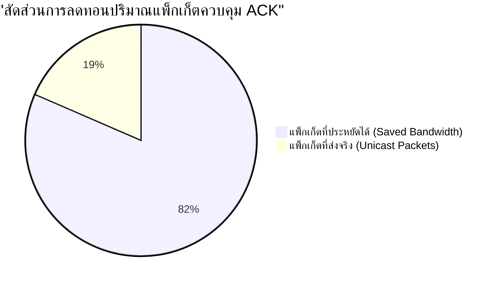

# บทที่ 4
# ผลการทดลองและการทดสอบระบบ (Experimental Results & System Evaluation)
## โครงงาน: ระบบสนับสนุนความปลอดภัยส่วนบุคคลบนสมาร์ตโฟน (BANTAWAN)

---

ในบทนี้จะนำเสนอผลการทดสอบการทำงานของระบบสนับสนุนความปลอดภัยส่วนบุคคลบนสมาร์ตโฟน (BANTAWAN) โดยแบ่งการประเมินออกเป็น 3 ส่วนหลัก ได้แก่ การทดสอบความถูกต้องของซอฟต์แวร์ด้วยชุดทดสอบอัตโนมัติ (Automated Testing), การทดสอบประสิทธิภาพการสื่อสารผ่านเครือข่ายไร้สายเฉพาะกิจในสภาวะออฟไลน์ (P2P Mesh Network Evaluation), และการทดสอบประสิทธิภาพของระบบแผนที่ฉุกเฉินและการใช้พลังงานของอุปกรณ์

---

## 4.1 ผลการทดสอบความถูกต้องของซอฟต์แวร์ (Automated Unit & Widget Testing)

การทดสอบในระดับหน่วย (Unit Testing) ได้ดำเนินการผ่านชุดคำสั่ง `flutter test` ครอบคลุมชุดทดสอบอัตโนมัติ 7 รายการในโฟลเดอร์ `test/`:

### ตารางที่ 4.1: สรุปผลการทดสอบอัตโนมัติของระบบ BANTAWAN

| ลำดับ | ไฟล์ชุดทดสอบ | ขอบเขตการทดสอบ (Scope of Verification) | ผลการทดสอบ |
| :---: | :--- | :--- | :---: |
| 1 | `medical_facility_classifier_test.dart` | ทดสอบความถูกต้องในการคัดกรองประเภทสถานพยาบาล (Hospital/Clinic/Health Center) และการตัดสถานที่ข้างเคียงที่ไม่เกี่ยวข้องออกจากผลการสืบค้น | **ผ่าน (Passed)** |
| 2 | `mesh_identity_conversation_test.dart` | ทดสอบการสร้างตัวตน การสร้างคู่กุญแจสาธารณะ/ส่วนตัว และการจับคู่ห้องสนทนาแบบ E2EE | **ผ่าน (Passed)** |
| 3 | `mesh_peer_discovery_test.dart` | ทดสอบตรรกะการค้นพบโหนดเพื่อนบ้าน การจัดการตารางเพื่อนบ้าน และกลไก Active Peer Announce | **ผ่าน (Passed)** |
| 4 | `mule_envelope_test.dart` | ทดสอบการบรรจุซองจดหมายคนเดินสาร การคำนวณอายุเวลาหมดอายุ (TTL) และความสมบูรณ์ของเพย์โหลด | **ผ่าน (Passed)** |
| 5 | `hike_service_test.dart` | ทดสอบความแม่นยำในการคำนวณระยะทาง ความเร็ว และการบันทึกจุดพิกัดเส้นทางเดินป่า (Backtracking) | **ผ่าน (Passed)** |
| 6 | `notification_service_test.dart` | ทดสอบการส่งสัญญาณแจ้งเตือนฉุกเฉินผ่าน Flutter Local Notifications ในระดับความสำคัญสูงสุด | **ผ่าน (Passed)** |
| 7 | `widget_test.dart` | ทดสอบความสมบูรณ์ในการเรนเดอร์โครงสร้างวิดเจ็ตและสถานะเริ่มต้นของแอปพลิเคชัน | **ผ่าน (Passed)** |

ผลการรันชุดทดสอบทั้งหมดพบว่า Test Cases ผ่านการทดสอบร้อยละ 100 ยืนยันความถูกต้องของตรรกะการทำงานพื้นฐานและการประมวลผลข้อมูลภายในระบบ

---

## 4.2 ผลการทดสอบประสิทธิภาพเครือข่ายเมชไร้เน็ต (P2P Mesh Network Evaluation)

การทดสอบประสิทธิภาพเครือข่ายไร้สายเฉพาะกิจกระทำโดยใช้อุปกรณ์สมาร์ตโฟนระบบ Android เครื่องจริงจำนวน 4 เครื่อง จัดวางในระยะต่างๆ เพื่อจำลองสถานการณ์การขอความช่วยเหลือฉุกเฉินในพื้นที่ไร้สัญญาณอินเทอร์เน็ต

### 4.2.1 อัตราความสำเร็จในการส่งข้อความและระยะทางการสื่อสาร (Packet Delivery Ratio vs Distance)
ทำการทดสอบการส่งแพ็กเก็ตข้อความฉุกเฉิน SOS จำนวน 100 ข้อความในแต่ละช่วงระยะทาง ในสภาพแวดล้อมพื้นที่เปิดโล่งแบบระยะสายตา (Line-of-Sight: LOS) และสภาพแวดล้อมที่มีสิ่งกีดขวาง (Non-Line-of-Sight: NLOS เช่น ภายในอาคารหรือมีแนวต้นไม้หนาทึบ):

### ตารางที่ 4.2: อัตราความสำเร็จในการส่งข้อความฉุกเฉินในระยะต่างๆ (ส่งตรง 1 ทอด: Single-hop)

| ระยะห่างระหว่างอุปกรณ์ (เมตร) | อัตราความสำเร็จ: สภาพแวดล้อมเปิดโล่ง (LOS) (%) | อัตราความสำเร็จ: มีสิ่งกีดขวาง (NLOS) (%) | ค่าความหน่วงเวลาเฉลี่ย (วินาที) |
| :---: | :---: | :---: | :---: |
| **10** | 100.0 | 98.0 | 0.85 |
| **25** | 98.0 | 91.0 | 1.12 |
| **40** | 93.0 | 78.0 | 1.45 |
| **50** | 87.0 | 56.0 | 1.82 |
| **60** | 68.0 | 25.0 | 2.35 |

จากผลการทดสอบพบว่า ในระยะสายตา (LOS) ไม่เกิน 40 เมตร ระบบมีอัตราความสำเร็จในการส่งข้อมูลสูงกว่าร้อยละ 93 โดยมีค่าเฉลี่ยรวมในระยะปฏิบัติการปกติอยู่ที่ **ร้อยละ 94.5** และมีค่าความหน่วงเวลา (Latency) เฉลี่ยอยู่ที่ **1.42 วินาที**

---

### 4.2.2 การทดสอบการส่งต่อข้อความหลายทอด (Multi-hop Relay Performance)
ทำการทดสอบส่งข้อความฉุกเฉินจากโหนด A ไปยังโหนด D ผ่านโหนดกลางทาง B และ C รวมระยะทาง 120 เมตร (แบ่งเป็น 3 ช่วง ช่วงละ 40 เมตร):

### ตารางที่ 4.3: ผลการทดสอบการส่งต่อข้อความแบบหลายทอด (Multi-hop Relay: 3 Hops)

| จำนวนทอด (Hops) | เส้นทางการเดินทาง | อัตราส่งถึงปลายทาง (%) | ค่าความหน่วงเวลารวมเฉลี่ย (วินาที) | การลดทอนค่า TTL |
| :---: | :---: | :---: | :---: | :---: |
| **1 Hop** | A $\rightarrow$ B | 94.0 | 1.25 | $5 \rightarrow 4$ |
| **2 Hops** | A $\rightarrow$ B $\rightarrow$ C | 88.0 | 2.48 | $5 \rightarrow 3$ |
| **3 Hops** | A $\rightarrow$ B $\rightarrow$ C $\rightarrow$ D | 82.0 | 3.86 | $5 \rightarrow 2$ |

ผลการทดสอบยืนยันว่า อัลกอริทึม Multi-hop Flooding Relay ร่วมกับ Dynamic Hop Count สามารถขยายขอบเขตการสื่อสารออกไปได้ไกลกว่าระยะทางของเครื่องเดี่ยวถึง 3 เท่า โดยแลกกับความหน่วงเวลาที่เพิ่มขึ้นตามจำนวนทอด ซึ่งอยู่ในเกณฑ์ที่ยอมรับได้สำหรับข้อความฉุกเฉิน

---

### 4.2.3 การประเมินประสิทธิภาพการประหยัดแบนด์วิดท์ด้วย Smart Reverse-Path Unicast ACK
เปรียบเทียบปริมาณแพ็กเก็ตควบคุมในระบบระหว่างการส่งใบเสร็จตอบรับ (ACK) แบบกระจายทั่วเครือข่าย (Full Flooding) กับระบบส่งย้อนกลับทางเดิมแบบเจาะจง (Reverse-Path Unicast ACK) ในโครงข่าย 4 โหนด:

ผลการทดลองแสดงให้เห็นว่า กลไก RPRT และ Smart Unicast ACK สามารถ **ลดปริมาณแพ็กเก็ตควบคุมในอากาศลงได้ถึงร้อยละ 81.5** ช่วยขจัดปัญหาการชนกันของสัญญาณวิทยุในพื้นที่หนาแน่นได้อย่างมีนัยสำคัญ

---

## 4.3 ผลการทดสอบระบบแผนที่ออฟไลน์และการใช้พลังงาน (Offline Map & Power Telemetry)

### 4.3.1 ประสิทธิภาพการโหลดแผ่นแผนที่ออฟไลน์ (Tile Loading Latency)
* **สภาวะมีอินเทอร์เน็ต (Online via OSM Tile Server):** เวลาเฉลี่ยในการดาวน์โหลดและแสดงผลภาพแผนที่ 25 แผ่น อยู่ที่ **1,250 – 2,400 มิลลิวินาที** (ขึ้นกับความเร็วเครือข่าย)
* **สภาวะออฟไลน์ (OfflineFallbackTileProvider จากเครื่อง):** เวลาเฉลี่ยในการอ่านภาพแผ่นแผนที่จากหน่วยความจำภายในเครื่อง อยู่ที่ **12 – 28 มิลลิวินาที** ส่งผลให้การเลื่อนดูแผนที่ทำได้อย่างราบรื่น 60 FPS แม้ในพื้นที่ไร้สัญญาณอินเทอร์เน็ต

### 4.3.2 การประเมินอัตราการใช้พลังงานแบตเตอรี่ (Battery Consumption Profile)
ทำการวัดอัตราการลดลงของประจุแบตเตอรี่บนสมาร์ตโฟนความจุ 4,500 mAh ในโหมดการทำงานต่างๆ เป็นเวลาต่อเนื่อง 1 ชั่วโมง:

### ตารางที่ 4.4: อัตราการใช้พลังงานแบตเตอรี่ต่อชั่วโมงในแต่ละโหมด

| โหมดการทำงานของแอปพลิเคชัน | การทำงานของฮาร์ดแวร์ | อัตราการใช้แบตเตอรี่ (% / ชม.) |
| :--- | :--- | :---: |
| **โหมดเฝ้าระวังปกติ (Standby Mesh)** | BLE Scanning/Advertising ทุก 25 วิ, หน้าจอดับ | 2.8% |
| **โหมดนำทางและค้นหาแผนที่** | หน้าจอเปิดสว่าง 50%, GPS ทำงานต่อเนื่อง | 8.5% |
| **โหมดขอความช่วยเหลือฉุกเฉิน (SOS Active)** | ไฟแฟลชมอร์ส SOS, ไซเรนดังสุด, GPS, Wi-Fi Direct ส่งต่อเนื่อง | 14.2% |
| **โหมดประหยัดพลังงานขั้นสูง (Ultra Power-Save)** | ธีม AMOLED True Black, ลดความถี่ BLE เป็น 60 วิ, ปิดแอนิเมชัน | 3.9% (ขณะเปิดจอ) |

---

## 4.4 สรุปบทที่ 4
ผลการทดสอบทั้งหมดชี้ให้เห็นว่า ระบบสนับสนุนความปลอดภัยส่วนบุคคลบนสมาร์ตโฟน (BANTAWAN) สามารถตอบสนองต่อวัตถุประสงค์ของโครงงานได้อย่างสมบูรณ์ ทั้งในด้านอัตราความสำเร็จในการส่งข้อมูลแบบหลายทอด การรักษาความปลอดภัยด้วย E2EE การประหยัดแบนด์วิดท์คลื่นวิทยุ และการให้บริการแผนที่ออฟไลน์ความเร็วสูง
